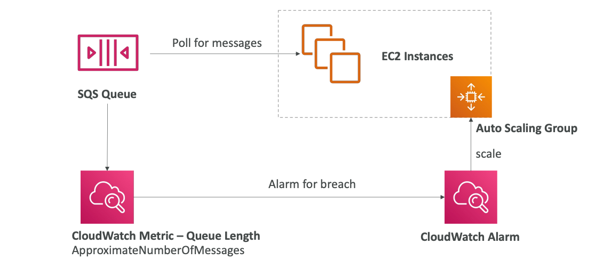
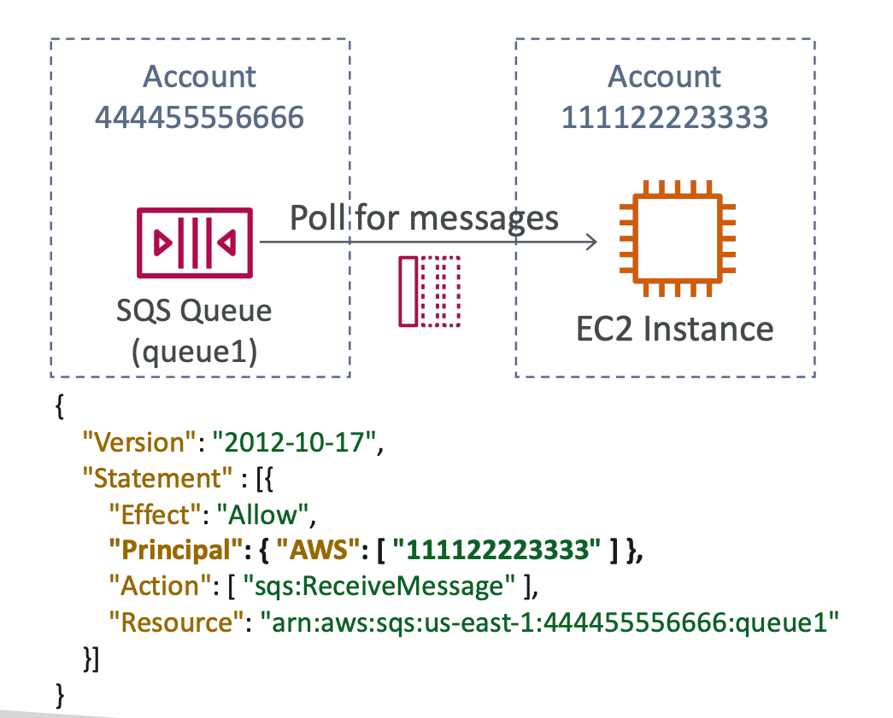
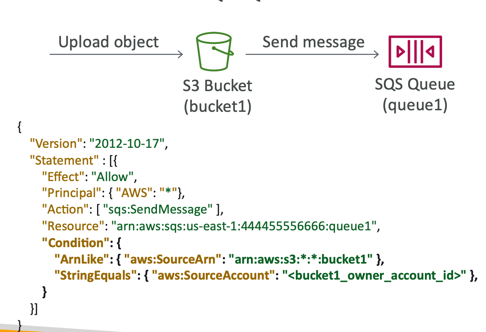
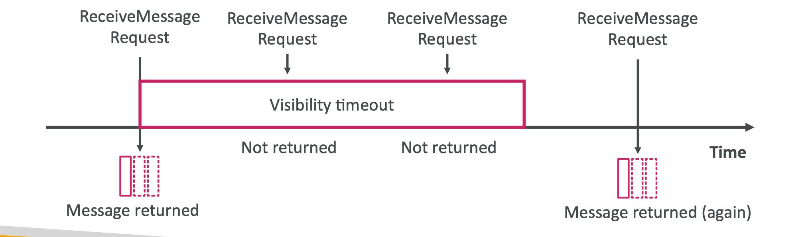
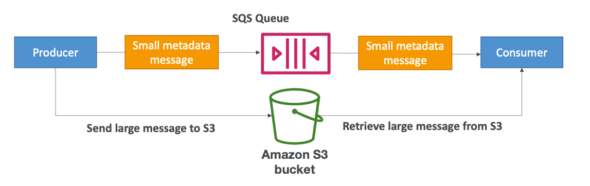
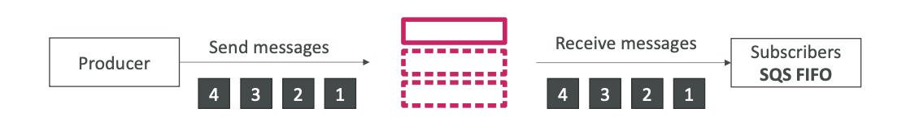
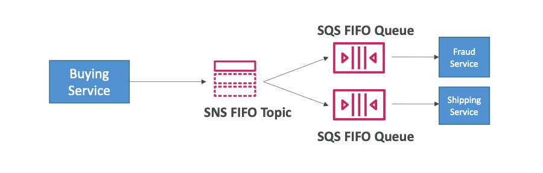

# AWS

Each resource has it unique **ARN** (Amazon Resource Name):
`arn:aws:s3::..`

## AWS Regions

Factors for choosing a particular AWS Region:
1. Compliance with data governance and legal requirements: data never leaves a region without your explicit permission.
2. Proximity to customers: reduced **latency**.
3. Available services withing an AWS Region: new services and new features aren't available in every Region.
4. Pricing: pricing varies region to region.

Each region has unique code.
Each region has at least **3 availability zones** (AZs).
**Min is 3, max is 6 AZs.**

AWS has 400+ POPs (or Edge Locations), 10+ Regional Caches in 90+ cities across 40+ countries.
Content is delivered to end users with lower latency.

AWS has Global Services:
1. AWS IAM
2. Route 53
3. CloudFront
4. WAF

But most AWS services are **Region-scoped**.

## AWS Limits and Quotas

API Rate Limits:
some services have a limit on the number of calls they can receive.
For dealing with Intermittent Errors: implement **Exponential Backoff**.
Use a case: `ThrottlingException`, `5xx` server errors.
**Retry mechanism already included in AWS SDK API calls**.
Must implement yourself if using the AWS API as-is or in specific cases.
For dealing with Consistent Errors: request an API throttling limit increase.

Service Quotas (Service Limits):
e.g. running on-demand standard instances: 1152 CPUs.
**You can request a service limit increase by opening a ticket**.
You can request a service quota increase by using the **Service Quotas API**.

## AWS Budget

In AWS, you can create budgets for an account and track billing per service.

## AWS ECS

**ECS (Elastic Container Service) — Docker on AWS**.
Docker images are stored in image repositories:
Docker Hub (`https://hub.docker.com`) - public repository,
**AWS ECR (Elastic Container Registry)** - private repository,
but also has a public repository (ECR Public Gallery - `https://gallery.ecr.aws`).

Container Management on AWS:
1. **ECS (Elastic Container Service)** — Amazon Container Platform.
2. **EKS (Elastic Kubernetes Service)** - Managed Kubernetes service.
3. **Fargate** — Amazon's serverless container platform, works with ECS and EKS.
4. **ECR (Elastic Container Registry)** — image repository.

Launch Docker containers on AWS means launch **ECS Tasks** on ECS Clusters.
Each Task includes containers.
Container can be essential (if it crashes, a whole task crashes) or not.
**ECS Cluster needs provisioned and maintained infrastructure based on launch type**.
 
Launch types:
1. EC2 Launch Type: Each EC2 Instance must run ECS agent to register in the ECS Cluster.
   **AWS take care of starting or stopping containers**.
   
2. Fargate Launch Type: **you don't provision the infrastructure (no EC2 Instances to manage)**,
   it's all **serverless**.
   You just create **task definitions**, AWS runs ECS Tasks based on the CPU/RAM you need.
   To scale, the number of tasks can be increased.
   **Easier to manage, comparing with EC2 Launch Type**.
   

### IAM Roles for ECS

1. **EC2 Instance Profile (EC2 Launch Type only)**:
   used by the ECS agent, makes API calls to ECS service,
   send container logs to CloudWatch Logs, pull docker images from ECR,
   reference sensitive data in Secrets Manager or SSM Parameter Store
2. ECS Task Role:
   allows each task to have a specific role

**IAM Roles assigned per Task Definition**.

### Load Balancer Integrations

**Application Load Balancer** is supported and works for most use cases.
 
**Network Load Balancer** is recommended only for high throughput.
 
**Classic Load Balancer** is supported, but not recommended (no Fargate).

### Data volumes

Mount EFS file systems onto ECS tasks.
**S3 cannot be mounted as a file system**.
Works for both **EC2** and **Fargate** launch types.
**Tasks running in any AZ will share the same data in the EFS**.
**Also, on EC2 you can mount data on EC2 Instance storage**.
**On Fargate, you can use ephemeral storage with capacity of 20GB — 200GB**.

`Fargate + EFS = Serverless`.

Use-case:
1. Persistent multi-AZ shared storage for your containers.
2. Sidecar container.

### Service Auto Scaling

Automatically increase/decrease the desired number of ECS Tasks.
ECS Auto Scaling uses **AWS Application Auto Scaling**:
1. ECS Service Average CPU Utilization
2. ECS Service Average RAM Utilization
3. ALB Request Count Per Target

**Target Tracking** - scale based on target value for a specific CloudWatch Metric.
 
**Step Scaling** - scale based on a specific CloudWatch Alarm.
 
**Schedule Scaling** - scale based on a specified date/time.

Fargate Auto Scaling is much easier to setup (because Serverless).
 
Auto scaling ECS based on EC2 Launch type:
1. Auto Scaling Group
2. ECS Cluster Capacity Provider: smarter one, recommended to use.

### Rolling Updates

When updating from v1 to v2,
we can control how many tasks can be started and stopped, and in which order.

### Arc examples

ECS Tasks invoked by Event Bridge:

ECS Tasks invoked by Event Bridge Schedule:

### Task Definitions

Task Definitions are **metadata in JSON format to tell ECS how to run a Docker container**.
It contains information, such as
1. image name
2. port binding for container and host
3. memory and CPU required
4. Environment variables: **Hardcoded**, **SSM Parameter Store**, **Secrets Manager** or
   **Environment files - `.env` (bulk) from S3 bucket**.
5. Networking information
6. IAM Role
7. Logging configuration

**Up to 10 containers can be defined in task definition**.
**Each task from within hosted on EC2 Instance is going to be
accessible from a different (random) port on the host EC2 Instance**.

We get a Dynamic Host Port Mapping if you define only the container port in the task definition.
**You must allow on the EC2 Instance's Security Group any port from ALB's Security Group**.
The ALB finds the right port on your EC2 Instances.

On Fargate, **each task has a unique private IP**.
Only define the container port (host port is not applicable).
You must allow only port 80 on ECS ENI and 80/443 on ALB.

### Task Placement

When a task of type EC2 is launched, ECS must determine where to place it,
with the constraints of CPU, memory, and available port.
Similarly, when a service scales in,
ECS needs to determine which task to terminate.

To assist with this, you can **define a task placement strategy** 
and **task placement constraints**.

`Placement strategies`:
1. **Binpack**: place tasks based on the least available amount of CPU or memory, minimizes the number of instances,
   brings cost savings.
2. **Random**: place tasks randomly.
3. **Spread**: place the task evenly based on specified value, e.g., `instanceID`, `attribute:ecs.availability-zone`

Placement strategies can be mixed together.

`Placement constraints`:
1. `distinctInstance`: place each task on a different container instance
2. `memberOf`: places tasks on instances that satisfy an expression, uses Cluster Query Language,
   e.g., `"attribute:ecs.instance-type =~ t2.*"`

AWS Task Placement Process:
1. Identify the instances that satisfy the CPU, memory, and port requirements in the task definition.
2. Identify the instances that satisfy the task placement constraints.
3. Identify the instances that satisfy the task placement strategies.

### ECR

**Elastic Container Registry**.
Store and manage Docker images on AWS.
Backed by S3.
Supports image vulnerability scanning, versioning, image tags, image lifecycle.

#### Copilot

AWS Copilot is a CLI tool to build, release,
and operate production-ready containerized applications.
Automated deployments with one command using CodePipeline.
Deploy to multiple environments.

### EKS

**Elastic Kubernetes Service (EKS)**.
**Managed Kubernetes cluster on AWS (master node is managed, you only create a worker ones)**.
EKS supports EC2 if you want to deploy worker nodes or Fargate to deploy serverless containers.

Use-case: if your company is already using Kubernetes on-premises
or in another cloud and wants to migrate to AWS using Kubernetes.
**Kubernetes is cloud-agnostic** (can be used in any cloud - AWS, Azure, GCP).
 
Node types:
1. Managed Node Groups: EKS creates and manages Nodes (EC2 Instances) for you.
2. Self-Managed Nodes: nodes created by you and registered to the EKS cluster,
   can be prebuilt using AMI.
3. Fargate mode: no maintenance required, no nodes are managed.

Also, you can attach Data Volumes to EKS cluster.
Need to specify StorageClass manifest on your EKS cluster.
Leverages a Container Storage Interface (CSI) compliant driver.

Support of:
1. EBS
2. EFS
3. FSx for Lustre
4. FSx for NetApp ONTAP

## AWS Elastic Beanstalk

**Elastic Beanstalk is a developer centric view of deploying an application on AWS**.
Just the application code is the responsibility of the developer.
Elastic Beanstalk **uses CloudFormation to deploy infrastructure stacks**.

Beanstalk is free, but you pay for the underlying instances.
 
**Components**:
1. Application: collection fo Elastic Beanstalk components (environments, versions, configurations).
2. Application Version.
3. Environment
   1. Collection of AWS resources running an application version (only one application version at a time).
   2. Tiers: **Web Server Environment Tier** and **Worker Environment Tier**
   **You can create multiple environments** (dev, test, prod).

Elastic Beanstalk supports many platforms and languages,
but if your is not supported, you can create your custom support.
 
**Web Server Tier Environment vs. Worker Tier Environment**:
Worker Tier Environment does not have any client directly accessing EC2 Instances,
instead it can be SQS queue or SNS topic.

Worker Environment can be combined with Web Environment.
**Also, environments can be cloned**.

### Deployment Options for Updates

1. **All at once** (deploy all in one go): fastest,
   but instances are not available to serve traffic for a bit (downtime),
   no additional costs.
2. **Rolling**: update a few instances at a time, runs below capacity
   (bucket, a partial set of instances, **size can be set**), 
   and then move onto the next bucket one the first bucket is healthy,
   **long deployment**, no additional costs.
3. **Rolling with batches**: like rolling, but always **runs at capacity**,
   so old application is still available, additional cost,
   additional batch is removed at the end of the deployment,
   **good for the production environment**.
4. **Immutable**: spins up new instances in a new temporary ASG,
   deploys a version to these instances, and then swaps all the instances when ready,
   **high cost** since double capacity, **longest deployment**, but **quick rollback**.
5. **Blue-Green**: **create a new environment** and switch over when ready,
   not a direct feature of Elastic Beanstalk,
   can be integrated with Route 53 Routing Policies.
6. **Traffic splitting**: send a small percentage of traffic to new deployment,
   used for **canary testing**, automated rollback.

Deployment Policy is inherited from the last artifact deployed.
Deployment Policy can be overwritten.

### CLI

Additional CLI can be installed, called "EB cli", which makes working with Beanstalk from the CLI easier.

Basic commands:
`eb create`, `eb status`, `eb health`, `eb events`, `eb logs`, `eb deploy`, etc.

It's helpful for your automated deployment pipelines.

### Extensions

**All the parameters set in the UI can be configured with code using files**.
It must be in `.ebextensions/` directory in the root of source code.
It must be in YAML/JSON format.
It must have `.config` extension.
Also, extensions have ability to add resources such as RDS, ElastiCache, DynamoDB, etc.
Resources managed by `.ebextensions` get deleted if the environment goes away.

Example: enable HTTPS on Load Balancer can be setup in `https-load-balancer.config`
in `.ebextensions/` folder.

**For running Jobs periodically, and asynchronously 
we can use `cron.yaml` in combination with Worker Environments**.

#### Lifecycle Policies

Elastic Beanstalk can store at most 1000 application versions.
All application versions are stored in S3.
If you don't remove old versions, you won't be able to deploy anymore.
For removal and environment management purposes, use a lifecycle policy:
1. Based on time
2. Based on space
After version deletion, **you can set retention policy to retain or delete source bundle from S3**.
**Versions that are currently used won't be deleted**.

#### Migration

**After creating an Elastic Beanstalk environment,
you cannot change the Elastic Load Balancer type** (only configuration).
To do this, you need to perform a migration:
1. Create a new environment with the same configuration except LB (can't clone).
2. Deploy your application onto the new environment
3. Shift traffic to the new environment: `CNAME` swap or Route 53 update.

RDS can be provisioned with Elastic Beanstalk, which is great for dev/testing.
This is not a good option for production environment,
since a database will be connected to the Elastic Beanstalk environment lifecycle.
The best way is to separate database and beanstalk environment.
**It is highly recommended to delete the associated CloudFormation
stack after deleting an environment**.

## AWS CloudFormation

CloudFormation — managing your infrastructure in code, **IaC (Infrastructure as Code)**.
CloudFormation cuts out manual setup of AWS services.
All this manual work will be very tough to reproduce in:
1. Another AWS Account
2. Another AWS Region

**CloudFormation is a declarative way of outlining your AWS Infrastructure** for any resources.
All the code can be version controlled using git.
Template deletion also can be automated.
**Template - YAML/JSON file, describes AWS resources and their properties**.
**Stack - created resources that was described in CloudFormation Template**.

**Templates have to be uploaded in S3** and then referenced in CloudFormation.
**Templates are immutable**, so you can't update previous ones,
you must create a new one instead.
**Name identifies Stack**.
**After Stack deletion, all resources will be deleted**.

Deploying CloudFormation Templates:
1. Manual way: CloudFormation Designer + AWS Console
2. Automated way: YAML/JSON files + CLI to deploy

### Components

1. **Resources**: your AWS resources declared in the template **(REQUIRED)**.
2. **Parameters**: the dynamic inputs for your template.
3. **Mappings**: the static variables for your template.
4. **Outputs**: references to what has been created.
5. **Conditionals**: conditions to perform resource creation.
6. **Metadata**

Also, there are Template helpers:
1. References
2. Functions

### Resources

Resources are the **core, required component** of your CloudFormation Template.
Resources represent AWS resources.
Resource types identifiers are of the form: `AWS::aws-product-name::data-type-name`
Resources are declared and can reference each other.

Each resource must have `Type` and `Properties`, a key-value pairs.

### Parameters

Parameters are a way to provide inputs to your AWS CloudFormation Template.
**Parameters can help in Template reuse**.
Also, sometimes parameters are inevitable
since some inputs cannot be determined ahead of time.

You will not have to re-upload a template to change the value of parameter.

Parameters can be controlled by all these settings:
1. Type
2. Description
3. Constraints
4. ConstraintDescription
5. Min/MaxLength
6. Min/MaxValue
7. Defaults
8. AllowedValues
9. AllowedPattern
10. NoEcho

To reference a parameter: `!Ref MyVPC`.
The `Fn::Ref` function can be leveraged to reference parameters,
the shorthand for `Fn::Ref` is `!Ref`.
Also, Ref function can be used to reference resources.

**AWS Pseudo Parameters**:
1. `AWS::AccountId`
2. `AWS::NotificationARNs`
3. `AWS::NoValue`
4. `AWS::Region`
5. `AWS::StackId`
6. `AWS::StackName`

### Mappings

Mappings are **fixed variables** in CloudFormation Template.
All the values are hardcoded for particular Template.

Some examples of using Mappings:
1. Region
2. AZ
3. AWS Account
4. Environment (dev vs. production)

`Fn::FindInMap` is used for accessing mapping values.
 
`!FindInMap [MapName, TopLevelJKey, SecondLevelKey]`

### Outputs

**The outputs declare optional output values that we can import into other templates**.
Outputs also can be viewed in AWS Console or using AWS CLI.

They are very useful, for example, if you define a network CloudFormation,
and output the variables such as VPC ID and your Subnet's IDs.

**It's the best way to perform cross-stack collaboration**.

**You can't delete a CloudFormation Stack if
its outputs are being referenced by another CloudFormation Stack**.

**Exported output names must be unique within your region**.
 

Then you can import a value using `Fn::ImportValue` function,
or `!ImportValue` for short.

### Conditions

**Used to control the creation of resources or outputs
based on a logical condition**.
 
Some common conditions:
1. Environment (dev/test/prod)
2. AWS Region

Each condition can reference another condition, parameter value or mapping.

### Intrinsic Functions

1. `Ref`: reference a resource will return a physical ID of it,
   reference a parameter will return its value.
2. `GetAtt`: get attribute from a resource, e.g., `!GetAtt EC2Instance.AvailabilityZone`.
3. `FindInMap`: return a named value from a specific key, e.g., `!FindInMap [ MapName, TopKey, LowKey ]`.
4. `ImportValue`: import values from other templates.
5. `Join`: join values with a delimiter, e.g., `!Join [ delimiter, [ values... ] ]`.
6. `Sub`: substitute variables from a text
7. Condition Functions: (`If`, `Not`, `Equals`, etc.)

### Rollbacks

Stack creation fails:
1. Default: everything rolls back -> get deleted, atomicity.
2. Preserve successfully provisioned resources, while
   rolling back failed resources to the last stable state.

Stack update fails:
the stack automatically rolls back to the previous known working state,
ability to see in the log what happened and error messages.

#### Stack Notifications

Send Stack events to SNS Topic, Email, Lambda.
**SNS Integration can be enabled using Stack Options**.

#### ChangeSets

When you update a stack, you need to know what changes before it happens for greater confidence.
ChangeSets won't say if the update will be successful or not, **just what will happen**.

#### Nested Stacks, StackSet

**Nested stacks are stack as part of other stacks**.
**They isolate common patterns and components in separate stacks and
call them from other stacks for reuse purposes**.
 
To update a nested stack, you need to update the parent first.
 
StackSets are for create, update, or delete stacks across
multiple accounts and regions with a single operation.
**When you update a stack set, all associated stack instances
are updated throughout all accounts and regions**.

#### Drift

CloudFormation doesn't protect you against manual configuration changes.
**CloudFormation Drift can be used for knowing resources been drifted**.

CloudFormation shows the difference between actual and expected state.

Not all resources are supported.

#### Stack Policies

During a CloudFormation Stack update,
all update actions are allowed on all resources (default).

**A Stack Policy is a JSON document that defines
the update actions that are allowed no specific resources during Stack updates**.

With a Stack Policy, by default, all resources in the stack are protected.

## AWS Integration and Messaging

When multiple applications appear, 
they will inevitably need it to communicate with one another using:

1. Synchronous communication (app to app)
2. Asynchronous communication (app to queue to app):
   1. SQS queue model
   2. SNS pub/sub model
   3. Kinesis real-time processing/streaming model

**Using asynchronous communication systems can scale independently**.

## SQS

Simple Queuing Service (SQS):
producers send a message to the queue, consumers poll it and process.

### Standard Queue

Fully managed service, used to decouple applications.
* Unlimited throughput, unlimited number of messages in queue
* At-least-once delivery
* Best-effort ordering

**Default retention of messages: 4 days, max: 14 days**.
 
**Low latency**: (less than 10ms on publish and receive).
**Limitation of 256KB per message sent**.
 
**Can have duplicate messages (at least once delivery)**.
 
**Can have out of order messages**.

 
SQS can be integrated with CloudWatch Metrics and Alarms for autoscaling purposes:

### Producing Messages

Producer sends a message to the Queue using the SDK SendMessage API.
The message is persisted in SQS **until a consumer deletes it**.
Or retention is off.

### Consuming Messages

Consumers can be running on EC2 Instances, other servers, or AWS Lambda).
Consumer polls queue for messages using SDK ReceiveMessages API, and **can receive up to 10 messages at a time**.
**Competing consumers can increase throughput**.
**By deleting message from SQS queue we are signaling that message was successfully processed**.
 
**Purge a queue — delete all messages from the queue**.

### Security

`Encryption`:
* In-flight encryption using HTTPS API;
* At-rest encryption using KMS keys;
* Client-side encryption if the client wants to perform encryption/decryption itself.
`Access Controls`:
* IAM Policies to regulate access to the SQS API.
`SQS Access Policies` (similar to S3 bucket policies):
* **Useful for cross-account access to SQS queues**.
* **Useful for allowing other services to send messages to an SQS queue**.

### Queue Access Policy

JSON Resource IAM Policies.

Use-cases:
1. Cross-Account Access
   
2. Access from other services
   

### Message Visibility Timeout

After a message is polled by a consumer, **it becomes invisible to other consumers**.
By default, the 'message visibility timeout' is `30` seconds.
**If a message is not deleted from the queue, and message visibility timeout is elapsed,
the message will be visible for other consumers**.

**Simply put, if a message is not processed within the visibility timeout,
it will be processed twice**.
A consumer could call the `ChangeMessageVisibility` API to get more time.

* If visibility timeout is high (hours), and consumer crashes,
re-processing will take a lot of time.

* If visibility timeout is too low (seconds), we may get duplicate processing.

### Dead Letter Queue (DLQ)

If a message is processed too many times and not successfully, 
it goes to the DLQ.

Useful for _debugging_.

**DLQ of a FIFO queue must be also a FIFO queue**.
 
**DLQ of a Standard queue must be also a Standard queue**.

When working with DLQs, it's a good idea to set long retention in DLQ.

### Redrive to Source

Feature to help consume messages in the DLQ to understand 
what is wrong with them.

When everything is fixed, you can redrive
messages from DLQ into the source queue.

### Delay Queues

Delay a message, so consumers don't see it immediately (up to 15 minutes).
Default is 0 seconds.
Can set a default at queue level.
Message delay can be overridden by sending data with `DelaySeconds` parameter.

### Long Polling

Long Polling: When a consumer requests messages from the queue,
it can optionally wait for messages to arrive if there are none in the queue.
**Long Polling decreases the number of API calls made to SQS,
while increasing the latency of your application**.

Using `ReceiveMessageWaitTimeSeconds`, on each polling you can tell your consumer: 
how long to wait before getting a response.

The wait time can be **between 1 and 20 seconds**.
Consumers will wait up to x seconds if the queue is empty.
**The default one is 0 seconds (Short Polling)**.

### Extended Client

Extended client helps to deliver large messages:

Use-cases:
* Video files
* Large documents

### SQS API

* `CreateQueue(MessageRetentionPeriod)`
* `DeleteQueue`
* `PurgeQueue`: delete all the messages in queue
* `SendMessage(DelaySeconds)`
* `ReceiveMessage`
* `DeleteMessage`
* `MaxNumberOfMessages`: default is 1, max 10 (for `ReceiveMessage` API)
* `ReceiveMessageWaitTimeSeconds`: how long to wait before getting a response (Long Polling)
* `ChangeMessageVisibility`: change the message timeout

Also, batch APIs for `SendMessage`, `DeleteMessage`, `ChangeMessageVisibility`
helps decrease costs.

### FIFO Queue

First In First Out (ordering of messages in the queue).
**FIFO is a queue with limited throughput: `300msg/s` without batching, 
and `3000 msg/s` with**.
* Exactly-once send capability (by removing duplicates)
* Messages are processed in order by the consumer

Queue's name must ends with `.fifo`

### FIFO Deduplication

Deduplication interval is 5 minutes.
**If the same message is delivered in this interval,
it will be refused**.

Deduplication methods:
1. Content-based deduplication: check SHA-256 hash of message body
2. Explicitly provided Message Deduplication ID

### Message Grouping

If you specify the **same value of `MessageGroupID`** is an SQS FIFO queue,
**you can only have one consumer, and all the messages are in order**.
 
To get **ordering at the level of a subset of messages**,
specify **different values for `MessageGroupID`**.
* So, messages will be ordered within a group,
while global ordering is not guaranteed.
* Each Group ID can have a different consumer (parallel processing)

## AWS SNS

Simple Notification Service.
It is either can be [Standard](#standard-queue) or [FIFO](#fifo-queue).
One message to many receivers.
 
**SNS is a Pub-Sub messaging**.
Each subscriber to the SNS topic will get all the messages.
Messages can be filtered.

* Up to 12,500,000 subs per topic
* 100,000 topics limit
* SNS can send messages directly to `Email`, `SMS`, mobile notifications,
  `HTTP(S)` endpoints or other AWS services: `SQS`, `Lambda`, `Kinesis Data Firehose`.
* SNS integrates with a lot of AWS services: `CloudWatch Alarms`, `AWS Budgets`, `Auto Scaling Group`,
  `S3 Bucket Events`, `CloudFormation State Changes`, `AWS DMS New Replic`, `RDS Events`, and others.

The same as SQS and S3, you will need Access Policies for allowing other services 
to publish into an SNS topic.

### SNS & SQS Fan Out

Push once in SNS, receive in all SQS queues that are subscribers.
* Fully decoupled, no data loss
* SQS allows for: data persistence, delayed processing and retries of work
* Ability to add more SQS subscribers over time

**Make sure your SQS queue Access Policy allows for SNS to publish in it**.

Use-cases:
* S3 Events to multiple queues

### SNS FIFO Topic

* Similar to [SQS FIFO](#fifo-queue)
* **Can only have SQS FIFO queues as subs**
* Limited throughput as SQS FIFO

Fan Out pattern with FIFO will look like this:

### Message Filtering

JSON Policy used to filter messages sent to SNS topic's subs.
**If a sub doesn't have a filter policy, it will receive every message**.

## AWS DynamoDB

Item key consists of:
Partition key (Hash key);
or
Partition key (Hash key) and Sort key (Range key).

Local secondary index (LSI) —An index that has the same partition key as the base table, but a different sort key.

RCU - Read Capacity Units.
WCU - Write Capacity Units.

LSI — Local Secondary Index, **can be created only on table creation**, **up to 5** in scope of one table.
GSI — Global Secondary Index, can be created anytime, **up to 20** in scope of one table.

A global secondary index lets you query over the entire table, across all partitions.
The primary key of a global secondary index can be either simple (partition key) or composite (partition key and sort key).
A local secondary index lets you query over a single partition, as specified by the partition key value in the query.
The primary key of a local secondary index must be composite (partition key and sort key).

In general, you **should use global secondary indexes** rather than local secondary indexes.
The exception is when you need strong consistency in your query results,
which a local secondary index can provide but a global secondary index cannot
(global secondary index queries only support eventual consistency).

DynamoDB is NoSQL, serverless database.
You can do `Scan`, `Query`, or `GetItem` your Table **Items**.
`Scan` - iterates through all the items, consumes more RCUs.
`Query` - iterating require usage of indexes, consumes less RCUs.
`GetItem` - returns a set of attributes for the **item** with the **given primary key**.
If there is no matching item,
GetItem does not return any data and there will be no Item element in the response.

## AWS Lambda

## AWS API Gateway

## AWS Cognito

## AWS Cloudwatch

### XRAY
