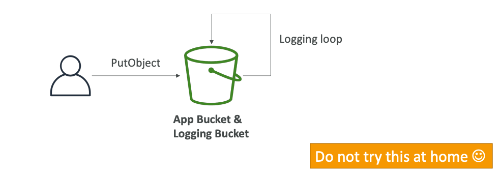

# AWS

Each resource has it unique **ARN** (Amazon Resource Name):
`arn:aws:s3::..`

## AWS Regions

Factors for choosing a particular AWS Region:
1. Compliance with data governance and legal requirements: data never leaves a region without your explicit permission.
2. Proximity to customers: reduced **latency**.
3. Available services withing an AWS Region: new services and new features aren't available in every Region.
4. Pricing: pricing varies region to region.

Each region has unique code.
Each region has at least **3 availability zones** (AZs).
**Min is 3, max is 6 AZs.**

AWS has 400+ POPs (or Edge Locations), 10+ Regional Caches in 90+ cities across 40+ countries.
Content is delivered to end users with lower latency.

AWS has Global Services:
1. AWS IAM
2. Route 53
3. CloudFront
4. WAF

But most AWS services are **Region-scoped**.

## AWS Limits and Quotas

API Rate Limits:
some services have a limit on the number of calls they can receive.
For dealing with Intermittent Errors: implement **Exponential Backoff**.
Use a case: `ThrottlingException`, `5xx` server errors.
**Retry mechanism already included in AWS SDK API calls**.
Must implement yourself if using the AWS API as-is or in specific cases.
For dealing with Consistent Errors: request an API throttling limit increase.

Service Quotas (Service Limits):
e.g. running on-demand standard instances: 1152 CPUs.
**You can request a service limit increase by opening a ticket**.
You can request a service quota increase by using the **Service Quotas API**.

## AWS Budget

In AWS, you can create budgets for an account and track billing per service.

## AWS IAM
IAM — Identity and Access Management.

### Accounts, Users, Groups
Deactivate and delete your ROOT account credentials, it shouldn't be used or shared.
Create users instead.
**Users** can be part of multiple groups.
**Groups** only contain users, not other groups.


### Policies
Users and Groups can be assigned JSON documents, a.k.a IAM Policies:

```json
{
    "Version": "2012-10-17",
    "Statement": [
        {
            "Sid": "FullAccess",
            "Effect": "Allow",
            "Action": ["s3:*"],
            "Resource": ["*"]
        },
        {
            "Sid": "DenyCustomerBucket",
            "Action": ["s3:*"],
            "Effect": "Deny",
            "Resource": ["arn:aws:s3:::customer", "arn:aws:s3:::customer/*" ]
        }
    ]
}
```

```json
{
    "Version": "2012-10-17",
    "Statement": [
        {
            "Effect": "Allow",
            "Action": [
                "dynamodb:DeleteItem",
                "dynamodb:GetItem",
                "dynamodb:PutItem",
                "dynamodb:UpdateItem"
            ],
            "Resource": [
                "arn:aws:dynamodb:us-west-1:123456789012:table/myDynamoTable"
            ],
            "Condition": {
                "ForAllValues:StringEquals": {
                    "dynamodb:LeadingKeys": [
                        "${cognito-identity.amazonaws.com:sub}"
                    ]
                }
            }
        }
    ]
}
```
These policies define the **permissions** of the users.
In AWS, you apply **the least privilege principle**:
don't give more permissions than a user needs.

Generate IAM user's keys for security tracing (but without access to IAM).
Create RBAC (Role Based Access Control).
Create Admin and attach roles for others.
Account ID -> Account Alias.
Account Alias must be globally unique.

IAM Policies inheritance:
<br>
Users inherit the policies from attached Groups.
<br>
Also, can `Inline Policy` be applied. 
`Inline Policy` — 1:1 mapping permissions only for 1 user / service and nobody else.


IAM Policy Structure:
<br>
`Version`: policy language version
<br>
`Id`: an identifier for the policy
<br>
`Statement`: one or more individual statements, which consists of:
<br>
`Sid`: an identifier for the statement
<br>
`Effect`: whether the statement allows or denies access (**Allow**, **Deny**)
<br>
`Principal`: account/user/role to which the policy applied to
<br>
`Action`: list of actions this policy allows or denies (based on the Effect)
<br>
`Resource`: list of resources on which actions will be applied
<br>
`Condition`: when to apply actions

Policies can be created using either JSON or Visual editor.

### IAM Multi-Factor Authentication (MFA)

Strong protection of your AWS account.
MFA = _password you know_ + _security device you own_

MFA device options in AWS:
<br>
Virtual device:
<br>
Google Authenticator (phone only)
<br>
Authy (multi-device)

Universal 2nd Factor (U2F) Security Key:
YubiKey by Yubico (3rd party) and other keychains.

#### MFA with CLI

To use MFA with CLI, you must create a temporary session token (run `STS GetSessionToken` API call).

Each service has permissions.
You can assign them to AWS services using policies.
For example, Inline Policy —
1:1 mapping permissions only for 1 user / service and nobody else.

### IAM Roles for Services
Some AWS service will need to perform actions on your behalf.
To do so, we need to assign **permissions** to AWS services (trusted entity) with IAM roles.
Most common use-cases are EC2 and Lambda.

Permissions, which are not explicitly allowed -> they are **implicitly denied**.
Everything can be setup in the IAM dashboard.

### Accessing the AWS
To access AWS, you have 3 options:
1. Management Console (protected by password + MFA)
2. Command Line Interface (CLI) (protected by access keys), Python runtime
3. Software Development Kit (SDK) (protected by access keys)
or AWS API.

With AWS API, you must sign the request using access and secret keys,
so that AWS can identify you (except some S3 requests).
You should use **Signature v4 (SigV4)** for request signing:
1. HTTP Header option (signature in Authorization header)
2. Query String option (signature in X-Amz-Signature)

If you are using CLI or SDK, the requests are signed for you.

With CLI, output format can be `text`, `json`, or `yaml`.
AWS CloudShell — cloud terminal, where you can run your CLI commands,
upload and download files.

Users manage their own access keys.
Access Key ~= username
Secret Key ~= password

Configuration stored in `.aws/config`.
Credentials are stored in `.aws/credentials`.
You can give a name for your account with profile alias.
In `.aws/credentials` you can specify [$profile] node on top of `ACCESS_KEY` and `SECRET_KEY`.
Many AWS credentials can be managed using profiles.
In AWS CLI you can choose the profile using `--profile`.

**If you don't specify a default region, then `us-east-1` will be chosen by default**.

#### Credentials Provider Chain

CLI:
1. Command line options `--region`, `--output`, `--profile`
2. Environment variables `AWS_ACCESS_KEY_ID`, `AWS_SECRET_KEY_ID`, `AWS_SESSION_TOKEN`
3. `~/.aws/credentials`
4. `~/.aws/config`
5. Container credentials for ECS tasks
6. Instance profile credentials for EC2 Instance Profiles

SDK:
1. system properties
2. Environment variables
3. `~/.aws/credentials`
4. ECS container credentials
5. Instance profile credentials for EC2 Instance Profiles

### IAM Security Tools
1. **IAM Credentials Report** (account-level) - 
   a report that lists all your account's users and the status of their various credentials.
2. **IAM Access Advisor** (user-level) - 
   shows the service permissions granted to a user and when those services were last accessed.
   You can use this information to revise your policies.

### Shared Responsibility Model for IAM
AWS is responsible for Infrastructure (global network security),
configuration and vulnerability analysis, and compliance validation.

While, **you are responsible for managing Users, Groups, Roles, Policies management, and monitoring**.
Also, MFA enabling, key rotation, usage of IAM tools for applying appropriate permissions,
analyze access patterns and review permissions.

### IAM Summary

**Users**: mapped to a physical user, has a password for AWS Console
<br>
**Groups**: contains users only
<br>
**Policies**: JSON document that outlines permissions for users or groups
<br>
**Roles**: for AWS services, such as EC2 or Lambda
<br>
**Security**: MFA + Password Policy
<br>
**AWS CLI**: manage your AWS services using the command-line
<br>
**AWS SDK**: manage your AWS services using a programming language
<br>
**Access Keys**: access AWS using the CLI or SDK
<br>
**Audit**: IAM Credential Reports and IAM Access Advisor

## AWS EC2

Elastic Compute Cloud (EC2), Infrastructure as a Service.
It mainly consists of:
1. Renting virtual machines (EC2)
2. Storing data on virtual drives (EBS)
3. Distributing a load across machines (ELB)
4. Scaling the services using an auto-scaling group (ASG)

EC2 sizing and configuration options:
1. OS: Linux, Windows, macOS
2. CPU
3. RAM
4. Storage: EBS (Elastic Block Storage), EFS (Elastic File Storage), hardware (EC2 Instance Store)
5. Network: speed of the card, Public IP address
6. Firewall rules: security group 
7. Bootstrap script (on machine launch): EC2 User Data

Each EC2 User Data script runs from root user (`sudo` required).

`t2.micro` (1 vCPU, 1 GB) is part of the AWS free tier (up to 750 hours per month).

### EC2 Configuration

1. Amazon Machine Image (**AMI**) - is a template that contains the software configuration
   (operating system, application server, and application) required to launch your instance.
   Base image can be: Amazon Linux, Ubuntu, Windows, macOS, Red Hat, etc.
2. Instance type
3. Key pair for SSH connection
4. Storage volumes
5. Advanced: Spot instances, Tenancy, User Data script, etc.

After EC2 instance stops, Public IP can be **resigned**.
`0.0.0.0/0`- CIDR block of 'everywhere.'

### Instance Types

AWS EC2 Instance Types:
1. **General Purpose**, Great diversity of workloads such as web servers or code repos.
   Balance between: Compute, Memory, Networking.
2. **Compute Optimized**, Great for compute-intensive tasks that require high-performance processors:
   Batch processing workloads, Media transcoding, High performance computing (HPC),
   Scientific modeling, Machine Learning, Dedicated gaming servers.
3. **Memory Optimized**, Fast performance for workloads that process large data sets in memory.
   Use-cases: High performance databases, Distributed web scale cache stores,
   In-memory databases optimized for BI (business intelligence), Real-time processing of big unstructured data.
4. **Storage Optimized**, Great for storage-intensive tasks that require high,
   sequential read and write access to large data sets on local storage.
   Use-cases: High frequency online transaction processing (OLTP) systems,
   Relational and NoSQL databases, Cache for in-memory database,
   Data warehousing applications, Distributed file systems.

AWS has the following naming convention: `m5.2xlarge`, where


m: instance class
<br>
5: generation (AWS improves them over time)
<br>
2xlarge: size withing the instance class

### Security Groups

Security groups control how traffic is allowed into or out of our EC2 instances.
Security groups only contain `allow` rules.
Security groups rules can be reference by IP or by security group.

Security groups are acting as a 'firewall' on EC2 instances.
They regulate port accessing, IP ranges (IPv4 and IPv6),
inbound network (from others to the instance),
outbound network (from the instance to others).

Any **timeout is cause of EC2 Security Groups**. 


Security groups can be attached to multiple instances.
By default, all inbound traffic is `blocked` by default.
By default, all outbound traffic is `authorised` by default.

Referencing other security groups:


Classic Ports to know:
<br>
22 = SSH (Secure Shell) - log into a Linux instance
<br>
21 = FTP (File Transfer Protocol) - upload files into file share
<br>
22 = SFTP (Secure File Transfer Protocol) - upload files using SSH
<br>
80 = HTTP - access unsecured websites
<br>
443 = HTTPS - access secured websites
<br>
3389 = RDP (Remote Desktop Protocol) - log into a Windows instance

### EC2 Connection

Using SSH:

```shell
ssh -i certi.pem ec2-user@<public ip>
```

If you have an error: `UNPROTECTED PRIVATE KEY FILE` -> 

```shell
chmod 0400 certi.pem
```

Using EC2 Instance Connect:
In the Management Console, you can start a new browser session with connection to your EC2.

### EC2 Instances Purchasing Options

**On-Demand Instances** — short workload, predictable pricing, pay by uptime second.
Pay for what you use:
1. Linux or Windows — billing per second, after the first minute
2. All other OSs — billing per hour
Has the **highest cost but no upfront payment**, no long-term commitment.

**Reserved** (1 and 3 years):
   1. Reserved Instances — long workloads, you specify `Instance Type`, `Region`, `Tenancy`, `OS`.
   2. Convertible Reserved Instances — long workloads with flexible instances,
      you can change the `Instance Type`, `Region`, `Tenancy`, `OS`,
      less discount comparing to Reserved Instances.
Good for databases.
**Savings Plan** (1 and 3 years) — commitment to and amount of usage, long workload.
Get a discount based on long-term usage (up to ~72%),
usage beyond EC2 Savings Plan is billed at the On-Demand price.
Locked to a specific instance family & AWS region (e.g., `M5` in `us-east-1`).
But flexible across: Instance size (e.g., `m5.xlarge`, `m5.2xlarge`), and OS (e.g., Linux, Windows).

**Spot Instances** - short workloads, cheap, can lose instances (less reliable).
Can get a discount of up to 90% compared to On-Demand.
Instances that you **can 'lose'** at any point of time
if your max price is less than the current spot price.
**Useful for workloads that are resilient to failure.**
**Not suitable for critical jobs or databases.**
<br>
**Dedicated Host** - book an entire physical server, control instance placement.
A physical server with EC2 instance capacity fully dedicated to your use.
Allows you to address compliance requirements and use your existing server-bound software licenses.
Can be purchased using these options: On-Demand, Reserved.
**The most expensive** option.
<br>
**Dedicated Instances** - no other customers will share your hardware.
Instances **run on hardware that's dedicated to you.**
May share hardware with other instances in the same account.
No control instance placement (can move hardware after Stop / Start).
<br>
**Capacity Reservations** - reserve capacity in a specific AZ for any duration.
You can reserve it with a full price, even you don't stay in it.

#### Instance Metadata

EC2 Instance Metadata (`IMDS`):
EC2 Instance Metadata allows EC2 instances to learn about
'themselves' without using an IAM Role for that purpose.
You can retrieve the IMA Role name from the metadata,
**but you cannot retrieve the IAM Policy**.

`IMDSv1` vs. `IMDSv2`:
IMDSv1 is accessing directly on endpoint: `http://169.254.169.254/latest/meta-data/`

IMDSv2 is more secure and is done in two steps:
1. Get Session Token (limited validity) using headers and PUT
2. Use Session Token in IMDSv2 via using headers `-H "X-aws-ec2-metadata-token: $TOKEN"`

### EC2 Instance Storage Options

#### EBS

Elastic Block Store (EBS) Volume
is a **network drive** you can attach to EC2 instances while they run.
It allows instances to persist data, even after their termination.
They can only be **mounted to one instance at a time**.
They are **bound to specific AZ**.

EBS Delete on Termination attribute:
by default, enabled in the EBS Root, and disabled in any other attached EBS.
It can be controlled by the AWS Management Console/AWS CLI.

**EBS Snapshots — a backup of the EBS volume** at a point in time.
Not necessary to detach volume to do snapshot, but recommended.
You can copy snapshots across AZ or Region.

EBS Snapshots Features:
1. EBS Snapshot Archive: move a snapshot to an 'archive tier' that is 75% cheaper,
   but takes within 24 to 72 hours for restoring the archive.
2. Recycle Bin for EBS Snapshots: setup retention rules (from 1d to 365d) to retain deleted snapshots,
   so you can recover them after an accidental deletion.
3. Fast Snapshot Restore (FSR): force full initialization of snapshot to have no latency on the first use,
   expensive $$$.


EBS volumes are network drives with 'limited' performance.
**If a high-performance disk is required, use EC2 Local Instance Store**.
EC2 Local Instance Store loses their storage if they are stopped (ephemeral storage).
EC2 Local Instance Store can't be used as a durable, long-term place to store data.
Good for buffer, cache, scratch data, temporary content.
Risk of data loss if hardware fails.
**Backups and Replication are your responsibility**.

EBS Volume Types:
1. **gp2/gp3 (SSD)**: General Purpose SSD volume
   that balances price and permanence for a wide variety of workloads.
2. **io1/io2 (SSD)**: Highest-performance SSD volume for mission-critical
   low-latency or high-throughput workloads.
3. **st1 (HDD)**: Low cost HDD volume designed for frequently accessed, throughput-intensive workloads.
4. **sc1 (HDD)**: Lowest cost HDD volume designed for less frequently accessed workloads.

EBS Volumes are characterized in `Size` | `Throughput` | `IOPS` (I/O Operations Per Second).
**Only gp2/gp3 and io1/io2 can be used as boot volumes (SSD).**

General Purpose SSD:

`gp2`: Small gp2 volumes can burst IOPS to 3,000,
**Size of the volume, and IOPS are linked**, max IOPS is 16,000,
3 IOPS per GB, means at 5,334 GB we are at the max IOPS.

`gp3`: Baseline of 3,000 IOPS and throughput of 125 MB/s, 
gp3 can increase IOPS up to 16,000 and throughput up to 1000 MB/s **independently**.

Provisioned IOPS (PIOPS) SSD:
Critical business application with sustained IOPS performance.
Or application **requires more than 16,000 IOPS**.
Great for **database workloads** (sensitive to storage performance and consistency).
Then, `io1/io2` is solution: size is 4GB - 16TB, max **PIOPS 64,000 for Nitro EC2 instances** and 32,000 for other,
**io1/io2 can increase PIOPS independently of storage size**,
io2 has more durability and more IOPS per GB (at the same price as io1).

io2 Block Express (4GB - 64 TB): sub-millisecond latency,
max PIOPS: 256,000 with an IOPS:GB ratio of 1,000:1,
**supports EBS Multi-attach**.

Hard Disk Drives (HDD):
cannot be a boot volume,
from 125GB to 16TB.

`st1`: Throughput Optimized HDD, great for Big Data, Data Warehouses, Log processing,
max throughput: 500 MB/s, max IOPS: 500.

`sc1`: Cold HDD, for data that is infrequently accessed, scenarios where the lowest cost is important,
max throughput: 250 MB/s, max IOPS: 250.

EBS Multi-attach: attach the same EBS volume to multiple EC2 instances in the same AZ.
Each instance has full read and write permissions to the HP volume.
**Up to 16 EC2 Instances at a time.**

Use-case:
1. Achieve **higher application availability** is clustered Linux applications.
2. Applications must manage concurrent write operations.

#### EFS

Elastic File System (EFS) — managed Network File System (NFS) that **can be mounted on many EC2**.
**EFS works with EC2 instances in multi-AZ.**
Highly available, scalable, expensive (3x gp2), pay per use.

Use-case:
1. Content management
2. Web serving
3. Data sharing
4. WordPress

**EFS is only compatible with Linux based AMIs.**
Encryption at rest using KMS.
POSIX file system that has a standard file API.
File system **scales automatically**, pay-per-use, **no capacity planning**.

EFS Classes:

1. EFS Scale
2. Performance Mode (set at EFS creation time)
3. Throughput Mode

EFS Storage Tiers:
1. Standard: for frequently accessed files 
2. Infrequent Access (EFS-IA)

EFS Availability and Durability Tiers:
1. Regional or Standard (old naming): Multi-AZ
2. One Zone
3. One Zone-IA (over 90% in cost savings)

#### EBS vs. EFS vs. Instance Store

EBS volumes:
1. can be attached to only one instance (expected io1/io2)
2. are locked at the AZ level
3. to migrate an EBS volume across AZ, we need to make a snapshot and restore it into another AZ
4. Root EBS volumes of instances get terminated by default if the EC2 instance gets terminated 

EFS:
1. it can be attached to many EC2 Instances
2. multi-AZ
3. only for Linux Instances (POSIX)
4. higher price point than EBS

Local Instance Store:
1. high-performance disk
2. lose their storage if they are stopped (ephemeral storage)
3. it can't be used as a durable, long-term place to store data

### AMI

Amazon Machine Image (AMI) is a customization of an EC2 instance **by reusing EC2 state**:
1. You add your own software, configuration, OS, monitoring, etc.
2. Faster boot/configuration time because **all your software is pre-packaged**

**AMIs are built for a specific region**, and can be copied across regions.

**Public AMI**: AWS provided.
<br>
**Your own AMI**: you make and maintain them yourself
<br>
**An AWS Marketplace AMI**: an AMI someone else made (and potentially sells)


## Load Balancing on AWS

Horizontal scaling implies distributed systems.
Using horizontal scaling, we need load balancing between them.
Scale out — increase number of instances.
Scale in - decrease number of instances.

High availability means running your application/system in at least 2 data centers (AZs).
The goal of high availability is to survive a data center loss.

Managing horizontal scaling on AWS:
1. Auto Scaling Group
2. Load Balancer

Managing high availability on AWS:
1. Run instances for the same application across multi AZ.

Why use a load balancer:
1. Spread a load across multiple downstream instances
2. Explore a single point of access (DNS) to your application
3. Health-checking instances
4. Separate public traffic from private traffic

### Elastic Load Balancer

An Elastic Load Balancer is a **managed load balancer**.

Types of load balancers on AWS:
1. **Classic Load Balancer** (CLB) — 2009, HTTP, HTTPS, TCP, SSL, **Deprecated**
2. **Application Load Balancer** (ALB) — 2016, HTTP, HTTPS, WebSocket
3. **Network Load Balancer** (NLB) — 2017, TCP, TLS, UDP, High performance, Low-latency
4. **Gateway Load Balancer** (GWLB) - 2020, IP Protocol (layer 3 of an OSI model)

some load balancers can be setup as internal (private) or external (public), a.k.a internet-facing ELBs.
**ELB provides static DNS name.**

EC2 instances should only **allow traffic only coming directly from load balancers**.

#### Application Load Balancer

Application Load Balancers (ALB) are Layer 7 (HTTP).

Use-cases:
1. Load balancing to multiple HTTP applications across machines (target groups)
2. Load balancing to multiple applications on the same machine

Support for HTTP/2 and WebSocket.
Also supports redirects (e.g., from HTTP to HTTPS).

Routing tables to different target groups:
1. Routing based on a path in URL (`example.com/users` and `example.com/posts`)
2. Routing based on hostname in URL (`one.example.com` and `another.example.com`)
3. Routing based on Query String, Headers (`example.com/users?id=123&order=false`)

ALBs are a great fit for microservices, container-based application.
We can have one ALB in front of many applications.

Target Groups:
1. EC2 Instances (can be managed by an Auto Scaling Group) - HTTP
2. ECS Tasks (managed by ECS itself) - HTTP
3. Lambda Functions — HTTP request is translated into a JSON event
4. IP Addresses - must be private IPs

ALB can route to multiple target groups.
Health checks are at the target group level.


ALB gives you fixed hostname (`xxx.region.elb.amazonaws.com`).
The application servers **don't see the IP of the client directly**,
real IP of the client is stored in `X-Forwarded-For` header.
We can also get Port (`X-Forwarded-Port`), and Proto (`X-Forwarded-Proto`).

#### Network Load Balancer

Network Load Balancers (NLB) are Layer 4 (TCP).
Forward TCP and UDP traffic.
Extreme performance, NLB can handle millions of requests per second.
Less latency ~100ms vs. ~400ms for ALB.
NLB has **one static IP per AZ**, and supports assigning Elastic IP.

Target groups:
1. EC2 Instances
2. IP Addresses
3. Application Load Balancer

Health checks support the TCP, HTTP and HTTPS protocols.

#### Gateway Load Balancer

Gateway Load Balancer (GWLB) — load balancer for deploying, scaling,
and managing a fleet of 3rd party network virtual appliances in AWS.
**Operates at Layer 3 (Network Layer) — IP.**
**Uses the GENEVE protocol on port 6081**.

Combines the following functions:
1. Transparent Network Gateway — singe entry/exit for all traffic.
2. Load Balancer - distributes traffic to your virtual appliances

Example: Firewalls, Intrusion Detection and Prevention Systems (IDPS),
Deep Packet Inspection Systems, Payload manipulation, etc.


Target groups:
1. EC2 Instances
2. IP Addresses - must be private IPs

#### Sticky Sessions (Session Affinity)

It is possible to implement stickiness,
so that the same client is always redirected to the same instance behind a load balancer.

Can not be implemented with Gateway Load Balancer.

Use-case: make sure the **user doesn't lose his session data**.

Application-based Cookies:
**Custom Cookie**: generated by the target,
can include any custom attributes required by the application.
Also, cookie name must be specified individually for each target group.
Don't use `AWSALB`, `AWSALBAPP`, `AWSALBTG` (they are reserved for use by the ELB).
**Application Cookie**: generated by the load balancer, cookie name is `AWSALBAPP`.
<br>
**Duration-based Cookies**
Cookie generated by the load balancer,
cookie name is `AWSALB` for ALB and `AWSELB` for Classic Load Balancer (CLB).

Thus, **cookies help in implementation of the Session Affinity**.

#### Cross-Zone Load Balancing

**With Cross-Zone Load Balancing**: each load balancer instance
distributes evenly across all registered instances in all AZ.


<br>
**Without Cross-Zone Load Balancing**:
Requests are distributed in the instances of the node the Elastic Load Balancer.


For Application Load Balancer (ALB), Cross-Zone Load Balancing is **enabled by default**
(can be disabled at the Target Group level).
No charges for inter AZ data.

For Network Load Balancer (NLB), Cross-Zone Load Balancing is **disabled by default**.
You pay charges for inter AZ data if enabled.

For Classic Load Balancer (CLB), Cross-Zone Load Balancing is **disabled by default**.
No charges for inter AZ data if enabled.

#### Certifications with Load Balancing

SSL - Secure Socket Layer.
<br>
TLS — Transport Layer Security. 

SSL Termination:


The load balancer uses an X.509 certificate (SSL/TLS server certificate).
**Certificates can be managed using ACM (AWS Certificate Manager)**.
You can create and upload your own certificates alternatively.

Server Name Indication (SNI):
simple mapping between `hostname` and `certificate` name.

SNI **solves the problem of loading multiple SSL certificates onto one web server**
(to serve multiple websites).
It's a newer protocol and requires the client to indicate the hostname
of the target server in the initial SSL handshake.
The server will then find the correct certificate or return the default one.


**Only works for** `ALB` and `NLB`, CloudFront.
**Does not work for `CLB`**.
Classic Load Balancer supports only one SSL certificate,
must use multiple CLB for multiple hostname with multiple SSL certificates.

Connection Draining.

**Connection Draining for CLB**, **Deregistration Delay for ALB and NLB** - 
time to complete 'in-flight requests' while the instance is de-registering or unhealthy.
a.k.a **Graceful shutdown**.
So, **load balancer is waiting for existing connections to complete;
new connections will not be established**.

This feature stops sending new requests to the EC2 Instance, which is de-registering.
Connection Draining feature can be disabled, by setting a `0` value.
**Set to a low value if your requests are short.**

#### Auto Scaling Groups

Auto Scaling Group (ASG) features:
1. Scale out (add EC2 Instances) to match an increased load
2. Scale in (remove EC2 Instances) to match a decreased load
3. Ensure that we have a minimum and a maximum number of EC2 Instances running
4. Automatically register new instances to a load balancer
5. If ELB seems that EC2 Instance is unhealthy, then the ASG will terminate it
6. Re-create an EC2 Instance in case a previous one is terminated or unhealthy

**ASGs are free (you only pay for the underlying EC2 Instances).**

ASG requires a **Launch Template** (contains information on how to launch your EC2 Instances):
1. AMI, Instance Type
2. EC2 User Data
3. EBS Volumes
4. Security Groups
5. SSH Key Pair
6. IAM Roles for your EC2 Instances
7. Network and Subnet information
8. Load Balancer information

Also, you need to define:
1. Size (Min size, Max size, Initial size)
2. Scaling Policies (when to scale out/scale in)

Use-case: It is possible to scale an ASG **based on CloudWatch alarms**,
an alarm monitors a metric (such as Average CPU, or a custom metric).

Scaling Policies:
Dynamic Scaling Policies:
1. Target Tracking Scaling: I want the avg ASG CPU to stay at around 40%.
2. Simple/Step Scaling: When CloudWatch alarm is triggered (CPU > 70%), then add 2 units to ASG,
   When CloudWatch alarm is triggered (CPU < 30%), then remove 1 unit from ASG
3. Schedule Actions: anticipate a scaling based on known usage patterns;
   increase the min capacity to 10 at 5pm on Fridays.

Predictive Scaling: continuously forecast load and schedule scaling ahead.
ML powered.

Metrics to scale on:
1. CPUUtilization
2. RequestCountPerTarget
3. Average Network In/Out
4. Any custom metric (that you push using CloudWatch)

Scaling Cool-downs:
**after a scaling activity happens, you are in the cool-down period** (default 300 secs).
During the cool-down period,
the ASG will not launch or terminate additional instances (to allow for metrics to stabilize).


**Use a ready-to-use AMI
to reduce configuration time**,
in order to be serving request faster and **reduce the cool-down period**.

Instance Refresh.
Goal: update launch template and then re-creating all EC2 Instances.
For this, we can use the **native feature or Instance Refresh**.

Each time, Instances with old Instance Template will be terminated
and swapped to Instances with new Instance Template.

## AWS RDS

**RDS (Relational Database Service) — managed database service** for a database
that uses SQL as a query language.

Database Options:
1. PostgreSQL
2. MySQL
3. MariaDB
4. Oracle
5. Microsoft SQL Server
6. Aurora

Databases will be managed by AWS:
1. Automated provisioning, OS patching
2. Continuous backups and restore to specific timestamp (Point in Time Restore)
3. Monitoring dashboards
4. Read replicas for improved read performance
5. Multi AZ setup for Disaster Recovery
6. Maintenance windows for upgrades
7. Scaling capability (vertical and horizontal)
8. Storage backed by EBS (`gp2` or `io1`)

**But you can't SSH into your instances!**

**RDS Storage Auto Scaling** helps you increase storage on your RDS DB instance dynamically.
When RDS detects you are running out of free database storage, it scales automatically.
You have to set **Maximum Storage Threshold** (maximum limit for DB storage).

Storage is automatically modified if:
1. Free storage is less than 10% of allocated storage
2. Low storage lasts at least 5 minutes
3. 6 hours have passed since the last modification

**Useful for applications with unpredictable workloads**.

**Avoid manually scaling your database storage!**

#### RDS Read Replicas vs Multi AZ

RDS Read Replicas for read scalability
<br>
Up to `15` Read Replicas.
<br>
Within AZ, Cross AZ or Cross Region.
<br>
Replication is `ASYNC`, **so reads are eventually consistent**.
<br>
**Replicas can be promoted to their own Database**.
<br>
**To use Read Replicas, applications must update the connection string.**

<br>
Network cost.
<br>

In AWS there is a **network cost** when data goes from one AZ to another.

**For RDS Read Replicas within the same region, you don't pay that fee.**


**RDS Multi AZ (Disaster Recovery)**
`SYNC` replication, One DNS name - automatic app failover to standby.
No manual intervention in apps.
Not used for scaling.


**Read Replicas can be setup as Multi AZ for Disaster Recovery.**

**RDS from Single-AZ to Multi-AZ**:
Zero downtime operation (no need to stop the database).
Just click on 'modify' for the database.

The following happens internally:
1. A snapshot is taken
2. A new database is restored from the snapshot in a new AZ
3. Synchronization is established between the two databases


Also, RDS has a connectivity feature with EC2 Instance.

#### RDS Templates

RDS has templates for database creation:
1. Production
2. Dev/Test
3. Free tier

#### Database authentication

1. Password authentication
2. Password and IAM database authentication (Oracle is not supported)
3. Password and Kerberos authentication

## AWS Aurora

Aurora is a proprietary database technology from AWS.
**PostgreSQL and MySQL are both supported as Aurora database** (drivers are fully compatible).
Aurora is 'cloud optimized' and claims 5x performance improvement over MySQL on RDS,
over 3x performance of PostgreSQL on RDS.

Aurora's storage automatically grows in increments of 10GB, up to 128TB.
Aurora can have up to 15 replicas,
and the replication process is faster than MySQL (sub 10ms replica lag).
Failover ins Aurora is instantaneous, it's highly available natively.
Aurora costs more than RDS (20% more) - but is more efficient.

6 copies of your data across 3 AZ:
1. 4 copies out of 6 needed for writes
2. 3 copies out of 6 needed for reads
3. Self-healing with peer-to-peer replication

Master-Slave replication.
Fast master failover for master in less than 30 secs.


Also, Aurora supports **Backtrack feature: restore data at any point of time without using backups**.

#### RDS & Aurora Security

`At-rest encryption`:
1. Database master and replicas encryption using AWS KMS must be defined as launch time.
2. **If the master is not encrypted, the read replicas cannot be encrypted.**
3. To encrypt an unencrypted database, go through a database snapshot and restore as encrypted.

`In-flight encryption`: TLS-ready by default, use the AWS TLS root certificates client-side.
<br>
`IAM Authentication`: IAM roles to connect to your database (instead of username and password).
<br>
`Security Groups`: Control Network access to your RDS / Aurora DB.
No SSH available except on RDS Custom.
Audit Logs can be enabled and sent to CloudWatch Logs for longer retention.

**SSL connections can be enforced with RDS MySQL using `REQUIRE SSL` to all db users**.

#### RDS Proxy

Fully managed database proxy for RDS.
Allow apps to pool and share database connection established with the database.
**RDS Proxy is used to minimize and pool connections to your database.**
**Improving database efficiency by reducing
the stress on database resources** (e.g., CPU, RAM) and minimize open connections (and timeouts).
Serverless, autoscaling, highly available (Multi-AZ).
**Reduced RDS and Aurora failover time by up `66%`.**

**Enforce IAM Authentication for a database**,
and securely store credentials in AWS Secrets Manager.

**RDS Proxy is never publicly accessible (must be accessed from VPC)**.


## AWS ElastiCache

**ElastiCache is a managed service for Redis and Memcached.**

It helps to reduce the load off of databases for read intensive workloads.
It helps to **make your application stateless**.


Also, you can store user session in ElastiCache

**thus we can make application stateless.**

**To ensure that ElastiCache cluster is highly available `Multi-AZ` must be enabled**.

#### Redis vs. Memcached

Redis:
1. **Multi AZ with Auto-Failover**
2. Read Replicas to scale reads and high availability
3. Data durability using AOF persistence
4. Backup and restore features
5. Supports Sets and Sorted Sets

**ElastiCache with Redis has 5 max `Read Replicas without Cluster Mode`**

Memcached:
1. Multi-node partitioning of data (sharding)
2. No replication
3. No persistent
4. No backup and restore
5. Multithreaded architecture

#### ElastiCache Strategies

Is caching effective for that data?
**If data changing slowly, few keys are frequently needed** then caching is good option.
Also, **data should be structured for caching**: key-value pairs or result aggregation.

Lazy Loading (a.k.a Cache Aside):


**Lazy Loading helps to improve the Read side.**

Cons:
1. Cache miss results in 3 round trips
2. **Stale data**: data can be updated in the database and outdated in the cache

Write Through:


**Write Through helps to improve the Write side.**

Cons:
1. Missing data until it is added/updated in the database
2. Cache churn: a lot of the data will never be read 

Time-to-lve (TTL).

Cache eviction can occur in three ways:
1. Explicitly delete the item
2. Item is evicted because the memory is full, and it's not recently used (LRU)
3. Set an item TTL

TTL are helpful for any kind of data:
1. Leaderboards
2. Comments
3. Activity streams

TTL can range from a few seconds to hours or days.

TTL should be used in combination with Lazy Loading caching strategy.
If too many evictions happen due to memory, ypu should scale up (vertically) or out (horizontally).

## AWS MemoryDB

MemoryDB — fully Redis compatible, durable, in-memory database service.
Ultra-fast performance with over 160 million requests/sec.
Durable in-memory data storage with Multi-AZ transactional log.

## AWS Route 53

### DNS

Domain Name System (DNS) which translates the human
friendly hostnames into the machine IP addresses.

DNS is the backbone of the internet.
DNS uses hierarchical naming structure:
`.com`
`example.com`
`api.example.com`

DNS Terminologies:
1. **Domain Registrar**: AWS Route53, GoDaddy, etc.
2. **DNS Records**: `A`, `AAAA`, `CNAME`, `NS`, etc.
3. **Zone File**: DNS records
4. **Name Server**: resolves DNS queries (Authoritative or Non-Authoritative)
5. **Top Level Domain (TLD)**: `.com`, `.us`, `.in`, `.org`, etc.
6. **Second Level Domain (SLD)**: `google.com`, `amazon.com`

**FQDN (Fully Qualified Domain Name)**: `api.of.example.com`


AWS Route 53 — highly available, scalable, fully managed and **Authoritative DNS**.
**Authoritative means that the customer can update the DNS records.**
Route 53 is a Domain Registrar.

The only AWS service which provides `100%` availability SLA.
53 means traditional DNS port.

Route 53 Records:
1. Domain/subdomain name: example.com
2. Record type: A or AAAA
3. Value: 12.34.56.78
4. Routing Policy: how Route 53 responds to queries
5. TTL: amount of time the record cached at DNS Resolvers

Route 53 supports the following DNS record types:
`A`, `AAAA`, `CNAME`, `NS`
and
`CAA`, `DS`, `MX`, `NAPTR`, `PTR`, `SOA`, `TXT`, `SPF`, `SRV`

#### Record Types
1. `A` - maps a hostname to IPv4
2. `AAAA` - maps a hostname to IPv6
3. `CNAME` - maps a hostname to another hostname
   (The target is a domain name which must have an `A` or `AAAA` record)
   **You can't create a CNAME record for the top node of a DNS namespace (Zone Apex)**:
   you can't create `CNAME` for `example.com`, but you can create it for `api.example.com`
4. `NS` - name servers for the hosted zone

#### Hosted Zones

A container for records that define how to route traffic to a domain and its subdomains.

**Public Hosted Zones**: contain records that specify how to route traffic on the internet (public domain name). 
**Private Hosted Zones**: contain records that specify how you route traffic within one or more VPCs
(private domain names).


#### Records TTL

Records TTL (Time To Live) is a time unit that client will cache the DNS server response.


**TTL is mandatory for each DNS record, except Alias**.

#### CNAME vs. Alias

`CNAME`: points a hostname to any other hostname (`app.domain.com` -> `blabla.anything.com`)
**Only for non-root domain**.
<br>
`Alias`: points to an AWS Resource (`app.domain.com` -> `blabla.amazonaws.com`)
**Works for root domain and non-root domain.**
**Free charge**.
Native health check.

#### Alias Targets

1. Elastic Load Balancers
2. CloudFront Distributions
3. API Gateway
4. Elastic Beanstalk environments
5. S3 websites
6. VPC Interface Endpoints
7. Global Accelerator accelerator
8. Route 53 record in the same hosted zone

**You cannot set an ALIAS record for an EC2 DNS name**.

#### Routing Policies

Define how Route 53 responds to DNS queries.

Route 53 supports the following Routing Policies:
1. Simple
2. Weighted
3. Failover
4. Latency-based
5. Geolocation
6. Multi-Value Answer
7. Geo-proximity (using Route 53 Traffic Flow feature)
8. IP-based

**Simple**:
Typically, route traffic to a single resource.
Can specify multiple values in the same record.
**If multiple values are returned, the client chooses a random one.**
When Alias is enabled, specify only one AWS resource.
Can't be associated with Health Checks.
<br>
**Weighted**:
control the % of the requests that go to each resource.
DNS records must have the same name and type.
Can be associated with Health Checks.
Use-case:
1. Load balancing between regions
2. testing a new version of applications
Assign a weight of 0 to a record to stop sending traffic to a resource.
**If all records have a weight of 0, then all records will be returned equally**.


<br>
**Latency-based**: 
redirect to the resource that has the least latency close to us.
**Useful when latency for users is a priority**.
**Latency is based on traffic between users and AWS Regions**.
Germany's users may be directed to the US (if that's the lowest latency).
Latency-based Routing Policy can be associated with Health Checks (has a failover capability).
<br>
**Failover (Active-Passive)**:
main target associated with a health checks, if the main target becomes unhealthy - 
then Route 53 is going to automatically failover to disaster recovery target (passive becomes active).

<br>
**Geolocation**: routing based on user location.
Use-cases: website localization, restrict content distribution, load balancing, etc.
Should create a 'Default' record in case there is no match.
It can be associated with Health Checks.
<br>
**Geo-proximity routing**:
route traffic to your resources based on the geographic location of users and resources.
**Ability to shift more traffic to resources based on the defined bias**.
Resources can be:
1. AWS resources with a specified region
2. Non-AWS resources with specified Latitude and Longitude
You must use Route 53 Traffic Flow to use this feature.

Use-case:
1. Shift more traffic to specific region.

`Traffic Flow` is a visual editor for setup Route 53 routing.
<br>
**IP-based**: routing based on clients' IP addresses.
You provide a list of CIDRs for your clients and the corresponding endpoints/locations.
Use-case:
1. Optimize performance, reduce network costs


<br>
**Multi-value**: **use when routing traffic to multiple resources**.
Route 53 return multiple values/resources.
This Multi-value routing policy can be associated with Health Checks.
Up to 8 healthy records are returned for each Multi-Value Query.
Use-case: for implementing **client-side load balancing**.

#### Domain Registrar vs. DNS Service
You can buy or register your domain name
with a Domain Registrar by paying annual charges (e.g., GoDaddy, Amazon Registrar).
The Domain Registrar usually provides you
with a DNS service to manage your DNS records.

You can register/buy domain on Domain Registrar (GoDaddy) and
manage its records using DNS Service (Route 53).
To do it:
1. Create a Public Hosted Zone in Route 53
2. Update `NS` Records on 3rd party website to use **Route 53 Name Servers**.


#### Health Checks

HTTP Health Checks are only for **public resources**.
1. Health checks that monitor an endpoint (application, server, other AWS resource):
   HTTP, HTTPS, TCP.
   If > 18% of health checkers report,
   the endpoint is health; Route 53 considers it **Healthy**.
   Interval 30s (can set to 10s)
   Ability to choose which locations you want Route 53 to use
   **Health checks pass only when the endpoint
   responds with `2xx` and `3xx` status codes**.
2. Health checks that monitor other health checks (Calculated Health Checks):
   **Combine the results of multiple Health Checks into a single Health Check**.
   You can use `OR`, `AND`, or `NOT` conditions.
   You can monitor up to 256 Child Health Checks,
   with specified parameter of how many of them need to be passed.
3. Health checks that monitor CloudWatch Alarms

Health Checks are integrated with CloudWatch metrics.

**Health Checks — Private-Hosted Zones**:
Route 53 health checkers are outside the VPC.
They can't access private endpoints (private VPC or on-premises resource).
**But you can create a CloudWatch Metric and associate a CloudWatch Alarm,
then create a Health Checks that checks the alarm itself**.

## Virtual Private Cloud (VPC)

1. **VPC: private network to deploy your resources** (regional resource), **1 default VPC per AWS Region**.
2. **Subnets**: allow you to partition your network inside your VPC (Availability Zone Resource).
3. **Public subnet** is a subnet that is accessible from the internet.
4. **Private subnet** is a subnet that is not accessible from the internet.
5. **Route Tables** are required to define access to the internet and between subnets.
     VPC CIDR Range: 10.0.0.0/16
6. **Internet Gateways** helps our VPC instances connect with the internet.
7. **Public Subnets have a route to the Internet Gateway**.
8. **NAT Gateways (AWS managed)** and NAT Instances (self-managed): allow your instances
   in your Private Subnets to access the internet while remaining private.

#### Network ACL & Security Groups

1. **NACL** (Network ACL) — a firewall which controls traffic from and to subnet.
   **Are attached to the Subnet level**.
   Can have `ALLOW` and `DENY` rules.
   Rules only include IP addresses.

2. **Security Groups**: 
   a firewall that controls traffic to and from an ENI / an EC2 Instance.
   **Operates at the Instance level**.
   Can have only `ALLOW` rules.
   Rules include IP addresses and other security groups.

#### VPC Flow Logs

VPC Flow Logs capture information about IP traffic going into your interfaces:
1. VPC Flow Logs
2. Subnet Flow Logs
3. Elastic Network Interface Flow Logs

**Helps to monitor and troubleshoot connectivity issues**:
1. Subnets to internet
2. Subnets to subnets
3. Internet to subnets

VPC Flow Logs can be sent to S3, CloudWatch Logs, and Kinesis Data Firehose.

#### VPC Peering

**Connect two VPC, privately using AWS's network**.
**Make them behave as if they were in the same network**.
Must not have overlapping CIDR (IP address range).

**VPC Peering connection is not transitive**
(must be established for each VPC that need to communicate with one another).

**VPC Endpoints**: allow you 
to connect to AWS Services using a private network instead of the public network.
This gives you enhanced security and lower latency to access AWS services.
**By default, all AWS services and resources talk to each other publicly**.

VPC Endpoint Gateway: S3 and DynamoDB.
VPC Endpoint Interface: all the rest services

#### Site to Site VPN and Direct Connect

**Site to Site VPN**:
1. Connect an on-premises VPN to AWS
2. The connection is automatically encrypted
3. Goes over the public internet
4. Takes a few minutes to establish

**Direct Connect**:
1. Establish a physical connection between on-premises and AWS
2. The connection is private, secure, and fast
3. Goes over a private network
4. Takes at least a month to establish


#### LAMP Stack on EC2
1. **L**inux: Os for EC2 Instances.
2. **A**pache: web server that runs on Linux (EC2).
3. **M**ySQL: database on RDS.
4. **P**HP: application logic.

#### WordPress on AWS


## AWS S3
S3 — Simple Storage Service.
**Distributed Object Storage**.

Use-case:
1. Bucket + content
2. Web-site hosting
3. Data Lake
4. Software Delivery

S3 stores files, called **objects** into **buckets**.
**Buckets must have a globally unique name** (across all regions and accounts).
**Buckets are defined at the region level**.

Naming convention:
1. No uppercase
2. No underscore
3. 3-63 chars long
4. Not an IP
5. Must start with a lower case letter or number
6. Must NOT start with the prefix `xn--`
7. Must NOT end with the suffix `-s3alias`

### S3 Objects

Objects are files stored in S3.
**The key is the full path to the object**: `s3://my-bucket/my-file.txt`.
The key is composed of **prefix** and **object name**. 

1. Object values are the content of the **body**:
   Max object size is 5TB (~5000 GB).
   When upload an object that has size more than 5GB, **use multipart upload**.
2. **Metadata**
3. Tags
4. Tags
5. Version ID (if versioning is enabled)

S3 presigned URL vs. Public URL:
**Public URL** does not have security tokens, while **presigned URL has security token and signature**.
So, with a presigned URL object can be viewed, 
while with a Public URL, by default object can not be viewed.

### S3 Security

**User-based**: 
1. **IAM policies**: which API calls should be allowed for a specific user from IAM.

**Resource-based**:
1. **Bucket policies**: bucket wide rules from the S3 console — allows cross-account.
2. **Object Access Control List (ACL)** — finer grain (can be disabled).
3. **Bucket Access Control List (ACL)** — less common (can be disabled).

IAM principal can access an S3 object if:
The user **IAM permissions ALLOW  it** `OR` **resource policy ALLOWS it**
`AND` there's no explicit `DENY`.

Encryption: encrypt objects in S3 using encryption keys.
For enabling public URL, you need to expose `GetObject` permission to **public**.

```json
{
   "Version": "2012-10-17",
   "Statement": [
      {
         "Sid": "GetObjectPublicly",
         "Effect": "Allow",
         "Principal": "*",
         "Action": [
            "s3:GetObject"
         ],
         "Resource": "arn:aws:s3:::DOC-EXAMPLE-BUCKET/*"
      }
   ]
}
```


With IAM permissions to the IAM user:


With Roles:


**Bucket Block Public Access**:
Extra layer of S3 security.
These settings were created to prevent company data leaks.
Even, if we give it public access, bucket will be private.

With Data Lake use-case you can query objects.
Also, AWS S3 supports events, mainly for integration purposes.

#### S3 Static Website Hosting

S3 can host static websites and have them accessible on the internet.

The website URL will be (depending on the Region):
`http://bucket-name.s3-website-aws-region.amazonaws.com`
OR
`http://bucket-name.s3-website.aws-region.amazonaws.com`

To make it accessible to the users, **S3 bucket must be public**.

### S3 Versioning

You can version your files in S3.
**It is enabled at the bucket level**.

The Same key overwriting will change the version to 1, 2, 3, etc.
<br>
**It is the best practice to version objects in bucket**:
1. Protect against unintended deletes (ability to restore version)
2. Easy rollback to a previous version

**Any file that is not versioned prior to enabling versioning will have version 'null'**.
**Version suspending does not delete the previous version**.

#### S3 Replication (CRR and SRR)

Cross-Region Replication (CRR) and Same Region Replication (SRR).

**Must enable Versioning in source and destination buckets**.
Buckets can be in different AWS accounts.
Copying is asynchronous.
Must give proper IAM permissions to S3.

After you enable Replication, **only new objects are replicated**.
Existing objects can be replicated using **S3 Batch Replication**.
For delete operations:
1. Can replicate delete markers from source to the target.
2. Deletions with a Version ID are not replicated

**Also, there is no 'chaining' replication**:
If `bucket-1` has replication to `bucket-2`, which has replication into `bucket-3`:
**then objects created in `bucket-1` are not replicated to `bucket-3`**.

**By default, delete markers are not replicated**, but it can be enabled.
**Deletes are not replicated, only delete markers**.

Use-case:
1. CRR — compliance, lower latency access, replication across accounts
2. SRR — log aggregation, live replication between production and test accounts.

### S3 Storage Classes

**S3 has very high durability (99.99999999999%, 11 9's) of objects across multiple AZ**.
If you store 10,000,000 objects with S3,
you can on averagely expect loss of a 1 object every 10,000 years.
This durability is the same for all storage classes.

S3 Standard has 99.99% availability -> not available 53 minutes a year.

1. S3 Standard - General Purpose: 99.99% availability,
   used for frequently accessed data, low latency and high throughput,
   sustain 2 concurrent facility failures, no retrieval charges.
   Use-case: **Big Data analytics, mobile and gaming applications, content distribution, etc**.
2. S3 Standard-Infrequent Access (IA): 99.9% availability, used for data that is less frequently accessed,
   but requires rapid access when needed lower cost than S3 standard.
   Use-case: **Disaster Recovery, backups**.
3. S3 One Zone-Infrequent Access: 99.5% availability, high durability in a single AZ,
   data lost when AZ is destroyed.
   Use-case: **Secondary backups of on-premise data, or data you can recreate**.
4. S3 Glacier Instant Retrieval: **Low cost object storage meant for archiving / backup**;
   pricing model: price for storage + object retrieval cost.
   Instant Retrieval - millisecond retrieval, great for data accessed once a quarter;
   minimum storage duration of 90 days.
5. S3 Glacier Flexible Retrieval: expedited (1 to 5 mins),
   standard (3 to 5 hours), bulk (5 to 12 hours) — free;
   minimum storage duration of 90 days.
6. S3 Glacier Deep Archive: **for long term storage**;
   retrieval: standard (12 hours), bulk (48 hours), minimum storage duration of 180 days. 
7. S3 Intelligent Tiering: small monthly monitoring and **auto-tiering fee**,
   **moves objects automatically between Access Tiers based on usage**,
   there are no retrieval charges in S3 Intelligent-Tiering.
   Tiers:
   1. Frequent Access Tier (automatic): default tier.
   2. Infrequent Access Tier (automatic): objects not accessed for 30 days.
   3. Archive Instant Access Tier (automatic): objects not accessed for 90 days.
   4. Archive Access Tier (optional, configurable): objects not accessed from 90 days to 700+ days.
   5. Deep Archive Access Tier (optional, configurable): objects not accessed from 180 days to 700+ days.

Objects can be moved between classes manually or using **S3 Lifecycle configurations**.

S3 Lifecycle Rules:

1. Transition Actions: configure objects to transition to another storage class;
   e.g., move objects to Standard IA class 60 days after creation,
   move to Glacier for archiving after 6 months.
2. Expiration Actions: configure objects to expire (delete) after some time:
   e.g., Access log files can be set to delete after 365 days,
   delete old versions of file (if versioning is enabled).

Rules can be created for a certain prefix: `s3://mybucket/mp3/*`.
Rules can be created for certain object tags: `Department: Finance`.

#### S3 Analytics, Storage Class Analysis

Help you decide when to transition objects to the right storage class.
Recommendations for Standard and Standard-IA, but **does not work for One-Zone IA or Glacier**.
Report is updated daily in `.csv` format.
24 to 48 hours to start seeing data analysis.


### S3 Event Notifications

`S3:ObjectCreated`, `S3:ObjectRemoved`, `S3:ObjectRestore`, `S3:Replication`.
Object name filtering possible: `*.jpg`.
Use-case:
1. generate thumbnails of images uploaded to S3.

Can create as many S3 events as desired.
S3 event notifications typically deliver events in seconds,
but sometimes it can take a minute or longer. 


**To send data to other services, S3 needs permissions a.k.a Resource Access Policy**.

Using S3 events with **EventBridge**, you can propagate events to other services as destinations using:
1. Advanced filtering with JSON rules
2. Multiple destinations
3. Archive events, Replay events, etc.


### S3 Baseline Performance

S3 automatically scales to high request rates, latency 100-200ms.
Your application can achieve at least
**3,500 PUT/COPY/POST/DELETE or 5,500 GET/HEAD requests per second per prefix in a bucket**.

Optimizing S3 performance:
1. Multi-Part upload: recommended for files > 100 MB, must use it for files > 5 GB,
   can help parallelize uploads (speed up transfers).
   
2. S3 Transfer Acceleration: increase transfer speed by transferring file
   to an AWS edge location which will forward the data to the S3 bucket in the target region;
   compatible with multi-part.
   
3. S3 Byte-Range Fetches: parallelize GETs by requesting specific byte ranges,
   better resilience in case of failures, can be used to speed download.
   

#### S3 Server Side Filtering

Retrieve less data using SQL by performing **server-side filtering**.


#### S3 Object Metadata, Tags

When uploading an object, you can also assign metadata
S3 User-Defined Object Metadata (K-V pairs):
1. User-Defined metadata must start with `x-amz-meta`.

S3 stores user-defined metadata keys in lowercase.
Metadata can be retrieved while retrieving the object.

S3 Object Tags are K-V pairs for objects in S3.
1. **Useful for fine-grained permissions (only access specific objects with specific tags)**.
2. **Useful for analytics purposes (using S3 Analytics to group by tags)**.
<br>

**You cannot search the object metadata or object tags**.

**Instead, you must use an external DB as a search index such as DynamoDB**.

### S3 Object Encryption

Objects can be encrypted using one of 4 methods:
1. **Server-Side Encryption** (SSE):
   1. Server-Side Encryption with S3-Managed Keys (SSE-S3): managed by AWS - **Enabled by Default**.
      Encryption type is **AES-256**, must set header `"x-amz-server-side-encryption":"AES256"`.
   2. Server-Side Encryption with KMS Keys stored in AWS KMS (SSE-KMS): keys are managed by AWS KMS.
      KMS advantages: **user control + audit key usage using CloudTrail**.
      Must set header `"x-amz-server-side-encryption":"aws:kms"`.
      You maybe impacted by the KMS limits:
      KMS quota per second (5500, 10000, 30000 req/s based on the region).
      **So, if you have very high throughput S3 bucket, you may go in throttling**.
   3. Server-Side Encryption with Customer-Provided Keys (SSE-C): you are managing your own keys.
      **S3 does not store the encryption key you provide**, **HTTPS must be used**.
      **Supported only in CLI and SDK**.
2. **Client-Side Encryption**: **Clients must encrypt data themselves before sending to S3**.
   **Data decryption happens on the client side too**.
   **Don't need to indicate AWS that you are encrypting object at your own**.

Encryption in flight is also called SSL/TLS.
S3 exposes two endpoints:
1. HTTP — non encrypted
2. HTTPS — encryption in flight, recommended

Force Encryption in Transit: `aws:SecureTransport`:


**Bucket Policies are evaluated before 'Default Encryption'**.

### S3 CORS

**Cross-Origin Resource Sharing** (CORS).
Origin = `protocol` + `host` + `port`.

Web Browser based mechanism to allow requests 
to other origins while visiting the main origin.

**Same origin**: `http:example.com/app1` & `http:example.com/app2`.
<br>
**Different origins**: `http:www.example.com/app1` & `http:other.example.com/app1`.

**The requests won't be fulfilled unless the other origin allows for the requests,
using CORS Headers** (example: `Access-Control-Allow-Origin`).

**If a client makes a cross-origin request on our S3 bucket,
we need to enable the correct CORS headers using JSON configuration**.
**In `AllowedOrigins` you must specify URL without last slash `'/'`**.
You can allow specific origin or for * (all origins).


#### S3 MFA Delete

MFA Delete is extra protection to prevent deletion of object versions.

MFA will be required to **permanently delete an object version**,
or **suspend versioning on the bucket**.
To use MFA Delete, you must **enable versioning on the bucket**.
**Only the bucket owner (root account) can enable/disable MFA Delete**.

#### S3 Access Logs

For audit purpose, you may want to log all access to S3 buckets.
Any request made to S3, from any account, authorized or denied,
will be **logged into another S3 bucket**.

The target bucket must be in the same AWS region.
To the target bucket new policy will be issued,
that allows `logging.s3.amazonaws.com` to do `s3:PutObject` on the target bucket. 

**Do not set your logging bucket to be the monitored bucket**.
**It will create a logging loop, and your bucket will grow exponentially**.



#### Pre-signed URLs

Generate pre-signed URLs using the S3 Console, CLI, or SDK.

URL expiration:
1. S3 Console: 1m to 720m (12 hours)
2. CLI and SDK: 3600s to 604800s (~168 hours)

Users given a pre-signed URL inherit the permissions of the user that generated the URL.


Use-case:
1. Allow only logged-in users to download a premium video from your S3 bucket.
2. Allow an ever-changing list of users to download files by generating URLs dynamically.

#### S3 Access Points

S3 Access Points can simplify management for S3 buckets.
Each Access Point has:
1. **DNS name (Internet Origin or VPC Origin)**
2. **An access point policy — to manage security at scale**

To use VPC Origin, we must create a VPC endpoint to access the Access Point.
The created VPC endpoint must allow access to the target bucket and Access Point.


#### S3 Object Lambda

Use AWS Lambda Functions to change the object
before it is retrieved by the client.
On top of the bucket we want to modify, we should create
**S3 Access Points** and **Object Lambda Access Points**.

All Lambdas will access the bucket by contacting only **one** S3 Access Point.


Use-case:
1. Redacting personally identifiable information for analytics or non-production environments.
2. Converting data formats, e.g., XML to JSON.
3. Resizing and watermarking images on the fly using caller-specific details.

## AWS CloudFront

Region-Globally, **Content Delivery Network (CDN)**: improves read performance,
content is cached at the edge locations.
CloudFront content called **distribution**.

216 POPs globally (edge locations).
**DDoS protection**, integration with Shield, AWS Web Application Firewall (WAF).

CloudFront Origins:
1. S3 bucket with **CloudFront Origin Access Control (OAC)**: 
   **buckets are still private, but content can be shared via CloudFront distribution**,
   CloudFront can be used as ingress to upload files to S3.
2. Custom Origin (HTTP): Application Load Balancer, EC2 Instance,
   S3 website (must first enable the bucket as a static website),
   or any HTTP backend.


### CloudFront vs. Cross-Region Replication

CloudFront:
1. Global-Edge Network (216 POPs)
2. Files are cached for a TTL
3. **Great for static content that must be available everywhere**

Cross-Region Replication:
1. Must be setup for each region you want replication to happen
2. Files are updated in near real-time (no caching happens)
3. Read-only
4. **Great for dynamic content that needs to be available at low-latency in few regions**

### Caching

**The cache lives at each CloudFront Edge Location**.
CloudFront identifies each object in the cache using **Cache Key**.
You want to maximize the Cache Hit ratio to minimize requests to the origin.
You can invalidate part of the cache using the `CreateInvalidation` API.

#### Cache Key

A unique identifier for every object in the cache.
By default, it consists of `hostname` + `resource portion of the URL`.
E.g., hostname: `mywebsite.com` and resource portion: `/content/stories/example-story.html`?ref=123abc.


#### Cache Policies

You can add other elements (HTTP headers, cookies, query strings)
to be part of the Cache Key using **CloudFront Cache Policies**.
You can use existing Cache Policies in CloudFront.

Using CloudFront Cache Policies, you can control 
**on what cache based on** (headers, cookies, query strings) and
**TTL** (can be set using Cache-Control header, Expires header).

**All HTTP headers, cookies, and query strings 
that you include in the Cache Key will be automatically included in origin requests**.

With **Origin Request Policy**, you can specify values that you want to include in origin requests
without including them in the Cache Key (no duplicated cached content).
Use-case:
1. When origin needs more information to process the request,
   but there is no need to cache all the information.
   


#### Cache Invalidations

In case you update the origin content,
CloudFront does not know anything about this
and will only get the refreshed content after the TTL has expired.

However, you can force an entire or partial cache refresh by performing **CloudFront Invalidation**.
You can invalidate all files (`*`), or a specific path (`/images`).

#### Cache Behaviors

Configure different settings for a given URL path pattern.
Also, route to different kinds of origin groups based on content-type or the path pattern.
**Default behavior is (`*`)**. 


Also, you can **separate access to the dynamic and static resources using Cache Behaviors**:


### ALB or EC2 as an Origin

**EC2 Instances must be public, since there is no VPC connectivity in CloudFront**.

**Application Load Balancer must be public (while EC2 Instances can be private),
since there is no VPC connectivity in CloudFront**.


#### Geo Restriction

You can restrict who can access your **distribution**.
`Allowlist` or `Blocklist` can be setup.
The 'country' is determined to use a 3rd party Geo-IP database.

Use-case:
1. Copyright laws to control access to content.

### Signed URL / Signed Cookies

**Distribution of paid shared content to premium users** over the world.
**CloudFront Signed URL can be used** with attached policy that includes:
1. URL expiration
2. IP ranges to access the data from
3. Trusted signers

How long should the URL be valid for:
1. Shared content (movie, music): few minutes
2. Private content (private to the specific user): for years

**Signed URL**: access to the individual files (one signed URL for file).
<br>
**Signed Cookies**: access to multiple files (one signed cookie for many files).


#### Signed URL Process

Two types of signers:
1. `Trusted Key Group`: **recommended**, creating and rotating keys.
2. AWS account that contains a CloudFront Key Pair: **no recommended**, need to use root account credentials.

In CloudFront distribution **one or more trusted key groups can be created**.
Private and public RSA keys are required.

### Pricing

CloudFront Edge Locations are all around the world.
**The cost of data out per edge location varies**.

**The more you transferred out the CloudFront, the lower the cost**.

The Number of Edge Locations can be reduced in order to do cost reduction.
There are three price classes:
1. All: all regions, the best performance
2. 200: most regions, but excludes the most expensive regions
3. 100: only the least expensive regions


#### Origin Groups

To increase high availability and do failover.


S3 + CloudFront -> Region-level High Availability.


#### Field Level Encryption

Protect user sensitive information through application stack.
Sensitive information is encrypted at the edge close to the user.
Uses asymmetric encryption.

Usage:
1. Specify a set of fields in POST requests that needed to be encrypted (up to 10 fields).
2. Specify the Public key to encrypt them.
3. Decrypt fields with a Private key.


#### Real-Time Logs

Get real-time requests received by CloudFront sent to Kinesis Data Streams.
Monitor, analyze, and take actions based on content delivery performance.
Allows you to choose:
1. Sampling Rate: percentage of request you want to receive
2. Specific fields and specific Cache Behaviors


## AWS ECS

**ECS (Elastic Container Service) — Docker on AWS**.
Docker images are stored in image repositories:
Docker Hub (`https://hub.docker.com`) - public repository,
**AWS ECR (Elastic Container Registry)** - private repository,
but also has a public repository (ECR Public Gallery - `https://gallery.ecr.aws`).


Container Management on AWS:
1. **ECS (Elastic Container Service)** — Amazon Container Platform.
2. **EKS (Elastic Kubernetes Service)** - Managed Kubernetes service.
3. **Fargate** — Amazon's serverless container platform, works with ECS and EKS.
4. **ECR (Elastic Container Registry)** — image repository.

Launch Docker containers on AWS means launch **ECS Tasks** on ECS Clusters.
Each Task includes containers.
Container can be essential (if it crashes, a whole task crashes) or not.
**ECS Cluster needs provisioned and maintained infrastructure based on launch type**.
<br>
Launch types:
1. EC2 Launch Type: Each EC2 Instance must run ECS agent to register in the ECS Cluster.
   **AWS take care of starting or stopping containers**.
   
2. Fargate Launch Type: **you don't provision the infrastructure (no EC2 Instances to manage)**,
   it's all **serverless**.
   You just create **task definitions**, AWS runs ECS Tasks based on the CPU/RAM you need.
   To scale, the number of tasks can be increased.
   **Easier to manage, comparing with EC2 Launch Type**.
   

### IAM Roles for ECS

1. **EC2 Instance Profile (EC2 Launch Type only)**:
   used by the ECS agent, makes API calls to ECS service,
   send container logs to CloudWatch Logs, pull docker images from ECR,
   reference sensitive data in Secrets Manager or SSM Parameter Store
2. ECS Task Role:
   allows each task to have a specific role

**IAM Roles assigned per Task Definition**.


### Load Balancer Integrations


**Application Load Balancer** is supported and works for most use cases.
<br>
**Network Load Balancer** is recommended only for high throughput.
<br>
**Classic Load Balancer** is supported, but not recommended (no Fargate).

### Data volumes

Mount EFS file systems onto ECS tasks.
**S3 cannot be mounted as a file system**.
Works for both **EC2** and **Fargate** launch types.
**Tasks running in any AZ will share the same data in the EFS**.
**Also, on EC2 you can mount data on EC2 Instance storage**.
**On Fargate, you can use ephemeral storage with capacity of 20GB — 200GB**.

`Fargate + EFS = Serverless`.


Use-case:
1. Persistent multi-AZ shared storage for your containers.
2. Sidecar container.

### Service Auto Scaling

Automatically increase/decrease the desired number of ECS Tasks.
ECS Auto Scaling uses **AWS Application Auto Scaling**:
1. ECS Service Average CPU Utilization
2. ECS Service Average RAM Utilization
3. ALB Request Count Per Target

**Target Tracking** - scale based on target value for a specific CloudWatch Metric.
<br>
**Step Scaling** - scale based on a specific CloudWatch Alarm.
<br>
**Schedule Scaling** - scale based on a specified date/time.

Fargate Auto Scaling is much easier to setup (because Serverless).
<br>
Auto scaling ECS based on EC2 Launch type:
1. Auto Scaling Group
2. ECS Cluster Capacity Provider: smarter one, recommended to use.

### Rolling Updates

When updating from v1 to v2,
we can control how many tasks can be started and stopped, and in which order.


### Arc examples

ECS Tasks invoked by Event Bridge:


ECS Tasks invoked by Event Bridge Schedule:


### Task Definitions

Task Definitions are **metadata in JSON format to tell ECS how to run a Docker container**.
It contains information, such as
1. image name
2. port binding for container and host
3. memory and CPU required
4. Environment variables: **Hardcoded**, **SSM Parameter Store**, **Secrets Manager** or
   **Environment files - `.env` (bulk) from S3 bucket**.
5. Networking information
6. IAM Role
7. Logging configuration

**Up to 10 containers can be defined in task definition**.
**Each task from within hosted on EC2 Instance is going to be
accessible from a different (random) port on the host EC2 Instance**.

We get a Dynamic Host Port Mapping if you define only the container port in the task definition.
**You must allow on the EC2 Instance's Security Group any port from ALB's Security Group**.
The ALB finds the right port on your EC2 Instances.


On Fargate, **each task has a unique private IP**.
Only define the container port (host port is not applicable).
You must allow only port 80 on ECS ENI and 80/443 on ALB.


### Task Placement

When a task of type EC2 is launched, ECS must determine where to place it,
with the constraints of CPU, memory, and available port.
Similarly, when a service scales in,
ECS needs to determine which task to terminate.

To assist with this, you can **define a task placement strategy** 
and **task placement constraints**.

`Placement strategies`:
1. **Binpack**: place tasks based on the least available amount of CPU or memory, minimizes the number of instances,
   brings cost savings.
2. **Random**: place tasks randomly.
3. **Spread**: place the task evenly based on specified value, e.g., `instanceID`, `attribute:ecs.availability-zone`

Placement strategies can be mixed together.

`Placement constraints`:
1. `distinctInstance`: place each task on a different container instance
2. `memberOf`: places tasks on instances that satisfy an expression, uses Cluster Query Language,
   e.g., `"attribute:ecs.instance-type =~ t2.*"`

AWS Task Placement Process:
1. Identify the instances that satisfy the CPU, memory, and port requirements in the task definition.
2. Identify the instances that satisfy the task placement constraints.
3. Identify the instances that satisfy the task placement strategies.

### ECR

**Elastic Container Registry**.
Store and manage Docker images on AWS.
Backed by S3.
Supports image vulnerability scanning, versioning, image tags, image lifecycle.

#### Copilot

AWS Copilot is a CLI tool to build, release,
and operate production-ready containerized applications.
Automated deployments with one command using CodePipeline.
Deploy to multiple environments.


### EKS

**Elastic Kubernetes Service (EKS)**.
**Managed Kubernetes cluster on AWS (master node is managed, you only create a worker ones)**.
EKS supports EC2 if you want to deploy worker nodes or Fargate to deploy serverless containers.

Use-case: if your company is already using Kubernetes on-premises
or in another cloud and wants to migrate to AWS using Kubernetes.
**Kubernetes is cloud-agnostic** (can be used in any cloud - AWS, Azure, GCP).
<br>
Node types:
1. Managed Node Groups: EKS creates and manages Nodes (EC2 Instances) for you.
2. Self-Managed Nodes: nodes created by you and registered to the EKS cluster,
   can be prebuilt using AMI.
3. Fargate mode: no maintenance required, no nodes are managed.

Also, you can attach Data Volumes to EKS cluster.
Need to specify StorageClass manifest on your EKS cluster.
Leverages a Container Storage Interface (CSI) compliant driver.

Support of:
1. EBS
2. EFS
3. FSx for Lustre
4. FSx for NetApp ONTAP

## AWS Elastic Beanstalk

**Elastic Beanstalk is a developer centric view of deploying an application on AWS**.
Just the application code is the responsibility of the developer.
Elastic Beanstalk **uses CloudFormation to deploy infrastructure stacks**.

Beanstalk is free, but you pay for the underlying instances.
<br>
**Components**:
1. Application: collection fo Elastic Beanstalk components (environments, versions, configurations).
2. Application Version.
3. Environment
   1. Collection of AWS resources running an application version (only one application version at a time).
   2. Tiers: **Web Server Environment Tier** and **Worker Environment Tier**
   **You can create multiple environments** (dev, test, prod).

Elastic Beanstalk supports many platforms and languages,
but if your is not supported, you can create your custom support.
<br>
**Web Server Tier Environment vs. Worker Tier Environment**:
Worker Tier Environment does not have any client directly accessing EC2 Instances,
instead it can be SQS queue or SNS topic.

Worker Environment can be combined with Web Environment.
**Also, environments can be cloned**.


### Deployment Options for Updates

1. **All at once** (deploy all in one go): fastest,
   but instances are not available to serve traffic for a bit (downtime),
   no additional costs.
2. **Rolling**: update a few instances at a time, runs below capacity
   (bucket, a partial set of instances, **size can be set**), 
   and then move onto the next bucket one the first bucket is healthy,
   **long deployment**, no additional costs.
3. **Rolling with batches**: like rolling, but always **runs at capacity**,
   so old application is still available, additional cost,
   additional batch is removed at the end of the deployment,
   **good for the production environment**.
4. **Immutable**: spins up new instances in a new temporary ASG,
   deploys a version to these instances, and then swaps all the instances when ready,
   **high cost** since double capacity, **longest deployment**, but **quick rollback**.
5. **Blue-Green**: **create a new environment** and switch over when ready,
   not a direct feature of Elastic Beanstalk,
   can be integrated with Route 53 Routing Policies.
6. **Traffic splitting**: send a small percentage of traffic to new deployment,
   used for **canary testing**, automated rollback.


Deployment Policy is inherited from the last artifact deployed.
Deployment Policy can be overwritten.

### CLI

Additional CLI can be installed, called "EB cli", which makes working with Beanstalk from the CLI easier.

Basic commands:
`eb create`, `eb status`, `eb health`, `eb events`, `eb logs`, `eb deploy`, etc.

It's helpful for your automated deployment pipelines.

### Extensions

**All the parameters set in the UI can be configured with code using files**.
It must be in `.ebextensions/` directory in the root of source code.
It must be in YAML/JSON format.
It must have `.config` extension.
Also, extensions have ability to add resources such as RDS, ElastiCache, DynamoDB, etc.
Resources managed by `.ebextensions` get deleted if the environment goes away.

Example: enable HTTPS on Load Balancer can be setup in `https-load-balancer.config`
in `.ebextensions/` folder.

**For running Jobs periodically, and asynchronously 
we can use `cron.yaml` in combination with Worker Environments**.

#### Lifecycle Policies

Elastic Beanstalk can store at most 1000 application versions.
All application versions are stored in S3.
If you don't remove old versions, you won't be able to deploy anymore.
For removal and environment management purposes, use a lifecycle policy:
1. Based on time
2. Based on space
After version deletion, **you can set retention policy to retain or delete source bundle from S3**.
**Versions that are currently used won't be deleted**.

#### Migration

**After creating an Elastic Beanstalk environment,
you cannot change the Elastic Load Balancer type** (only configuration).
To do this, you need to perform a migration:
1. Create a new environment with the same configuration except LB (can't clone).
2. Deploy your application onto the new environment
3. Shift traffic to the new environment: `CNAME` swap or Route 53 update.

RDS can be provisioned with Elastic Beanstalk, which is great for dev/testing.
This is not a good option for production environment,
since a database will be connected to the Elastic Beanstalk environment lifecycle.
The best way is to separate database and beanstalk environment.
**It is highly recommended to delete the associated CloudFormation
stack after deleting an environment**.

## AWS CloudFormation

CloudFormation — managing your infrastructure in code, **IaC (Infrastructure as Code)**.
CloudFormation cuts out manual setup of AWS services.
All this manual work will be very tough to reproduce in:
1. Another AWS Account
2. Another AWS Region

**CloudFormation is a declarative way of outlining your AWS Infrastructure** for any resources.
All the code can be version controlled using git.
Template deletion also can be automated.
**Template - YAML/JSON file, describes AWS resources and their properties**.
**Stack - created resources that was described in CloudFormation Template**.

**Templates have to be uploaded in S3** and then referenced in CloudFormation.
**Templates are immutable**, so you can't update previous ones,
you must create a new one instead.
**Name identifies Stack**.
**After Stack deletion, all resources will be deleted**.

Deploying CloudFormation Templates:
1. Manual way: CloudFormation Designer + AWS Console
2. Automated way: YAML/JSON files + CLI to deploy

### Components

1. **Resources**: your AWS resources declared in the template **(REQUIRED)**.
2. **Parameters**: the dynamic inputs for your template.
3. **Mappings**: the static variables for your template.
4. **Outputs**: references to what has been created.
5. **Conditionals**: conditions to perform resource creation.
6. **Metadata**

Also, there are Template helpers:
1. References
2. Functions

### Resources

Resources are the **core, required component** of your CloudFormation Template.
Resources represent AWS resources.
Resource types identifiers are of the form: `AWS::aws-product-name::data-type-name`
Resources are declared and can reference each other.

Each resource must have `Type` and `Properties`, a key-value pairs.

### Parameters

Parameters are a way to provide inputs to your AWS CloudFormation Template.
**Parameters can help in Template reuse**.
Also, sometimes parameters are inevitable
since some inputs cannot be determined ahead of time.

You will not have to re-upload a template to change the value of parameter.

Parameters can be controlled by all these settings:
1. Type
2. Description
3. Constraints
4. ConstraintDescription
5. Min/MaxLength
6. Min/MaxValue
7. Defaults
8. AllowedValues
9. AllowedPattern
10. NoEcho

To reference a parameter: `!Ref MyVPC`.
The `Fn::Ref` function can be leveraged to reference parameters,
the shorthand for `Fn::Ref` is `!Ref`.
Also, Ref function can be used to reference resources.

**AWS Pseudo Parameters**:
1. `AWS::AccountId`
2. `AWS::NotificationARNs`
3. `AWS::NoValue`
4. `AWS::Region`
5. `AWS::StackId`
6. `AWS::StackName`

### Mappings

Mappings are **fixed variables** in CloudFormation Template.
All the values are hardcoded for particular Template.

Some examples of using Mappings:
1. Region
2. AZ
3. AWS Account
4. Environment (dev vs. production)

`Fn::FindInMap` is used for accessing mapping values.
<br>
`!FindInMap [MapName, TopLevelJKey, SecondLevelKey]`


### Outputs

**The outputs declare optional output values that we can import into other templates**.
Outputs also can be viewed in AWS Console or using AWS CLI.

They are very useful, for example, if you define a network CloudFormation,
and output the variables such as VPC ID and your Subnet's IDs.

**It's the best way to perform cross-stack collaboration**.

**You can't delete a CloudFormation Stack if
its outputs are being referenced by another CloudFormation Stack**.


**Exported output names must be unique within your region**.
<br>

Then you can import a value using `Fn::ImportValue` function,
or `!ImportValue` for short.


### Conditions

**Used to control the creation of resources or outputs
based on a logical condition**.
<br>
Some common conditions:
1. Environment (dev/test/prod)
2. AWS Region

Each condition can reference another condition, parameter value or mapping.


### Intrinsic Functions

1. `Ref`: reference a resource will return a physical ID of it,
   reference a parameter will return its value.
2. `GetAtt`: get attribute from a resource, e.g., `!GetAtt EC2Instance.AvailabilityZone`.
3. `FindInMap`: return a named value from a specific key, e.g., `!FindInMap [ MapName, TopKey, LowKey ]`.
4. `ImportValue`: import values from other templates.
5. `Join`: join values with a delimiter, e.g., `!Join [ delimiter, [ values... ] ]`.
6. `Sub`: substitute variables from a text
7. Condition Functions: (`If`, `Not`, `Equals`, etc.)

### Rollbacks

Stack creation fails:
1. Default: everything rolls back -> get deleted, atomicity.
2. Preserve successfully provisioned resources, while
   rolling back failed resources to the last stable state.

Stack update fails:
the stack automatically rolls back to the previous known working state,
ability to see in the log what happened and error messages.

#### Stack Notifications

Send Stack events to SNS Topic, Email, Lambda.
**SNS Integration can be enabled using Stack Options**.

#### ChangeSets

When you update a stack, you need to know what changes before it happens for greater confidence.
ChangeSets won't say if the update will be successful or not, **just what will happen**.

#### Nested Stacks, StackSet

**Nested stacks are stack as part of other stacks**.
**They isolate common patterns and components in separate stacks and
call them from other stacks for reuse purposes**.
<br>
To update a nested stack, you need to update the parent first.
<br>
StackSets are for create, update, or delete stacks across
multiple accounts and regions with a single operation.
**When you update a stack set, all associated stack instances
are updated throughout all accounts and regions**.

#### Drift

CloudFormation doesn't protect you against manual configuration changes.
**CloudFormation Drift can be used for knowing resources been drifted**.

CloudFormation shows the difference between actual and expected state.

Not all resources are supported.

#### Stack Policies

During a CloudFormation Stack update,
all update actions are allowed on all resources (default).

**A Stack Policy is a JSON document that defines
the update actions that are allowed no specific resources during Stack updates**.

With a Stack Policy, by default, all resources in the stack are protected.

## AWS DynamoDB

Item key consists of:
Partition key (Hash key);
or
Partition key (Hash key) and Sort key (Range key).

Local secondary index (LSI) —An index that has the same partition key as the base table, but a different sort key.

RCU - Read Capacity Units.
WCU - Write Capacity Units.

LSI — Local Secondary Index, **can be created only on table creation**, **up to 5** in scope of one table.
GSI — Global Secondary Index, can be created anytime, **up to 20** in scope of one table.

A global secondary index lets you query over the entire table, across all partitions.
The primary key of a global secondary index can be either simple (partition key) or composite (partition key and sort key).
A local secondary index lets you query over a single partition, as specified by the partition key value in the query.
The primary key of a local secondary index must be composite (partition key and sort key).

In general, you **should use global secondary indexes** rather than local secondary indexes.
The exception is when you need strong consistency in your query results,
which a local secondary index can provide but a global secondary index cannot
(global secondary index queries only support eventual consistency).

DynamoDB is NoSQL, serverless database.
You can do `Scan`, `Query`, or `GetItem` your Table **Items**.
`Scan` - iterates through all the items, consumes more RCUs.
`Query` - iterating require usage of indexes, consumes less RCUs.
`GetItem` - returns a set of attributes for the **item** with the **given primary key**.
If there is no matching item,
GetItem does not return any data and there will be no Item element in the response.

## AWS Lambda

## AWS API Gateway

## AWS Cognito

## AWS Cloudwatch

### XRAY
