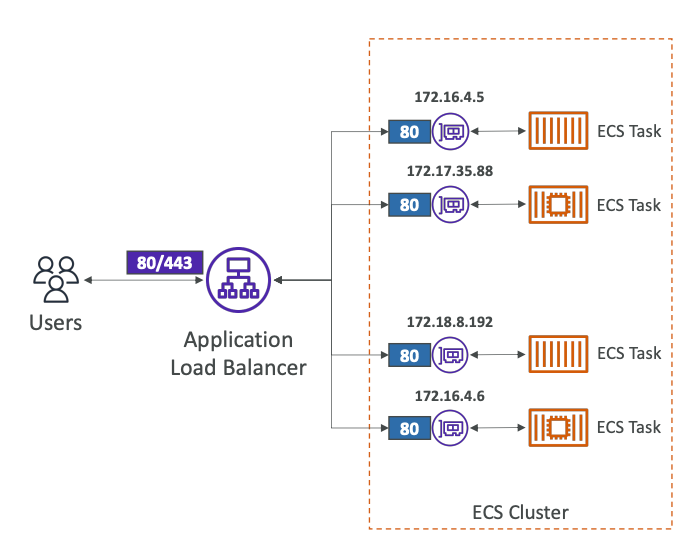
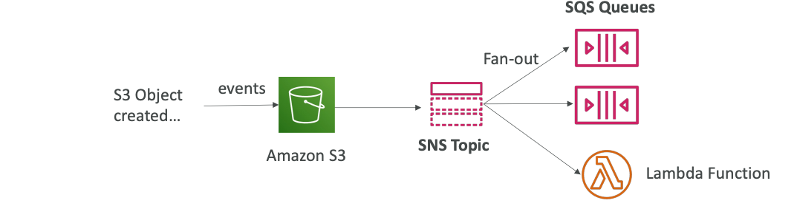
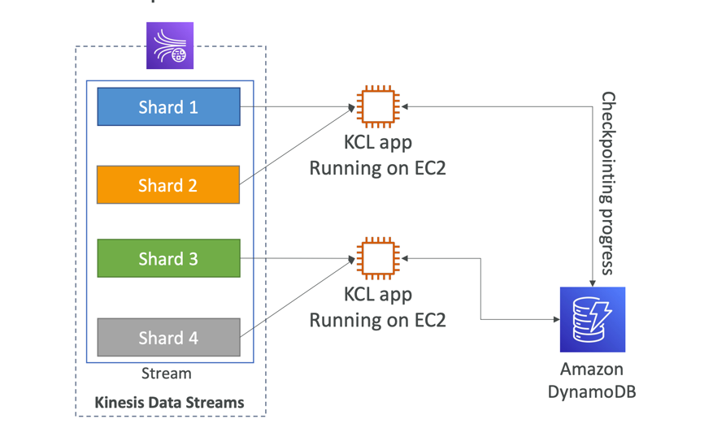

# AWS

Each resource has it unique **ARN** (Amazon Resource Name):
`arn:aws:s3::..`

## AWS Regions

Factors for choosing a particular AWS Region:
1. Compliance with data governance and legal requirements: data never leaves a region without your explicit permission.
2. Proximity to customers: reduced **latency**.
3. Available services withing an AWS Region: new services and new features aren't available in every Region.
4. Pricing: pricing varies region to region.

Each region has unique code.
Each region has at least **3 availability zones** (AZs).
**Min is 3, max is 6 AZs.**

AWS has 400+ POPs (or Edge Locations), 10+ Regional Caches in 90+ cities across 40+ countries.
Content is delivered to end users with lower latency.

AWS has Global Services:
1. AWS IAM
2. Route 53
3. CloudFront
4. WAF

But most AWS services are **Region-scoped**.

## AWS Limits and Quotas

API Rate Limits:
some services have a limit on the number of calls they can receive.
For dealing with Intermittent Errors: implement **Exponential Backoff**.
Use a case: `ThrottlingException`, `5xx` server errors.
**Retry mechanism already included in AWS SDK API calls**.
Must implement yourself if using the AWS API as-is or in specific cases.
For dealing with Consistent Errors: request an API throttling limit increase.

Service Quotas (Service Limits):
e.g. running on-demand standard instances: 1152 CPUs.
**You can request a service limit increase by opening a ticket**.
You can request a service quota increase by using the **Service Quotas API**.

## AWS Budget

In AWS, you can create budgets for an account and track billing per service.

## AWS S3
S3 — Simple Storage Service.
**Distributed Object Storage**.

Use-case:
1. Bucket + content
2. Web-site hosting
3. Data Lake
4. Software Delivery

S3 stores files, called **objects** into **buckets**.
**Buckets must have a globally unique name** (across all regions and accounts).
**Buckets are defined at the region level**.

Naming convention:
1. No uppercase
2. No underscore
3. 3-63 chars long
4. Not an IP
5. Must start with a lower case letter or number
6. Must NOT start with the prefix `xn--`
7. Must NOT end with the suffix `-s3alias`

### S3 Objects

Objects are files stored in S3.
**The key is the full path to the object**: `s3://my-bucket/my-file.txt`.
The key is composed of **prefix** and **object name**. 

1. Object values are the content of the **body**:
   Max object size is 5TB (~5000 GB).
   When upload an object that has size more than 5GB, **use multipart upload**.
2. **Metadata**
3. Tags
4. Tags
5. Version ID (if versioning is enabled)

S3 presigned URL vs. Public URL:
**Public URL** does not have security tokens, while **presigned URL has security token and signature**.
So, with a presigned URL object can be viewed, 
while with a Public URL, by default object can not be viewed.

### S3 Security

**User-based**: 
1. **IAM policies**: which API calls should be allowed for a specific user from IAM.

**Resource-based**:
1. **Bucket policies**: bucket wide rules from the S3 console — allows cross-account.
2. **Object Access Control List (ACL)** — finer grain (can be disabled).
3. **Bucket Access Control List (ACL)** — less common (can be disabled).

IAM principal can access an S3 object if:
The user **IAM permissions ALLOW  it** `OR` **resource policy ALLOWS it**
`AND` there's no explicit `DENY`.

Encryption: encrypt objects in S3 using encryption keys.
For enabling public URL, you need to expose `GetObject` permission to **public**.

```json
{
   "Version": "2012-10-17",
   "Statement": [
      {
         "Sid": "GetObjectPublicly",
         "Effect": "Allow",
         "Principal": "*",
         "Action": [
            "s3:GetObject"
         ],
         "Resource": "arn:aws:s3:::DOC-EXAMPLE-BUCKET/*"
      }
   ]
}
```


With IAM permissions to the IAM user:


With Roles:


**Bucket Block Public Access**:
Extra layer of S3 security.
These settings were created to prevent company data leaks.
Even, if we give it public access, bucket will be private.

With Data Lake use-case you can query objects.
Also, AWS S3 supports events, mainly for integration purposes.

#### S3 Static Website Hosting

S3 can host static websites and have them accessible on the internet.

The website URL will be (depending on the Region):
`http://bucket-name.s3-website-aws-region.amazonaws.com`
OR
`http://bucket-name.s3-website.aws-region.amazonaws.com`

To make it accessible to the users, **S3 bucket must be public**.

### S3 Versioning

You can version your files in S3.
**It is enabled at the bucket level**.

The Same key overwriting will change the version to 1, 2, 3, etc.
<br>
**It is the best practice to version objects in bucket**:
1. Protect against unintended deletes (ability to restore version)
2. Easy rollback to a previous version

**Any file that is not versioned prior to enabling versioning will have version 'null'**.
**Version suspending does not delete the previous version**.

#### S3 Replication (CRR and SRR)

Cross-Region Replication (CRR) and Same Region Replication (SRR).

**Must enable Versioning in source and destination buckets**.
Buckets can be in different AWS accounts.
Copying is asynchronous.
Must give proper IAM permissions to S3.

After you enable Replication, **only new objects are replicated**.
Existing objects can be replicated using **S3 Batch Replication**.
For delete operations:
1. Can replicate delete markers from source to the target.
2. Deletions with a Version ID are not replicated

**Also, there is no 'chaining' replication**:
If `bucket-1` has replication to `bucket-2`, which has replication into `bucket-3`:
**then objects created in `bucket-1` are not replicated to `bucket-3`**.

**By default, delete markers are not replicated**, but it can be enabled.
**Deletes are not replicated, only delete markers**.

Use-case:
1. CRR — compliance, lower latency access, replication across accounts
2. SRR — log aggregation, live replication between production and test accounts.

### S3 Storage Classes

**S3 has very high durability (99.99999999999%, 11 9's) of objects across multiple AZ**.
If you store 10,000,000 objects with S3,
you can on averagely expect loss of a 1 object every 10,000 years.
This durability is the same for all storage classes.

S3 Standard has 99.99% availability -> not available 53 minutes a year.

1. S3 Standard - General Purpose: 99.99% availability,
   used for frequently accessed data, low latency and high throughput,
   sustain 2 concurrent facility failures, no retrieval charges.
   Use-case: **Big Data analytics, mobile and gaming applications, content distribution, etc**.
2. S3 Standard-Infrequent Access (IA): 99.9% availability, used for data that is less frequently accessed,
   but requires rapid access when needed lower cost than S3 standard.
   Use-case: **Disaster Recovery, backups**.
3. S3 One Zone-Infrequent Access: 99.5% availability, high durability in a single AZ,
   data lost when AZ is destroyed.
   Use-case: **Secondary backups of on-premise data, or data you can recreate**.
4. S3 Glacier Instant Retrieval: **Low cost object storage meant for archiving / backup**;
   pricing model: price for storage + object retrieval cost.
   Instant Retrieval - millisecond retrieval, great for data accessed once a quarter;
   minimum storage duration of 90 days.
5. S3 Glacier Flexible Retrieval: expedited (1 to 5 mins),
   standard (3 to 5 hours), bulk (5 to 12 hours) — free;
   minimum storage duration of 90 days.
6. S3 Glacier Deep Archive: **for long term storage**;
   retrieval: standard (12 hours), bulk (48 hours), minimum storage duration of 180 days. 
7. S3 Intelligent Tiering: small monthly monitoring and **auto-tiering fee**,
   **moves objects automatically between Access Tiers based on usage**,
   there are no retrieval charges in S3 Intelligent-Tiering.
   Tiers:
   1. Frequent Access Tier (automatic): default tier.
   2. Infrequent Access Tier (automatic): objects not accessed for 30 days.
   3. Archive Instant Access Tier (automatic): objects not accessed for 90 days.
   4. Archive Access Tier (optional, configurable): objects not accessed from 90 days to 700+ days.
   5. Deep Archive Access Tier (optional, configurable): objects not accessed from 180 days to 700+ days.

Objects can be moved between classes manually or using **S3 Lifecycle configurations**.

S3 Lifecycle Rules:

1. Transition Actions: configure objects to transition to another storage class;
   e.g., move objects to Standard IA class 60 days after creation,
   move to Glacier for archiving after 6 months.
2. Expiration Actions: configure objects to expire (delete) after some time:
   e.g., Access log files can be set to delete after 365 days,
   delete old versions of file (if versioning is enabled).

Rules can be created for a certain prefix: `s3://mybucket/mp3/*`.
Rules can be created for certain object tags: `Department: Finance`.

#### S3 Analytics, Storage Class Analysis

Help you decide when to transition objects to the right storage class.
Recommendations for Standard and Standard-IA, but **does not work for One-Zone IA or Glacier**.
Report is updated daily in `.csv` format.
24 to 48 hours to start seeing data analysis.


### S3 Event Notifications

`S3:ObjectCreated`, `S3:ObjectRemoved`, `S3:ObjectRestore`, `S3:Replication`.
Object name filtering possible: `*.jpg`.
Use-case:
1. generate thumbnails of images uploaded to S3.

Can create as many S3 events as desired.
S3 event notifications typically deliver events in seconds,
but sometimes it can take a minute or longer. 


**To send data to other services, S3 needs permissions a.k.a Resource Access Policy**.

Using S3 events with **EventBridge**, you can propagate events to other services as destinations using:
1. Advanced filtering with JSON rules
2. Multiple destinations
3. Archive events, Replay events, etc.


### S3 Baseline Performance

S3 automatically scales to high request rates, latency 100-200ms.
Your application can achieve at least
**3,500 PUT/COPY/POST/DELETE or 5,500 GET/HEAD requests per second per prefix in a bucket**.

Optimizing S3 performance:
1. Multi-Part upload: recommended for files > 100 MB, must use it for files > 5 GB,
   can help parallelize uploads (speed up transfers).
   
2. S3 Transfer Acceleration: increase transfer speed by transferring file
   to an AWS edge location which will forward the data to the S3 bucket in the target region;
   compatible with multi-part.
   
3. S3 Byte-Range Fetches: parallelize GETs by requesting specific byte ranges,
   better resilience in case of failures, can be used to speed download.
   

#### S3 Server Side Filtering

Retrieve less data using SQL by performing **server-side filtering**.


#### S3 Object Metadata, Tags

When uploading an object, you can also assign metadata
S3 User-Defined Object Metadata (K-V pairs):
1. User-Defined metadata must start with `x-amz-meta`.

S3 stores user-defined metadata keys in lowercase.
Metadata can be retrieved while retrieving the object.

S3 Object Tags are K-V pairs for objects in S3.
1. **Useful for fine-grained permissions (only access specific objects with specific tags)**.
2. **Useful for analytics purposes (using S3 Analytics to group by tags)**.
<br>

**You cannot search the object metadata or object tags**.

**Instead, you must use an external DB as a search index such as DynamoDB**.

### S3 Object Encryption

Objects can be encrypted using one of 4 methods:
1. **Server-Side Encryption** (SSE):
   1. Server-Side Encryption with S3-Managed Keys (SSE-S3): managed by AWS - **Enabled by Default**.
      Encryption type is **AES-256**, must set header `"x-amz-server-side-encryption":"AES256"`.
   2. Server-Side Encryption with KMS Keys stored in AWS KMS (SSE-KMS): keys are managed by AWS KMS.
      KMS advantages: **user control + audit key usage using CloudTrail**.
      Must set header `"x-amz-server-side-encryption":"aws:kms"`.
      You maybe impacted by the KMS limits:
      KMS quota per second (5500, 10000, 30000 req/s based on the region).
      **So, if you have very high throughput S3 bucket, you may go in throttling**.
   3. Server-Side Encryption with Customer-Provided Keys (SSE-C): you are managing your own keys.
      **S3 does not store the encryption key you provide**, **HTTPS must be used**.
      **Supported only in CLI and SDK**.
2. **Client-Side Encryption**: **Clients must encrypt data themselves before sending to S3**.
   **Data decryption happens on the client side too**.
   **Don't need to indicate AWS that you are encrypting object at your own**.

Encryption in flight is also called SSL/TLS.
S3 exposes two endpoints:
1. HTTP — non encrypted
2. HTTPS — encryption in flight, recommended

Force Encryption in Transit: `aws:SecureTransport`:


**Bucket Policies are evaluated before 'Default Encryption'**.

### S3 CORS

**Cross-Origin Resource Sharing** (CORS).
Origin = `protocol` + `host` + `port`.

Web Browser based mechanism to allow requests 
to other origins while visiting the main origin.

**Same origin**: `http:example.com/app1` & `http:example.com/app2`.
<br>
**Different origins**: `http:www.example.com/app1` & `http:other.example.com/app1`.

**The requests won't be fulfilled unless the other origin allows for the requests,
using CORS Headers** (example: `Access-Control-Allow-Origin`).

**If a client makes a cross-origin request on our S3 bucket,
we need to enable the correct CORS headers using JSON configuration**.
**In `AllowedOrigins` you must specify URL without last slash `'/'`**.
You can allow specific origin or for * (all origins).


#### S3 MFA Delete

MFA Delete is extra protection to prevent deletion of object versions.

MFA will be required to **permanently delete an object version**,
or **suspend versioning on the bucket**.
To use MFA Delete, you must **enable versioning on the bucket**.
**Only the bucket owner (root account) can enable/disable MFA Delete**.

#### S3 Access Logs

For audit purpose, you may want to log all access to S3 buckets.
Any request made to S3, from any account, authorized or denied,
will be **logged into another S3 bucket**.

The target bucket must be in the same AWS region.
To the target bucket new policy will be issued,
that allows `logging.s3.amazonaws.com` to do `s3:PutObject` on the target bucket. 

**Do not set your logging bucket to be the monitored bucket**.
**It will create a logging loop, and your bucket will grow exponentially**.


#### Pre-signed URLs

Generate pre-signed URLs using the S3 Console, CLI, or SDK.

URL expiration:
1. S3 Console: 1m to 720m (12 hours)
2. CLI and SDK: 3600s to 604800s (~168 hours)

Users given a pre-signed URL inherit the permissions of the user that generated the URL.


Use-case:
1. Allow only logged-in users to download a premium video from your S3 bucket.
2. Allow an ever-changing list of users to download files by generating URLs dynamically.

#### S3 Access Points

S3 Access Points can simplify management for S3 buckets.
Each Access Point has:
1. **DNS name (Internet Origin or VPC Origin)**
2. **An access point policy — to manage security at scale**

To use VPC Origin, we must create a VPC endpoint to access the Access Point.
The created VPC endpoint must allow access to the target bucket and Access Point.


#### S3 Object Lambda

Use AWS Lambda Functions to change the object
before it is retrieved by the client.
On top of the bucket we want to modify, we should create
**S3 Access Points** and **Object Lambda Access Points**.

All Lambdas will access the bucket by contacting only **one** S3 Access Point.


Use-case:
1. Redacting personally identifiable information for analytics or non-production environments.
2. Converting data formats, e.g., XML to JSON.
3. Resizing and watermarking images on the fly using caller-specific details.

## AWS CloudFront

Region-Globally, **Content Delivery Network (CDN)**: improves read performance,
content is cached at the edge locations.
CloudFront content called **distribution**.

216 POPs globally (edge locations).
**DDoS protection**, integration with Shield, AWS Web Application Firewall (WAF).

CloudFront Origins:
1. S3 bucket with **CloudFront Origin Access Control (OAC)**: 
   **buckets are still private, but content can be shared via CloudFront distribution**,
   CloudFront can be used as ingress to upload files to S3.
2. Custom Origin (HTTP): Application Load Balancer, EC2 Instance,
   S3 website (must first enable the bucket as a static website),
   or any HTTP backend.


### CloudFront vs. Cross-Region Replication

CloudFront:
1. Global-Edge Network (216 POPs)
2. Files are cached for a TTL
3. **Great for static content that must be available everywhere**

Cross-Region Replication:
1. Must be setup for each region you want replication to happen
2. Files are updated in near real-time (no caching happens)
3. Read-only
4. **Great for dynamic content that needs to be available at low-latency in few regions**

### Caching

**The cache lives at each CloudFront Edge Location**.
CloudFront identifies each object in the cache using **Cache Key**.
You want to maximize the Cache Hit ratio to minimize requests to the origin.
You can invalidate part of the cache using the `CreateInvalidation` API.

#### Cache Key

A unique identifier for every object in the cache.
By default, it consists of `hostname` + `resource portion of the URL`.
E.g., hostname: `mywebsite.com` and resource portion: `/content/stories/example-story.html`?ref=123abc.


#### Cache Policies

You can add other elements (HTTP headers, cookies, query strings)
to be part of the Cache Key using **CloudFront Cache Policies**.
You can use existing Cache Policies in CloudFront.

Using CloudFront Cache Policies, you can control 
**on what cache based on** (headers, cookies, query strings) and
**TTL** (can be set using Cache-Control header, Expires header).

**All HTTP headers, cookies, and query strings 
that you include in the Cache Key will be automatically included in origin requests**.

With **Origin Request Policy**, you can specify values that you want to include in origin requests
without including them in the Cache Key (no duplicated cached content).
Use-case:
1. When origin needs more information to process the request,
   but there is no need to cache all the information.
   


#### Cache Invalidations

In case you update the origin content,
CloudFront does not know anything about this
and will only get the refreshed content after the TTL has expired.

However, you can force an entire or partial cache refresh by performing **CloudFront Invalidation**.
You can invalidate all files (`*`), or a specific path (`/images`).

#### Cache Behaviors

Configure different settings for a given URL path pattern.
Also, route to different kinds of origin groups based on content-type or the path pattern.
**Default behavior is (`*`)**. 


Also, you can **separate access to the dynamic and static resources using Cache Behaviors**:


### ALB or EC2 as an Origin

**EC2 Instances must be public, since there is no VPC connectivity in CloudFront**.

**Application Load Balancer must be public (while EC2 Instances can be private),
since there is no VPC connectivity in CloudFront**.


#### Geo Restriction

You can restrict who can access your **distribution**.
`Allowlist` or `Blocklist` can be setup.
The 'country' is determined to use a 3rd party Geo-IP database.

Use-case:
1. Copyright laws to control access to content.

### Signed URL / Signed Cookies

**Distribution of paid shared content to premium users** over the world.
**CloudFront Signed URL can be used** with attached policy that includes:
1. URL expiration
2. IP ranges to access the data from
3. Trusted signers

How long should the URL be valid for:
1. Shared content (movie, music): few minutes
2. Private content (private to the specific user): for years

**Signed URL**: access to the individual files (one signed URL for file).
<br>
**Signed Cookies**: access to multiple files (one signed cookie for many files).


#### Signed URL Process

Two types of signers:
1. `Trusted Key Group`: **recommended**, creating and rotating keys.
2. AWS account that contains a CloudFront Key Pair: **no recommended**, need to use root account credentials.

In CloudFront distribution **one or more trusted key groups can be created**.
Private and public RSA keys are required.

### Pricing

CloudFront Edge Locations are all around the world.
**The cost of data out per edge location varies**.

**The more you transferred out the CloudFront, the lower the cost**.

The Number of Edge Locations can be reduced in order to do cost reduction.
There are three price classes:
1. All: all regions, the best performance
2. 200: most regions, but excludes the most expensive regions
3. 100: only the least expensive regions


#### Origin Groups

To increase high availability and do failover.


S3 + CloudFront -> Region-level High Availability.


#### Field Level Encryption

Protect user sensitive information through application stack.
Sensitive information is encrypted at the edge close to the user.
Uses asymmetric encryption.

Usage:
1. Specify a set of fields in POST requests that needed to be encrypted (up to 10 fields).
2. Specify the Public key to encrypt them.
3. Decrypt fields with a Private key.


#### Real-Time Logs

Get real-time requests received by CloudFront sent to Kinesis Data Streams.
Monitor, analyze, and take actions based on content delivery performance.
Allows you to choose:
1. Sampling Rate: percentage of request you want to receive
2. Specific fields and specific Cache Behaviors


## AWS ECS

**ECS (Elastic Container Service) — Docker on AWS**.
Docker images are stored in image repositories:
Docker Hub (`https://hub.docker.com`) - public repository,
**AWS ECR (Elastic Container Registry)** - private repository,
but also has a public repository (ECR Public Gallery - `https://gallery.ecr.aws`).


Container Management on AWS:
1. **ECS (Elastic Container Service)** — Amazon Container Platform.
2. **EKS (Elastic Kubernetes Service)** - Managed Kubernetes service.
3. **Fargate** — Amazon's serverless container platform, works with ECS and EKS.
4. **ECR (Elastic Container Registry)** — image repository.

Launch Docker containers on AWS means launch **ECS Tasks** on ECS Clusters.
Each Task includes containers.
Container can be essential (if it crashes, a whole task crashes) or not.
**ECS Cluster needs provisioned and maintained infrastructure based on launch type**.
<br>
Launch types:
1. EC2 Launch Type: Each EC2 Instance must run ECS agent to register in the ECS Cluster.
   **AWS take care of starting or stopping containers**.
   
2. Fargate Launch Type: **you don't provision the infrastructure (no EC2 Instances to manage)**,
   it's all **serverless**.
   You just create **task definitions**, AWS runs ECS Tasks based on the CPU/RAM you need.
   To scale, the number of tasks can be increased.
   **Easier to manage, comparing with EC2 Launch Type**.
   

### IAM Roles for ECS

1. **EC2 Instance Profile (EC2 Launch Type only)**:
   used by the ECS agent, makes API calls to ECS service,
   send container logs to CloudWatch Logs, pull docker images from ECR,
   reference sensitive data in Secrets Manager or SSM Parameter Store
2. ECS Task Role:
   allows each task to have a specific role

**IAM Roles assigned per Task Definition**.


### Load Balancer Integrations


**Application Load Balancer** is supported and works for most use cases.
<br>
**Network Load Balancer** is recommended only for high throughput.
<br>
**Classic Load Balancer** is supported, but not recommended (no Fargate).

### Data volumes

Mount EFS file systems onto ECS tasks.
**S3 cannot be mounted as a file system**.
Works for both **EC2** and **Fargate** launch types.
**Tasks running in any AZ will share the same data in the EFS**.
**Also, on EC2 you can mount data on EC2 Instance storage**.
**On Fargate, you can use ephemeral storage with capacity of 20GB — 200GB**.

`Fargate + EFS = Serverless`.


Use-case:
1. Persistent multi-AZ shared storage for your containers.
2. Sidecar container.

### Service Auto Scaling

Automatically increase/decrease the desired number of ECS Tasks.
ECS Auto Scaling uses **AWS Application Auto Scaling**:
1. ECS Service Average CPU Utilization
2. ECS Service Average RAM Utilization
3. ALB Request Count Per Target

**Target Tracking** - scale based on target value for a specific CloudWatch Metric.
<br>
**Step Scaling** - scale based on a specific CloudWatch Alarm.
<br>
**Schedule Scaling** - scale based on a specified date/time.

Fargate Auto Scaling is much easier to setup (because Serverless).
<br>
Auto scaling ECS based on EC2 Launch type:
1. Auto Scaling Group
2. ECS Cluster Capacity Provider: smarter one, recommended to use.

### Rolling Updates

When updating from v1 to v2,
we can control how many tasks can be started and stopped, and in which order.


### Arc examples

ECS Tasks invoked by Event Bridge:


ECS Tasks invoked by Event Bridge Schedule:


### Task Definitions

Task Definitions are **metadata in JSON format to tell ECS how to run a Docker container**.
It contains information, such as
1. image name
2. port binding for container and host
3. memory and CPU required
4. Environment variables: **Hardcoded**, **SSM Parameter Store**, **Secrets Manager** or
   **Environment files - `.env` (bulk) from S3 bucket**.
5. Networking information
6. IAM Role
7. Logging configuration

**Up to 10 containers can be defined in task definition**.
**Each task from within hosted on EC2 Instance is going to be
accessible from a different (random) port on the host EC2 Instance**.

We get a Dynamic Host Port Mapping if you define only the container port in the task definition.
**You must allow on the EC2 Instance's Security Group any port from ALB's Security Group**.
The ALB finds the right port on your EC2 Instances.


On Fargate, **each task has a unique private IP**.
Only define the container port (host port is not applicable).
You must allow only port 80 on ECS ENI and 80/443 on ALB.



### Task Placement

When a task of type EC2 is launched, ECS must determine where to place it,
with the constraints of CPU, memory, and available port.
Similarly, when a service scales in,
ECS needs to determine which task to terminate.

To assist with this, you can **define a task placement strategy** 
and **task placement constraints**.

`Placement strategies`:
1. **Binpack**: place tasks based on the least available amount of CPU or memory, minimizes the number of instances,
   brings cost savings.
2. **Random**: place tasks randomly.
3. **Spread**: place the task evenly based on specified value, e.g., `instanceID`, `attribute:ecs.availability-zone`

Placement strategies can be mixed together.

`Placement constraints`:
1. `distinctInstance`: place each task on a different container instance
2. `memberOf`: places tasks on instances that satisfy an expression, uses Cluster Query Language,
   e.g., `"attribute:ecs.instance-type =~ t2.*"`

AWS Task Placement Process:
1. Identify the instances that satisfy the CPU, memory, and port requirements in the task definition.
2. Identify the instances that satisfy the task placement constraints.
3. Identify the instances that satisfy the task placement strategies.

### ECR

**Elastic Container Registry**.
Store and manage Docker images on AWS.
Backed by S3.
Supports image vulnerability scanning, versioning, image tags, image lifecycle.

#### Copilot

AWS Copilot is a CLI tool to build, release,
and operate production-ready containerized applications.
Automated deployments with one command using CodePipeline.
Deploy to multiple environments.


### EKS

**Elastic Kubernetes Service (EKS)**.
**Managed Kubernetes cluster on AWS (master node is managed, you only create a worker ones)**.
EKS supports EC2 if you want to deploy worker nodes or Fargate to deploy serverless containers.

Use-case: if your company is already using Kubernetes on-premises
or in another cloud and wants to migrate to AWS using Kubernetes.
**Kubernetes is cloud-agnostic** (can be used in any cloud - AWS, Azure, GCP).
<br>
Node types:
1. Managed Node Groups: EKS creates and manages Nodes (EC2 Instances) for you.
2. Self-Managed Nodes: nodes created by you and registered to the EKS cluster,
   can be prebuilt using AMI.
3. Fargate mode: no maintenance required, no nodes are managed.

Also, you can attach Data Volumes to EKS cluster.
Need to specify StorageClass manifest on your EKS cluster.
Leverages a Container Storage Interface (CSI) compliant driver.

Support of:
1. EBS
2. EFS
3. FSx for Lustre
4. FSx for NetApp ONTAP

## AWS Elastic Beanstalk

**Elastic Beanstalk is a developer centric view of deploying an application on AWS**.
Just the application code is the responsibility of the developer.
Elastic Beanstalk **uses CloudFormation to deploy infrastructure stacks**.

Beanstalk is free, but you pay for the underlying instances.
<br>
**Components**:
1. Application: collection fo Elastic Beanstalk components (environments, versions, configurations).
2. Application Version.
3. Environment
   1. Collection of AWS resources running an application version (only one application version at a time).
   2. Tiers: **Web Server Environment Tier** and **Worker Environment Tier**
   **You can create multiple environments** (dev, test, prod).

Elastic Beanstalk supports many platforms and languages,
but if your is not supported, you can create your custom support.
<br>
**Web Server Tier Environment vs. Worker Tier Environment**:
Worker Tier Environment does not have any client directly accessing EC2 Instances,
instead it can be SQS queue or SNS topic.

Worker Environment can be combined with Web Environment.
**Also, environments can be cloned**.


### Deployment Options for Updates

1. **All at once** (deploy all in one go): fastest,
   but instances are not available to serve traffic for a bit (downtime),
   no additional costs.
2. **Rolling**: update a few instances at a time, runs below capacity
   (bucket, a partial set of instances, **size can be set**), 
   and then move onto the next bucket one the first bucket is healthy,
   **long deployment**, no additional costs.
3. **Rolling with batches**: like rolling, but always **runs at capacity**,
   so old application is still available, additional cost,
   additional batch is removed at the end of the deployment,
   **good for the production environment**.
4. **Immutable**: spins up new instances in a new temporary ASG,
   deploys a version to these instances, and then swaps all the instances when ready,
   **high cost** since double capacity, **longest deployment**, but **quick rollback**.
5. **Blue-Green**: **create a new environment** and switch over when ready,
   not a direct feature of Elastic Beanstalk,
   can be integrated with Route 53 Routing Policies.
6. **Traffic splitting**: send a small percentage of traffic to new deployment,
   used for **canary testing**, automated rollback.


Deployment Policy is inherited from the last artifact deployed.
Deployment Policy can be overwritten.

### CLI

Additional CLI can be installed, called "EB cli", which makes working with Beanstalk from the CLI easier.

Basic commands:
`eb create`, `eb status`, `eb health`, `eb events`, `eb logs`, `eb deploy`, etc.

It's helpful for your automated deployment pipelines.

### Extensions

**All the parameters set in the UI can be configured with code using files**.
It must be in `.ebextensions/` directory in the root of source code.
It must be in YAML/JSON format.
It must have `.config` extension.
Also, extensions have ability to add resources such as RDS, ElastiCache, DynamoDB, etc.
Resources managed by `.ebextensions` get deleted if the environment goes away.

Example: enable HTTPS on Load Balancer can be setup in `https-load-balancer.config`
in `.ebextensions/` folder.

**For running Jobs periodically, and asynchronously 
we can use `cron.yaml` in combination with Worker Environments**.

#### Lifecycle Policies

Elastic Beanstalk can store at most 1000 application versions.
All application versions are stored in S3.
If you don't remove old versions, you won't be able to deploy anymore.
For removal and environment management purposes, use a lifecycle policy:
1. Based on time
2. Based on space
After version deletion, **you can set retention policy to retain or delete source bundle from S3**.
**Versions that are currently used won't be deleted**.

#### Migration

**After creating an Elastic Beanstalk environment,
you cannot change the Elastic Load Balancer type** (only configuration).
To do this, you need to perform a migration:
1. Create a new environment with the same configuration except LB (can't clone).
2. Deploy your application onto the new environment
3. Shift traffic to the new environment: `CNAME` swap or Route 53 update.

RDS can be provisioned with Elastic Beanstalk, which is great for dev/testing.
This is not a good option for production environment,
since a database will be connected to the Elastic Beanstalk environment lifecycle.
The best way is to separate database and beanstalk environment.
**It is highly recommended to delete the associated CloudFormation
stack after deleting an environment**.

## AWS CloudFormation

CloudFormation — managing your infrastructure in code, **IaC (Infrastructure as Code)**.
CloudFormation cuts out manual setup of AWS services.
All this manual work will be very tough to reproduce in:
1. Another AWS Account
2. Another AWS Region

**CloudFormation is a declarative way of outlining your AWS Infrastructure** for any resources.
All the code can be version controlled using git.
Template deletion also can be automated.
**Template - YAML/JSON file, describes AWS resources and their properties**.
**Stack - created resources that was described in CloudFormation Template**.

**Templates have to be uploaded in S3** and then referenced in CloudFormation.
**Templates are immutable**, so you can't update previous ones,
you must create a new one instead.
**Name identifies Stack**.
**After Stack deletion, all resources will be deleted**.

Deploying CloudFormation Templates:
1. Manual way: CloudFormation Designer + AWS Console
2. Automated way: YAML/JSON files + CLI to deploy

### Components

1. **Resources**: your AWS resources declared in the template **(REQUIRED)**.
2. **Parameters**: the dynamic inputs for your template.
3. **Mappings**: the static variables for your template.
4. **Outputs**: references to what has been created.
5. **Conditionals**: conditions to perform resource creation.
6. **Metadata**

Also, there are Template helpers:
1. References
2. Functions

### Resources

Resources are the **core, required component** of your CloudFormation Template.
Resources represent AWS resources.
Resource types identifiers are of the form: `AWS::aws-product-name::data-type-name`
Resources are declared and can reference each other.

Each resource must have `Type` and `Properties`, a key-value pairs.

### Parameters

Parameters are a way to provide inputs to your AWS CloudFormation Template.
**Parameters can help in Template reuse**.
Also, sometimes parameters are inevitable
since some inputs cannot be determined ahead of time.

You will not have to re-upload a template to change the value of parameter.

Parameters can be controlled by all these settings:
1. Type
2. Description
3. Constraints
4. ConstraintDescription
5. Min/MaxLength
6. Min/MaxValue
7. Defaults
8. AllowedValues
9. AllowedPattern
10. NoEcho

To reference a parameter: `!Ref MyVPC`.
The `Fn::Ref` function can be leveraged to reference parameters,
the shorthand for `Fn::Ref` is `!Ref`.
Also, Ref function can be used to reference resources.

**AWS Pseudo Parameters**:
1. `AWS::AccountId`
2. `AWS::NotificationARNs`
3. `AWS::NoValue`
4. `AWS::Region`
5. `AWS::StackId`
6. `AWS::StackName`

### Mappings

Mappings are **fixed variables** in CloudFormation Template.
All the values are hardcoded for particular Template.

Some examples of using Mappings:
1. Region
2. AZ
3. AWS Account
4. Environment (dev vs. production)

`Fn::FindInMap` is used for accessing mapping values.
<br>
`!FindInMap [MapName, TopLevelJKey, SecondLevelKey]`


### Outputs

**The outputs declare optional output values that we can import into other templates**.
Outputs also can be viewed in AWS Console or using AWS CLI.

They are very useful, for example, if you define a network CloudFormation,
and output the variables such as VPC ID and your Subnet's IDs.

**It's the best way to perform cross-stack collaboration**.

**You can't delete a CloudFormation Stack if
its outputs are being referenced by another CloudFormation Stack**.


**Exported output names must be unique within your region**.
<br>

Then you can import a value using `Fn::ImportValue` function,
or `!ImportValue` for short.


### Conditions

**Used to control the creation of resources or outputs
based on a logical condition**.
<br>
Some common conditions:
1. Environment (dev/test/prod)
2. AWS Region

Each condition can reference another condition, parameter value or mapping.


### Intrinsic Functions

1. `Ref`: reference a resource will return a physical ID of it,
   reference a parameter will return its value.
2. `GetAtt`: get attribute from a resource, e.g., `!GetAtt EC2Instance.AvailabilityZone`.
3. `FindInMap`: return a named value from a specific key, e.g., `!FindInMap [ MapName, TopKey, LowKey ]`.
4. `ImportValue`: import values from other templates.
5. `Join`: join values with a delimiter, e.g., `!Join [ delimiter, [ values... ] ]`.
6. `Sub`: substitute variables from a text
7. Condition Functions: (`If`, `Not`, `Equals`, etc.)

### Rollbacks

Stack creation fails:
1. Default: everything rolls back -> get deleted, atomicity.
2. Preserve successfully provisioned resources, while
   rolling back failed resources to the last stable state.

Stack update fails:
the stack automatically rolls back to the previous known working state,
ability to see in the log what happened and error messages.

#### Stack Notifications

Send Stack events to SNS Topic, Email, Lambda.
**SNS Integration can be enabled using Stack Options**.

#### ChangeSets

When you update a stack, you need to know what changes before it happens for greater confidence.
ChangeSets won't say if the update will be successful or not, **just what will happen**.

#### Nested Stacks, StackSet

**Nested stacks are stack as part of other stacks**.
**They isolate common patterns and components in separate stacks and
call them from other stacks for reuse purposes**.
<br>
To update a nested stack, you need to update the parent first.
<br>
StackSets are for create, update, or delete stacks across
multiple accounts and regions with a single operation.
**When you update a stack set, all associated stack instances
are updated throughout all accounts and regions**.

#### Drift

CloudFormation doesn't protect you against manual configuration changes.
**CloudFormation Drift can be used for knowing resources been drifted**.

CloudFormation shows the difference between actual and expected state.

Not all resources are supported.

#### Stack Policies

During a CloudFormation Stack update,
all update actions are allowed on all resources (default).

**A Stack Policy is a JSON document that defines
the update actions that are allowed no specific resources during Stack updates**.

With a Stack Policy, by default, all resources in the stack are protected.

## AWS Integration and Messaging

When multiple applications appear, 
they will inevitably need it to communicate with one another using:

1. Synchronous communication (app to app)
2. Asynchronous communication (app to queue to app):
   1. SQS queue model
   2. SNS pub/sub model
   3. Kinesis real-time processing/streaming model

**Using asynchronous communication systems can scale independently**.

## SQS

Simple Queuing Service (SQS):
producers send a message to the queue, consumers poll it and process.

### Standard Queue

Fully managed service, used to decouple applications.
* Unlimited throughput, unlimited number of messages in queue
* At-least-once delivery
* Best-effort ordering

**Default retention of messages: 4 days, max: 14 days**.
<br>
**Low latency**: (less than 10ms on publish and receive).
**Limitation of 256KB per message sent**.
<br>
**Can have duplicate messages (at least once delivery)**.
<br>
**Can have out of order messages**.

<br>
SQS can be integrated with CloudWatch Metrics and Alarms for autoscaling purposes:


### Producing Messages

Producer sends a message to the Queue using the SDK SendMessage API.
The message is persisted in SQS **until a consumer deletes it**.
Or retention is off.

### Consuming Messages

Consumers can be running on EC2 Instances, other servers, or AWS Lambda).
Consumer polls queue for messages using SDK ReceiveMessages API, and **can receive up to 10 messages at a time**.
**Competing consumers can increase throughput**.
**By deleting message from SQS queue we are signaling that message was successfully processed**.
<br>
**Purge a queue — delete all messages from the queue**.

### Security

`Encryption`:
* In-flight encryption using HTTPS API;
* At-rest encryption using KMS keys;
* Client-side encryption if the client wants to perform encryption/decryption itself.
`Access Controls`:
* IAM Policies to regulate access to the SQS API.
`SQS Access Policies` (similar to S3 bucket policies):
* **Useful for cross-account access to SQS queues**.
* **Useful for allowing other services to send messages to an SQS queue**.

### Queue Access Policy

JSON Resource IAM Policies.

Use-cases:
1. Cross-Account Access
   
2. Access from other services
   

### Message Visibility Timeout

After a message is polled by a consumer, **it becomes invisible to other consumers**.
By default, the 'message visibility timeout' is `30` seconds.
**If a message is not deleted from the queue, and message visibility timeout is elapsed,
the message will be visible for other consumers**.


**Simply put, if a message is not processed within the visibility timeout,
it will be processed twice**.
A consumer could call the `ChangeMessageVisibility` API to get more time.

* If visibility timeout is high (hours), and consumer crashes,
re-processing will take a lot of time.

* If visibility timeout is too low (seconds), we may get duplicate processing.

### Dead Letter Queue (DLQ)

If a message is processed too many times and not successfully, 
it goes to the DLQ.

Useful for _debugging_.

**DLQ of a FIFO queue must be also a FIFO queue**.
<br>
**DLQ of a Standard queue must be also a Standard queue**.

When working with DLQs, it's a good idea to set long retention in DLQ.

### Redrive to Source

Feature to help consume messages in the DLQ to understand 
what is wrong with them.

When everything is fixed, you can redrive
messages from DLQ into the source queue.

### Delay Queues

Delay a message, so consumers don't see it immediately (up to 15 minutes).
Default is 0 seconds.
Can set a default at queue level.
Message delay can be overridden by sending data with `DelaySeconds` parameter.

### Long Polling

Long Polling: When a consumer requests messages from the queue,
it can optionally wait for messages to arrive if there are none in the queue.
**Long Polling decreases the number of API calls made to SQS,
while increasing the latency of your application**.

Using `ReceiveMessageWaitTimeSeconds`, on each polling you can tell your consumer: 
how long to wait before getting a response.

The wait time can be **between 1 and 20 seconds**.
Consumers will wait up to x seconds if the queue is empty.
**The default one is 0 seconds (Short Polling)**.

### Extended Client

Extended client helps to deliver large messages:


Use-cases:
* Video files
* Large documents

### SQS API

* `CreateQueue(MessageRetentionPeriod)`
* `DeleteQueue`
* `PurgeQueue`: delete all the messages in queue
* `SendMessage(DelaySeconds)`
* `ReceiveMessage`
* `DeleteMessage`
* `MaxNumberOfMessages`: default is 1, max 10 (for `ReceiveMessage` API)
* `ReceiveMessageWaitTimeSeconds`: how long to wait before getting a response (Long Polling)
* `ChangeMessageVisibility`: change the message timeout

Also, batch APIs for `SendMessage`, `DeleteMessage`, `ChangeMessageVisibility`
helps decrease costs.

### FIFO Queue

First In First Out (ordering of messages in the queue).
**FIFO is a queue with limited throughput: `300msg/s` without batching, 
and `3000 msg/s` with**.
* Exactly-once send capability (by removing duplicates)
* Messages are processed in order by the consumer

Queue's name must ends with `.fifo`

### FIFO Deduplication

Deduplication interval is 5 minutes.
**If the same message is delivered in this interval,
it will be refused**.

Deduplication methods:
1. Content-based deduplication: check SHA-256 hash of message body
2. Explicitly provided Message Deduplication ID

### Message Grouping

If you specify the **same value of `MessageGroupID`** is an SQS FIFO queue,
**you can only have one consumer, and all the messages are in order**.
<br>
To get **ordering at the level of a subset of messages**,
specify **different values for `MessageGroupID`**.
* So, messages will be ordered within a group,
while global ordering is not guaranteed.
* Each Group ID can have a different consumer (parallel processing)

## AWS SNS

Simple Notification Service.
It is either can be [Standard](#standard-queue) or [FIFO](#fifo-queue).
One message to many receivers.
<br>
**SNS is a Pub-Sub messaging**.
Each subscriber to the SNS topic will get all the messages.
Messages can be filtered.

* Up to 12,500,000 subs per topic
* 100,000 topics limit
* SNS can send messages directly to `Email`, `SMS`, mobile notifications,
  `HTTP(S)` endpoints or other AWS services: `SQS`, `Lambda`, `Kinesis Data Firehose`.
* SNS integrates with a lot of AWS services: `CloudWatch Alarms`, `AWS Budgets`, `Auto Scaling Group`,
  `S3 Bucket Events`, `CloudFormation State Changes`, `AWS DMS New Replic`, `RDS Events`, and others.

The same as SQS and S3, you will need Access Policies for allowing other services 
to publish into an SNS topic.

### SNS & SQS Fan Out

Push once in SNS, receive in all SQS queues that are subscribers.
* Fully decoupled, no data loss
* SQS allows for: data persistence, delayed processing and retries of work
* Ability to add more SQS subscribers over time

**Make sure your SQS queue Access Policy allows for SNS to publish in it**.

Use-cases:
* S3 Events to multiple queues



### SNS FIFO Topic


* Similar to [SQS FIFO](#fifo-queue)
* **Can only have SQS FIFO queues as subs**
* Limited throughput as SQS FIFO

Fan Out pattern with FIFO will look like this:


### Message Filtering

JSON Policy used to filter messages sent to SNS topic's subs.
**If a sub doesn't have a filter policy, it will receive every message**.

## AWS Kinesis

Kinesis combines the collection, processing, and analyzing of streaming data in real-time.
Ingest real-time data such as:
* Application Logs
* Metrics
* Website click streams
* IoT telemetry data
* etc.

Kinesis consists of 4 services:
1. Kinesis Data Streams: capture, process, and store data streams
2. Kinesis Data Firehose: load data streams into AWS data stores
3. Kinesis Data Analytics: analyze data streams with SQL or Apache Flink
4. Kinesis Video Streams: capture, process, and store video streams

### Data Streams

**Data Streams are made of multiple numbered shards**.
Data split across all the shards.
Number of shards you need to provision ahead of time.

* Retention between 1 day to 365 days.
* Ability to reprocess/replay data.
* Data Immutability: once data is inserted in Kinesis, it can't be deleted.
* Data with the **same partition key goes to the same shard**, thus ordering is guarantied.

#### Capacity Modes

1. Provisioned mode: you choose the number of shards provisioned, then scale manually or using API.
   Each shard gets 1MB/s in and 2MB/s out.
   **You pay per shard provisioned per hour**.
2. On-demand mode: no need to manage the capacity, capacity will be adjusted on-demand.
   Default capacity provisioned: 4MB/s.
   Scales automatically based on observed throughput peak during the last 30 days.
   **You pay per stream per hour and data in/out per GB**.

### Producers

Kinesis Producers **put data records into data streams**.
Data record consists of:
* Sequence number
* Partition key
* Data blob (up to 1 MB)

Producer can send a record with partition key and data blob up to 1MB.
1MB/s or 1000 msg/s per shard.
Producer examples:
* Clients
* SDK, KPL
* Kinesis Agent

API to put record into data stream is `PutRecord`.

Each record is going through hash function for high data distribution: 


So, to avoid 'hot partition', **use highly distributed partition key**.

Kinesis ordering works with a partition key:
**the same key will always go to the same shard**.

In the case of [SQS](#sqs), you can have only one SQS FIFO Queue
and multiple Group IDs.

#### ProvisionedThroughputExceeded


Solution for this error:
1. Use a highly distributed partition key
2. Implement retries with exponential backoff
3. Increase shards (scaling): increased MB/s

### Consumers

Consumer can process the record consists of:
partition key, sequence number, and data blob.
Throughput in the **shared fan-out mode is 2MB/s per shard all consumers**,
in the **enhanced fan-out mode is 2MB/s per shard per consumer**.
Consumer examples:
* KCL, SDK
* Lambda
* Kinesis Data Firehose
* Kinesis Data Analytics

#### Shared vs. Enhanced mode

API call for receiving records is `GetRecords`.
In shared mode, all consumers share the throughput per shard.
The more consumers we will add, the more throughput limitations we will get.

* Latency: ~200ms
* Minimize cost
* Data polling using `GetRecords`
* Returns up to 10MB or 10 000 records, then throttle for 5 s.
<br>

In enhanced mode, consumer getting throughput per shard per consumer.
For enabling that, we need to hit `SubscribeToShard` API.
**In this mode, we are getting a Push model**, instead of a Kinesis Classic Pull model.

* Latency: ~70ms
* Higher cost
* Consumers subscribe to shard using `SubscribeToShard` API
* Kinesis Push data over HTTP/2
* Soft limit of 5 consumer applications/stream (can be resolved by creating AWS Ticket)

#### Lambda Consumers

Lambda functions can also be a Kinesis consumers.
Lambda functions both support shared and enhanced mode.


* Lambda function will read records in batches using `GetBatch` API
* Batch size and batch window can be configured
* In case of error, Lambda retries until succeeded or data expired
* Can process **up to 10 batches per shard simultaneously**

### Kinesis Client Library

Kinesis Client Library (KCL): Java library that helps
read records from a Kinesis Data Stream with distributed applications
**sharing the read workload**.

**Each shard is to be read by only one KCL instance**.

**Read progress will be checkpoint into DynamoDB (needs IAM access)**.
Records are read in order at the shard level.



**To scale Kinesis Data Stream, you need to increase the number of shards,
and only then increase the number of KCL applications**.

Versions:
1. KCL 1.x: supports shared consumers
2. KCL 2.x: supports shared and enhanced fan-out consumers

### Operations

**Since no autoscaling in Kinesis,
you need to do manual capacity increasing and decreasing**.

* Shard splitting (Scale Up):
  used to increase throughput, used to divide 'hot' shard,
  cost will also be increased
  can't split than two shards within a single operation.
* Merging shards (Scale Down): used to decrease capacity, cost saving,
  can't merge than two shards within a single operation. 


### Data Firehose

Data Firehose, a fully managed, serverless service that
can take data from producers or [Data Streams](#data-streams)
and apply transformations using AWS Lambda (optionally),
after this, writes data using batch to the destination:
1. AWS Destinations: **S3**, **Redshift**, **OpenSearch**
2. 3rd-party Partner Destinations: Datadog, Splunk, MongoDB, etc
3. Custom Destinations: HTTP Endpoint

You can send failed or all data to a backup S3 bucket.

* **Near Real Time: 60-second latency** minimum for non-full batches
* Pay for data going through Firehose.

### Data Analytics

Fully managed, serverless service for SQL/Flink analytics.

Data Analytics for SQL applications can have the following sources:
1. Data Streams
2. Data Firehose

and destinations are:
1. Data Streams
2. Data Firehose

Data Analytics for Apache Flink can have the following sources:
1. Data Streams
2. MSK

## AWS DynamoDB

Item key consists of:
Partition key (Hash key);
or
Partition key (Hash key) and Sort key (Range key).

Local secondary index (LSI) —An index that has the same partition key as the base table, but a different sort key.

RCU - Read Capacity Units.
WCU - Write Capacity Units.

LSI — Local Secondary Index, **can be created only on table creation**, **up to 5** in scope of one table.
GSI — Global Secondary Index, can be created anytime, **up to 20** in scope of one table.

A global secondary index lets you query over the entire table, across all partitions.
The primary key of a global secondary index can be either simple (partition key) or composite (partition key and sort key).
A local secondary index lets you query over a single partition, as specified by the partition key value in the query.
The primary key of a local secondary index must be composite (partition key and sort key).

In general, you **should use global secondary indexes** rather than local secondary indexes.
The exception is when you need strong consistency in your query results,
which a local secondary index can provide but a global secondary index cannot
(global secondary index queries only support eventual consistency).

DynamoDB is NoSQL, serverless database.
You can do `Scan`, `Query`, or `GetItem` your Table **Items**.
`Scan` - iterates through all the items, consumes more RCUs.
`Query` - iterating require usage of indexes, consumes less RCUs.
`GetItem` - returns a set of attributes for the **item** with the **given primary key**.
If there is no matching item,
GetItem does not return any data and there will be no Item element in the response.

## AWS Lambda

## AWS API Gateway

## AWS Cognito

## AWS Cloudwatch

### XRAY
