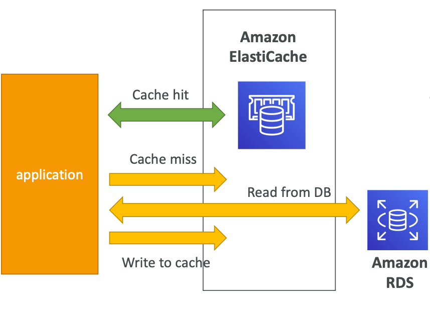
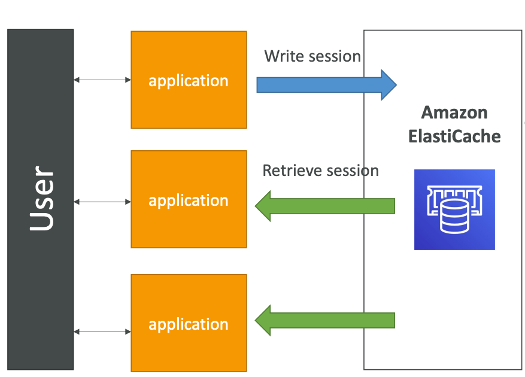
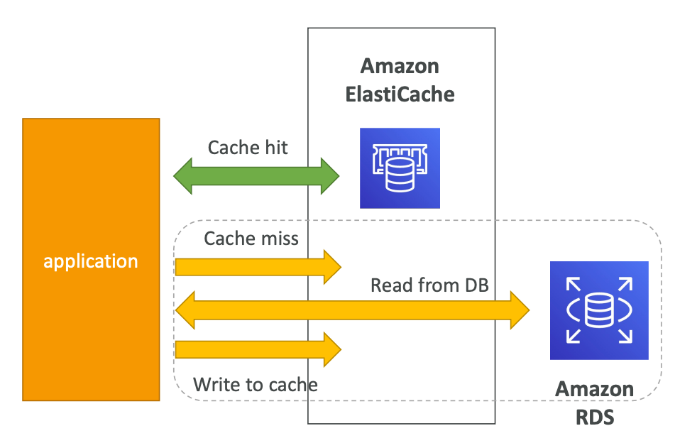
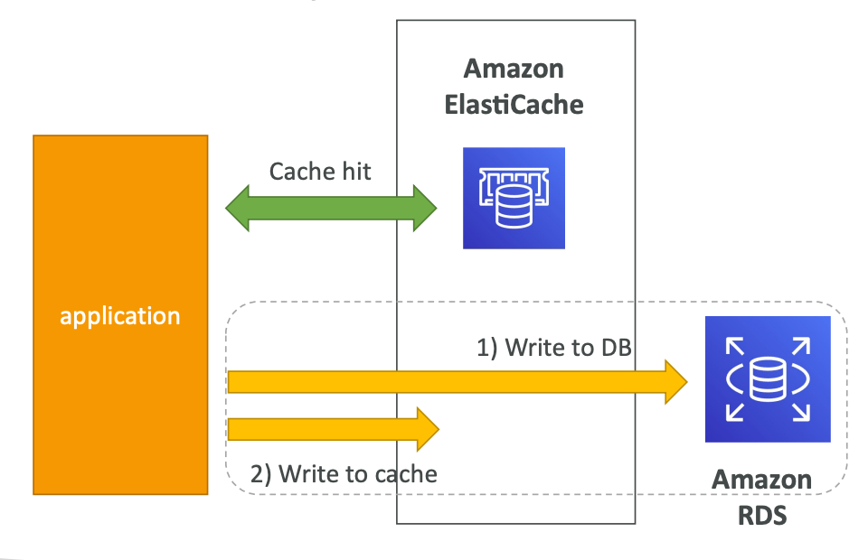

## AWS ElastiCache

**ElastiCache is a managed service for Redis and Memcached.**

It helps to reduce the load off of databases for read intensive workloads.
It helps to **make your application stateless**.

Also, you can store user session in ElastiCache

**thus we can make application stateless.**

**To ensure that ElastiCache cluster is highly available `Multi-AZ` must be enabled**.

#### Redis vs. Memcached

Redis:
1. **Multi AZ with Auto-Failover**
2. Read Replicas to scale reads and high availability
3. Data durability using AOF persistence
4. Backup and restore features
5. Supports Sets and Sorted Sets

**ElastiCache with Redis has 5 max `Read Replicas without Cluster Mode`**

Memcached:
1. Multi-node partitioning of data (sharding)
2. No replication
3. No persistent
4. No backup and restore
5. Multithreaded architecture

#### ElastiCache Strategies

Is caching effective for that data?
**If data changing slowly, few keys are frequently needed** then caching is good option.
Also, **data should be structured for caching**: key-value pairs or result aggregation.

Lazy Loading (a.k.a Cache Aside):

**Lazy Loading helps to improve the Read side.**

Cons:
1. Cache miss results in 3 round trips
2. **Stale data**: data can be updated in the database and outdated in the cache

Write Through:

**Write Through helps to improve the Write side.**

Cons:
1. Missing data until it is added/updated in the database
2. Cache churn: a lot of the data will never be read

Time-to-lve (TTL).

Cache eviction can occur in three ways:
1. Explicitly delete the item
2. Item is evicted because the memory is full, and it's not recently used (LRU)
3. Set an item TTL

TTL are helpful for any kind of data:
1. Leaderboards
2. Comments
3. Activity streams

TTL can range from a few seconds to hours or days.

TTL should be used in combination with Lazy Loading caching strategy.
If too many evictions happen due to memory, ypu should scale up (vertically) or out (horizontally).

## AWS MemoryDB

MemoryDB — fully Redis compatible, durable, in-memory database service.
Ultra-fast performance with over 160 million requests/sec.
Durable in-memory data storage with Multi-AZ transactional log.
