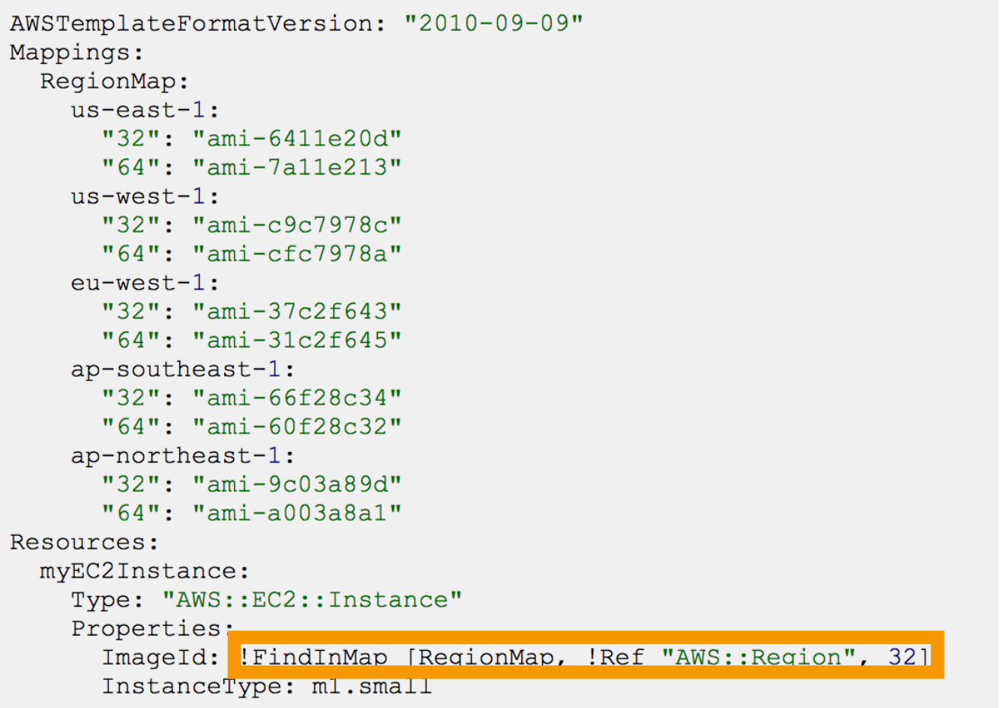
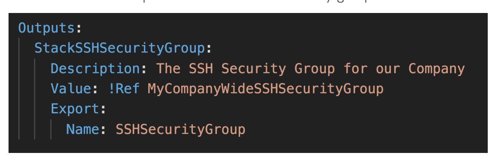
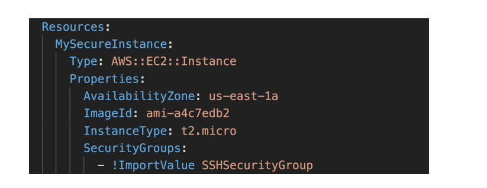
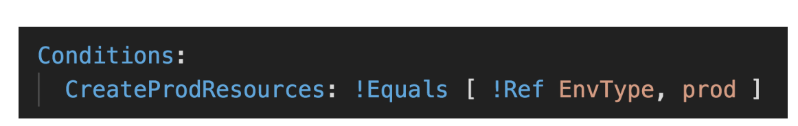
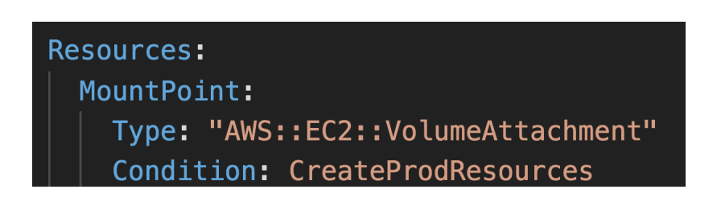
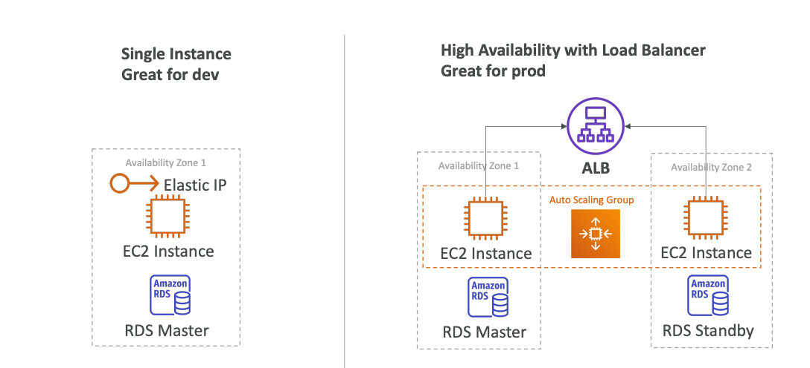
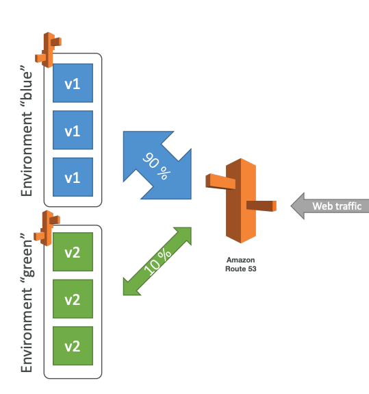

## AWS CloudFormation

CloudFormation — managing your infrastructure in code, **IaC (Infrastructure as Code)**.
CloudFormation cuts out manual setup of AWS services.
All this manual work will be very tough to reproduce in:
1. Another AWS Account
2. Another AWS Region

**CloudFormation is a declarative way of outlining your AWS Infrastructure** for any resources.
All the code can be version controlled using git.
Template deletion also can be automated.
**Template - YAML/JSON file, describes AWS resources and their properties**.
**Stack - created resources that was described in CloudFormation Template**.

**Templates have to be uploaded in S3** and then referenced in CloudFormation.
**Templates are immutable**, so you can't update previous ones,
you must create a new one instead.
**Name identifies Stack**.
**After Stack deletion, all resources will be deleted**.

Deploying CloudFormation Templates:
1. Manual way: CloudFormation Designer + AWS Console
2. Automated way: YAML/JSON files + CLI to deploy

### Components

1. **Resources**: your AWS resources declared in the template **(REQUIRED)**.
2. **Parameters**: the dynamic inputs for your template.
3. **Mappings**: the static variables for your template.
4. **Outputs**: references to what has been created.
5. **Conditionals**: conditions to perform resource creation.
6. **Metadata**

Also, there are Template helpers:
1. References
2. Functions

### Resources

Resources are the **core, required component** of your CloudFormation Template.
Resources represent AWS resources.
Resource types identifiers are of the form: `AWS::aws-product-name::data-type-name`
Resources are declared and can reference each other.

Each resource must have `Type` and `Properties`, a key-value pairs.

### Parameters

Parameters are a way to provide inputs to your AWS CloudFormation Template.
**Parameters can help in Template reuse**.
Also, sometimes parameters are inevitable
since some inputs cannot be determined ahead of time.

You will not have to re-upload a template to change the value of parameter.

Parameters can be controlled by all these settings:
1. Type
2. Description
3. Constraints
4. ConstraintDescription
5. Min/MaxLength
6. Min/MaxValue
7. Defaults
8. AllowedValues
9. AllowedPattern
10. NoEcho

To reference a parameter: `!Ref MyVPC`.
The `Fn::Ref` function can be leveraged to reference parameters,
the shorthand for `Fn::Ref` is `!Ref`.
Also, Ref function can be used to reference resources.

**AWS Pseudo Parameters**:
1. `AWS::AccountId`
2. `AWS::NotificationARNs`
3. `AWS::NoValue`
4. `AWS::Region`
5. `AWS::StackId`
6. `AWS::StackName`

### Mappings

Mappings are **fixed variables** in CloudFormation Template.
All the values are hardcoded for particular Template.

Some examples of using Mappings:
1. Region
2. AZ
3. AWS Account
4. Environment (dev vs. production)

`Fn::FindInMap` is used for accessing mapping values.
 
`!FindInMap [MapName, TopLevelJKey, SecondLevelKey]`

### Outputs

**The outputs declare optional output values that we can import into other templates**.
Outputs also can be viewed in AWS Console or using AWS CLI.

They are very useful, for example, if you define a network CloudFormation,
and output the variables such as VPC ID and your Subnet's IDs.

**It's the best way to perform cross-stack collaboration**.

**You can't delete a CloudFormation Stack if
its outputs are being referenced by another CloudFormation Stack**.

**Exported output names must be unique within your region**.
 

Then you can import a value using `Fn::ImportValue` function,
or `!ImportValue` for short.

### Conditions

**Used to control the creation of resources or outputs
based on a logical condition**.
 
Some common conditions:
1. Environment (dev/test/prod)
2. AWS Region

Each condition can reference another condition, parameter value or mapping.

### Intrinsic Functions

1. `Ref`: reference a resource will return a physical ID of it,
   reference a parameter will return its value.
2. `GetAtt`: get attribute from a resource, e.g., `!GetAtt EC2Instance.AvailabilityZone`.
3. `FindInMap`: return a named value from a specific key, e.g., `!FindInMap [ MapName, TopKey, LowKey ]`.
4. `ImportValue`: import values from other templates.
5. `Join`: join values with a delimiter, e.g., `!Join [ delimiter, [ values... ] ]`.
6. `Sub`: substitute variables from a text
7. Condition Functions: (`If`, `Not`, `Equals`, etc.)

### Rollbacks

Stack creation fails:
1. Default: everything rolls back -> get deleted, atomicity.
2. Preserve successfully provisioned resources, while
   rolling back failed resources to the last stable state.

Stack update fails:
the stack automatically rolls back to the previous known working state,
ability to see in the log what happened and error messages.

#### Stack Notifications

Send Stack events to SNS Topic, Email, Lambda.
**SNS Integration can be enabled using Stack Options**.

#### ChangeSets

When you update a stack, you need to know what changes before it happens for greater confidence.
ChangeSets won't say if the update will be successful or not, **just what will happen**.

#### Nested Stacks, StackSet

**Nested stacks are stack as part of other stacks**.
**They isolate common patterns and components in separate stacks and
call them from other stacks for reuse purposes**.
 
To update a nested stack, you need to update the parent first.
 
StackSets are for create, update, or delete stacks across
multiple accounts and regions with a single operation.
**When you update a stack set, all associated stack instances
are updated throughout all accounts and regions**.

#### Drift

CloudFormation doesn't protect you against manual configuration changes.
**CloudFormation Drift can be used for knowing resources been drifted**.

CloudFormation shows the difference between actual and expected state.

Not all resources are supported.

#### Stack Policies

During a CloudFormation Stack update,
all update actions are allowed on all resources (default).

**A Stack Policy is a JSON document that defines
the update actions that are allowed no specific resources during Stack updates**.

With a Stack Policy, by default, all resources in the stack are protected.

## AWS Elastic Beanstalk

**Elastic Beanstalk is a developer centric view of deploying an application on AWS**.
Just the application code is the responsibility of the developer.
Elastic Beanstalk **uses CloudFormation to deploy infrastructure stacks**.

Beanstalk is free, but you pay for the underlying instances.
 
**Components**:
1. Application: collection fo Elastic Beanstalk components (environments, versions, configurations).
2. Application Version.
3. Environment
   1. Collection of AWS resources running an application version (only one application version at a time).
   2. Tiers: **Web Server Environment Tier** and **Worker Environment Tier**
      **You can create multiple environments** (dev, test, prod).

Elastic Beanstalk supports many platforms and languages,
but if your is not supported, you can create your custom support.
 
**Web Server Tier Environment vs. Worker Tier Environment**:
Worker Tier Environment does not have any client directly accessing EC2 Instances,
instead it can be SQS queue or SNS topic.

Worker Environment can be combined with Web Environment.
**Also, environments can be cloned**.

### Deployment Options for Updates

1. **All at once** (deploy all in one go): fastest,
   but instances are not available to serve traffic for a bit (downtime),
   no additional costs.
2. **Rolling**: update a few instances at a time, runs below capacity
   (bucket, a partial set of instances, **size can be set**),
   and then move onto the next bucket one the first bucket is healthy,
   **long deployment**, no additional costs.
3. **Rolling with batches**: like rolling, but always **runs at capacity**,
   so old application is still available, additional cost,
   additional batch is removed at the end of the deployment,
   **good for the production environment**.
4. **Immutable**: spins up new instances in a new temporary ASG,
   deploys a version to these instances, and then swaps all the instances when ready,
   **high cost** since double capacity, **longest deployment**, but **quick rollback**.
5. **Blue-Green**: **create a new environment** and switch over when ready,
   not a direct feature of Elastic Beanstalk,
   can be integrated with Route 53 Routing Policies.
6. **Traffic splitting**: send a small percentage of traffic to new deployment,
   used for **canary testing**, automated rollback.

Deployment Policy is inherited from the last artifact deployed.
Deployment Policy can be overwritten.

### CLI

Additional CLI can be installed, called "EB cli", which makes working with Beanstalk from the CLI easier.

Basic commands:
`eb create`, `eb status`, `eb health`, `eb events`, `eb logs`, `eb deploy`, etc.

It's helpful for your automated deployment pipelines.

### Extensions

**All the parameters set in the UI can be configured with code using files**.
It must be in `.ebextensions/` directory in the root of source code.
It must be in YAML/JSON format.
It must have `.config` extension.
Also, extensions have ability to add resources such as RDS, ElastiCache, DynamoDB, etc.
Resources managed by `.ebextensions` get deleted if the environment goes away.

Example: enable HTTPS on Load Balancer can be setup in `https-load-balancer.config`
in `.ebextensions/` folder.

**For running Jobs periodically, and asynchronously
we can use `cron.yaml` in combination with Worker Environments**.

#### Lifecycle Policies

Elastic Beanstalk can store at most 1000 application versions.
All application versions are stored in S3.
If you don't remove old versions, you won't be able to deploy anymore.
For removal and environment management purposes, use a lifecycle policy:
1. Based on time
2. Based on space
   After version deletion, **you can set retention policy to retain or delete source bundle from S3**.
   **Versions that are currently used won't be deleted**.

#### Migration

**After creating an Elastic Beanstalk environment,
you cannot change the Elastic Load Balancer type** (only configuration).
To do this, you need to perform a migration:
1. Create a new environment with the same configuration except LB (can't clone).
2. Deploy your application onto the new environment
3. Shift traffic to the new environment: `CNAME` swap or Route 53 update.

RDS can be provisioned with Elastic Beanstalk, which is great for dev/testing.
This is not a good option for production environment,
since a database will be connected to the Elastic Beanstalk environment lifecycle.
The best way is to separate database and beanstalk environment.
**It is highly recommended to delete the associated CloudFormation
stack after deleting an environment**.
