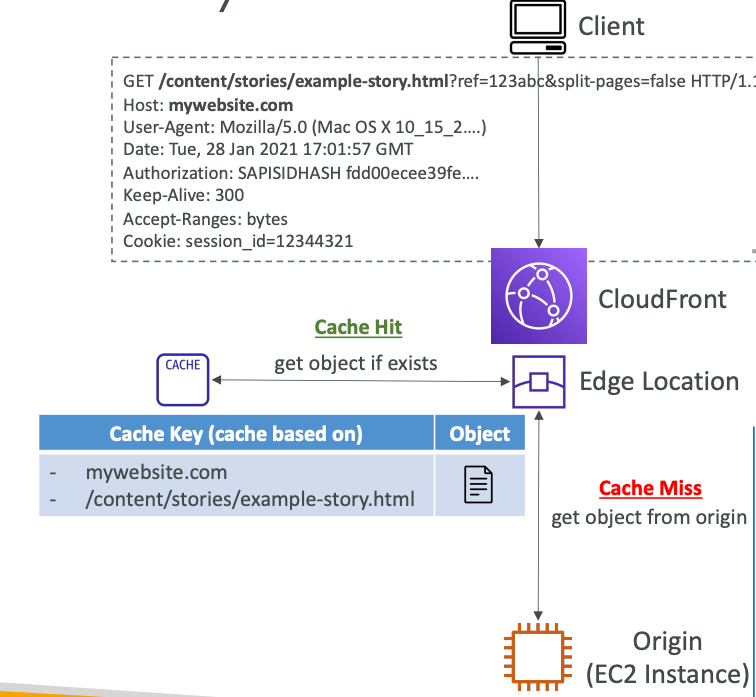

## AWS CloudFront

Region-Globally, **Content Delivery Network (CDN)**: improves read performance,
content is cached at the edge locations.
CloudFront content called **distribution**.

216 POPs globally (edge locations).
**DDoS protection**, integration with Shield, AWS Web Application Firewall (WAF).

CloudFront Origins:
1. S3 bucket with **CloudFront Origin Access Control (OAC)**:
   **buckets are still private, but content can be shared via CloudFront distribution**,
   CloudFront can be used as ingress to upload files to S3.
2. Custom Origin (HTTP): Application Load Balancer, EC2 Instance,
   S3 website (must first enable the bucket as a static website),
   or any HTTP backend.

### CloudFront vs. Cross-Region Replication

CloudFront:
1. Global-Edge Network (216 POPs)
2. Files are cached for a TTL
3. **Great for static content that must be available everywhere**

Cross-Region Replication:
1. Must be setup for each region you want replication to happen
2. Files are updated in near real-time (no caching happens)
3. Read-only
4. **Great for dynamic content that needs to be available at low-latency in few regions**

### Caching

**The cache lives at each CloudFront Edge Location**.
CloudFront identifies each object in the cache using **Cache Key**.
You want to maximize the Cache Hit ratio to minimize requests to the origin.
You can invalidate part of the cache using the `CreateInvalidation` API.

#### Cache Key

A unique identifier for every object in the cache.
By default, it consists of `hostname` + `resource portion of the URL`.
E.g., hostname: `mywebsite.com` and resource portion: `/content/stories/example-story.html`?ref=123abc.

#### Cache Policies

You can add other elements (HTTP headers, cookies, query strings)
to be part of the Cache Key using **CloudFront Cache Policies**.
You can use existing Cache Policies in CloudFront.

Using CloudFront Cache Policies, you can control
**on what cache based on** (headers, cookies, query strings) and
**TTL** (can be set using Cache-Control header, Expires header).

**All HTTP headers, cookies, and query strings
that you include in the Cache Key will be automatically included in origin requests**.

With **Origin Request Policy**, you can specify values that you want to include in origin requests
without including them in the Cache Key (no duplicated cached content).
Use-case:
1. When origin needs more information to process the request,
   but there is no need to cache all the information.

#### Cache Invalidations

In case you update the origin content,
CloudFront does not know anything about this
and will only get the refreshed content after the TTL has expired.

However, you can force an entire or partial cache refresh by performing **CloudFront Invalidation**.
You can invalidate all files (`*`), or a specific path (`/images`).

#### Cache Behaviors

Configure different settings for a given URL path pattern.
Also, route to different kinds of origin groups based on content-type or the path pattern.
**Default behavior is (`*`)**.

Also, you can **separate access to the dynamic and static resources using Cache Behaviors**:

### ALB or EC2 as an Origin

**EC2 Instances must be public, since there is no VPC connectivity in CloudFront**.

**Application Load Balancer must be public (while EC2 Instances can be private),
since there is no VPC connectivity in CloudFront**.

#### Geo Restriction

You can restrict who can access your **distribution**.
`Allowlist` or `Blocklist` can be setup.
The 'country' is determined to use a 3rd party Geo-IP database.

Use-case:
1. Copyright laws to control access to content.

### Signed URL / Signed Cookies

**Distribution of paid shared content to premium users** over the world.
**CloudFront Signed URL can be used** with attached policy that includes:
1. URL expiration
2. IP ranges to access the data from
3. Trusted signers

How long should the URL be valid for:
1. Shared content (movie, music): few minutes
2. Private content (private to the specific user): for years

**Signed URL**: access to the individual files (one signed URL for file).
 
**Signed Cookies**: access to multiple files (one signed cookie for many files).

#### Signed URL Process

Two types of signers:
1. `Trusted Key Group`: **recommended**, creating and rotating keys.
2. AWS account that contains a CloudFront Key Pair: **no recommended**, need to use root account credentials.

In CloudFront distribution **one or more trusted key groups can be created**.
Private and public RSA keys are required.

### Pricing

CloudFront Edge Locations are all around the world.
**The cost of data out per edge location varies**.

**The more you transferred out the CloudFront, the lower the cost**.

The Number of Edge Locations can be reduced in order to do cost reduction.
There are three price classes:
1. All: all regions, the best performance
2. 200: most regions, but excludes the most expensive regions
3. 100: only the least expensive regions

#### Origin Groups

To increase high availability and do failover.

S3 + CloudFront -> Region-level High Availability.

#### Field Level Encryption

Protect user sensitive information through application stack.
Sensitive information is encrypted at the edge close to the user.
Uses asymmetric encryption.

Usage:
1. Specify a set of fields in POST requests that needed to be encrypted (up to 10 fields).
2. Specify the Public key to encrypt them.
3. Decrypt fields with a Private key.

#### Real-Time Logs

Get real-time requests received by CloudFront sent to Kinesis Data Streams.
Monitor, analyze, and take actions based on content delivery performance.
Allows you to choose:
1. Sampling Rate: percentage of request you want to receive
2. Specific fields and specific Cache Behaviors

