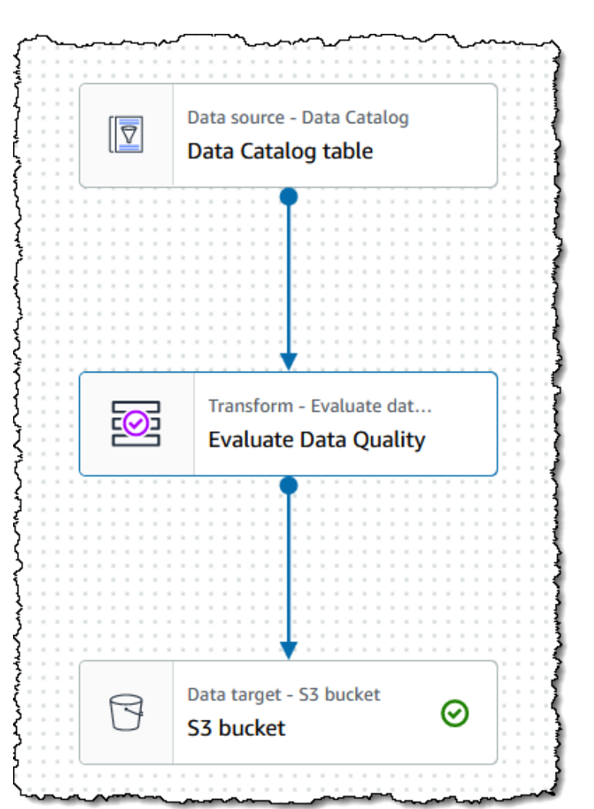
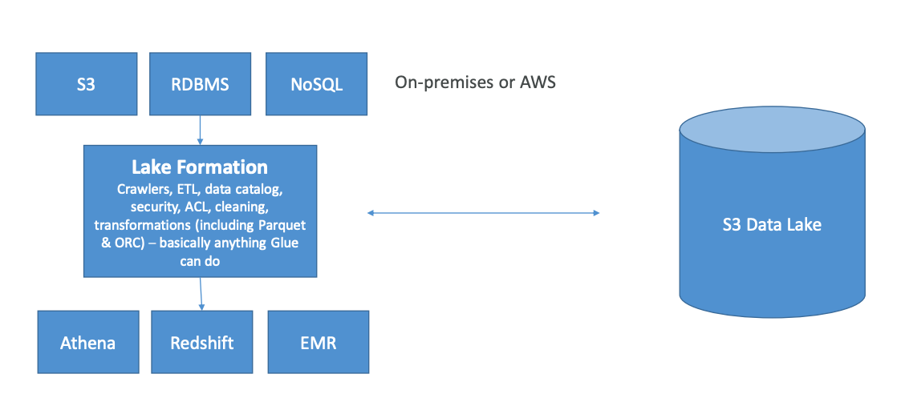

# Data processing on AWS

## AWS Lambda

Run code snippets in serverless way,
without server management.
**Lambda is a stateless service**.
**You are paying only for the time that you use**.

Use-cases:
1. Real-time stream processing
2. Real-time file processing
3. ETL
4. Integration inside AWS
5. Cron jobs

Lambda anti-patterns:
1. Long-running applications: use EC2 instead, or chain functions
2. Dynamic websites with AJAX
3. Stateful applications

## AWS Glue

Serverless service that handles discovery and definition
of table definitions and schema:
1. S3 data lakes
2. RDS
3. Redshift
4. other RDBMS

Also, custom ETL jobs:
1. Trigger-driven, on a schedule, or on demand
2. Fully managed

**ETL jobs uses Apache Spark under the hood**.

#### Glue Crawler

Glue Crawler scans data in S3, and **creates schema**.
Populates Glue Data Catalog: **stores only table definition,
original data stays in S3**.

**Once cataloged, you can treat your unstructured data in S3
like it's structured**.

Glue crawler will extract partitions based on how your S3 data is organized.
Partition your data based on how you will be querying your data lake.

#### Glue with Hive

Hive lets you run SQL-like queries from EMR.
Glue can be integrated with Hive:
1. Glue Data Catalog can serve as a Hive 'metastore'.
2. Hive metastore can be imported into Glue.

#### Glue ETL

Automatic code generation based on a graphical data pipeline,
in Scala or Python, that will be run
on Spark.
Target can be S3, JDBC (RDS, Redshift), or on Glue Data Catalog.

**All data that comes into Glue ETL is called DynamicFrame(
similar to Spark's DataFrame)**.

Glue Transformations are:
* `DropFields`, `DropNullFields`: remove (null) fields.
* `Filter`: specify a function to filter records
* `Join`: to enrich data
* `Map`: add fields, delete fields, perform external lookups
Machine Learning Transformations:
* `FindMatches ML`: identity duplicate or matching records in a dataset, even when the
  records do not have a common unique identifier and no fields match exactly
Format conversions:
* CSV
* JSON
* Avro
* ORC
* XML
And all Apache Spark transformations.
 
`ResolveChoice` deals with ambiguities in a DynamicFrame and returns a new one:
for instance, two fields with the same name can be handled by:
1. `make_cols`: creates a new column for each type
2. `cast`: casts all values to a specified type
3. `make_struct`: creates a structure that contains each data type
4. `project`: projects every type to a given type

**Also, Glue supports Streaming running on Apache Spark Structured Streaming**.

#### Job bookmarks 

There are several ways to run Glue jobs:
1. Cron schedule
2. Job bookmarks: persists state from job run,
   preventing old data reprocessing;
   handles only new rows, not updated ones
3. CloudWatch Events

#### Glue Studio

**Visual interface for ETL workflows, the visual job editor**.
That allows you to create DAG's for workflows.
**You can specify the mappings, transformations, and so on**.
Also, includes visual job dashboard: overview, status and run times.

#### Glue Data Quality

Data quality can be controlled and monitored automatically
integrating it into Glue jobs.
Glue operates with Data Quality Definition Language (DQDL).
Results can be used to fail the job, or just be reported
to CloudWatch.

#### Glue DataBrew

Glue DataBrew is a visual data preparation tool.
You create 'recipes' of transformations that can be saved as jobs
within a larger project.
May define data quality rules.

#### Cost model

**Glue bills by the second for crawler and ETL jobs**.
The first million objects stored and accesses are free for the Glue
Data Catalog.
Development endpoints for developing ETL code charged by the minute.

#### Glue Anti-patterns

* Multiple ETL engines: 
  **Glue is based on Spark**, if you want to use other engines, check out
  Data Pipeline or EMR.

## AWS Lake Formation

Lake Formation is built on top of [Glue](#aws-glue).
Makes it easy to set up a secure data lake.
Everything in Glue you can do with Lake Formation.

* Access control
* Auditing

## AWS Security Lake

Separate version of [lake formation](#aws-lake-formation),
built for security teams.
**Centralizes security data**.
Normalizes data across AWS and on-premises.

## AWS EMR

**Elastic MapReduce (EMR): managed Hadoop cluster** on EC2 instances.
Includes Spark, HBase, Presto, Flink, Hive and more.
Has its own EMR Notebooks.
Frameworks and applications are specified at cluster launch.

EMR Cluster basically is just a collection of EC2 instances:
1. **Master node**: manages cluster
2. **Core node**: host HDFS data and runs tasks
3. **Task node** (Optional): run tasks, does not host data, good use of **spot instances**

### Transient cluster vs. Long-running:
transient cluster will terminate once all steps are complete, saves money;
long-running cluster must be manually terminated.

### Storage

1. HDFS: Hadoop Distributed File System,
   multiple copies stored across nodes for redundancy,
   files stored as blocks (128 MB default size),
   **data is ephemeral: HDFS data is lost when the cluster is terminated**;
   useful for caching intermediate results or workloads with random I/O.
2. EMRFS: access S3 as if it were HDFS,
   **allows persistent storage after cluster termination**,
   strongly consistent, uses DynamoDB to track consistency.
3. Local file system: suitable only for temporary data (buffers, caches).
4. EBS for HDFS: allows use of EMR on EBS-only types (M4, C4),
   deletes volumes when the cluster is terminated;
   **EBS volumes can only be attached when launching a cluster**;
   if you manually detach an EBS volume, EMR treats that as a failure
   and replaces it.

### Policy
