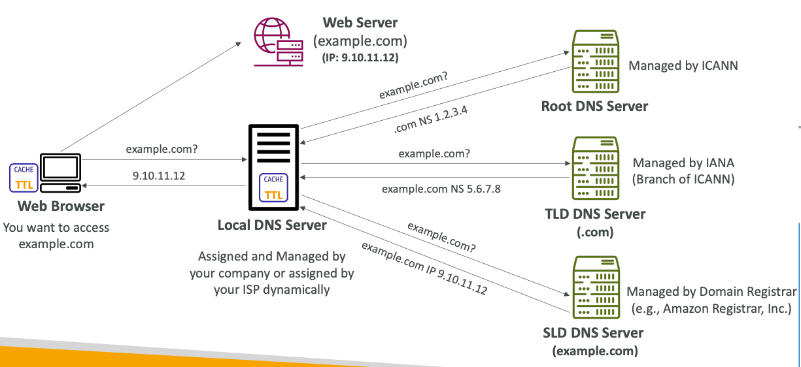
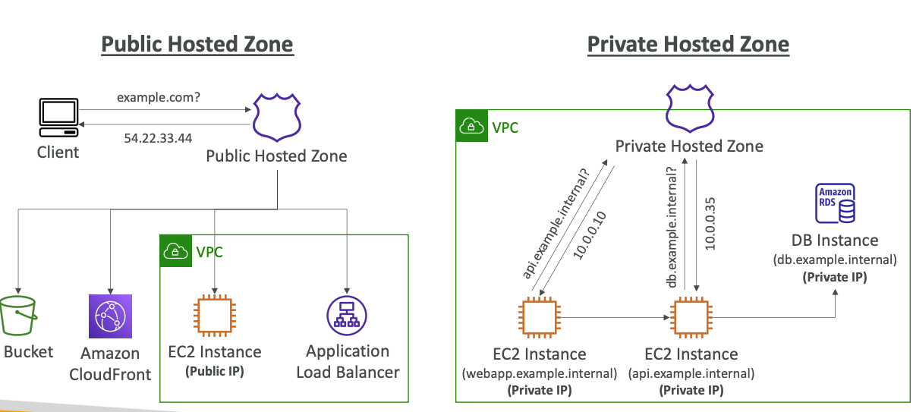
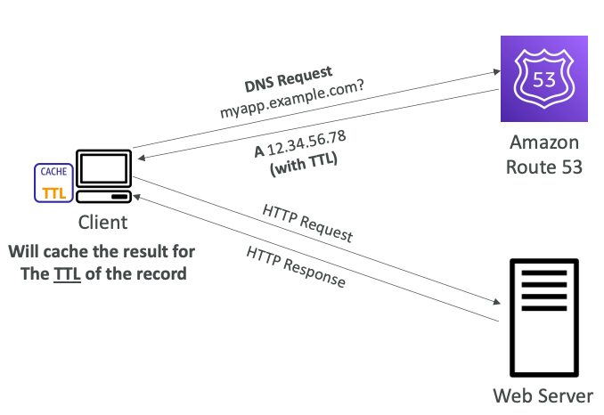
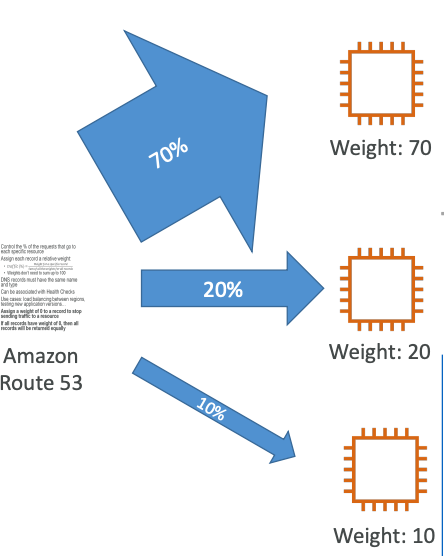
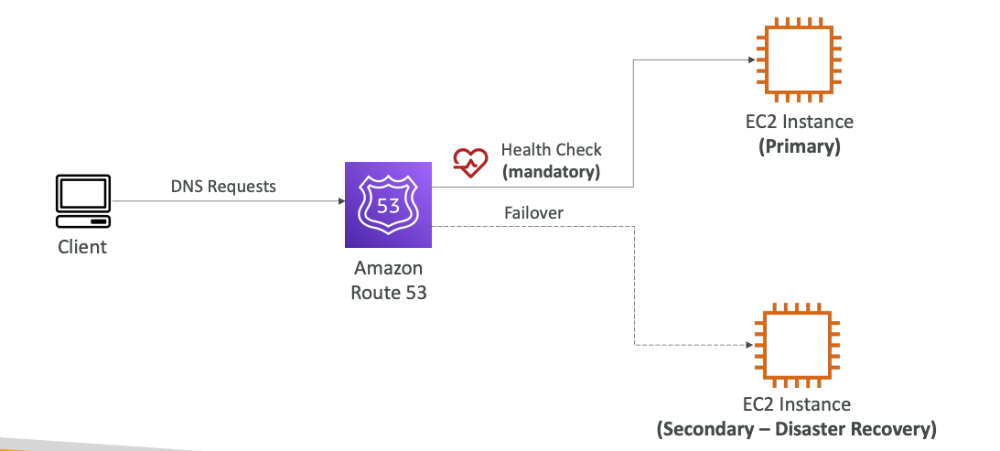
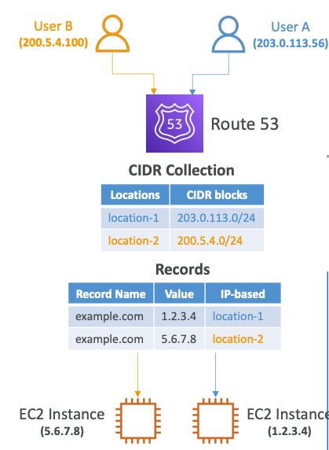

## AWS Route 53

### DNS

Domain Name System (DNS) which translates the human
friendly hostnames into the machine IP addresses.

DNS is the backbone of the internet.
DNS uses hierarchical naming structure:
`.com`
`example.com`
`api.example.com`

DNS Terminologies:
1. **Domain Registrar**: AWS Route53, GoDaddy, etc.
2. **DNS Records**: `A`, `AAAA`, `CNAME`, `NS`, etc.
3. **Zone File**: DNS records
4. **Name Server**: resolves DNS queries (Authoritative or Non-Authoritative)
5. **Top Level Domain (TLD)**: `.com`, `.us`, `.in`, `.org`, etc.
6. **Second Level Domain (SLD)**: `google.com`, `amazon.com`

**FQDN (Fully Qualified Domain Name)**: `api.of.example.com`

AWS Route 53 — highly available, scalable, fully managed and **Authoritative DNS**.
**Authoritative means that the customer can update the DNS records.**
Route 53 is a Domain Registrar.

The only AWS service which provides `100%` availability SLA.
53 means traditional DNS port.

Route 53 Records:
1. Domain/subdomain name: example.com
2. Record type: A or AAAA
3. Value: 12.34.56.78
4. Routing Policy: how Route 53 responds to queries
5. TTL: amount of time the record cached at DNS Resolvers

Route 53 supports the following DNS record types:
`A`, `AAAA`, `CNAME`, `NS`
and
`CAA`, `DS`, `MX`, `NAPTR`, `PTR`, `SOA`, `TXT`, `SPF`, `SRV`

#### Record Types
1. `A` - maps a hostname to IPv4
2. `AAAA` - maps a hostname to IPv6
3. `CNAME` - maps a hostname to another hostname
   (The target is a domain name which must have an `A` or `AAAA` record)
   **You can't create a CNAME record for the top node of a DNS namespace (Zone Apex)**:
   you can't create `CNAME` for `example.com`, but you can create it for `api.example.com`
4. `NS` - name servers for the hosted zone

#### Hosted Zones

A container for records that define how to route traffic to a domain and its subdomains.

**Public Hosted Zones**: contain records that specify how to route traffic on the internet (public domain name).
**Private Hosted Zones**: contain records that specify how you route traffic within one or more VPCs
(private domain names).

#### Records TTL

Records TTL (Time To Live) is a time unit that client will cache the DNS server response.

**TTL is mandatory for each DNS record, except Alias**.

#### CNAME vs. Alias

`CNAME`: points a hostname to any other hostname (`app.domain.com` -> `blabla.anything.com`)
**Only for non-root domain**.
 
`Alias`: points to an AWS Resource (`app.domain.com` -> `blabla.amazonaws.com`)
**Works for root domain and non-root domain.**
**Free charge**.
Native health check.

#### Alias Targets

1. Elastic Load Balancers
2. CloudFront Distributions
3. API Gateway
4. Elastic Beanstalk environments
5. S3 websites
6. VPC Interface Endpoints
7. Global Accelerator accelerator
8. Route 53 record in the same hosted zone

**You cannot set an ALIAS record for an EC2 DNS name**.

#### Routing Policies

Define how Route 53 responds to DNS queries.

Route 53 supports the following Routing Policies:
1. Simple
2. Weighted
3. Failover
4. Latency-based
5. Geolocation
6. Multi-Value Answer
7. Geo-proximity (using Route 53 Traffic Flow feature)
8. IP-based

**Simple**:
Typically, route traffic to a single resource.
Can specify multiple values in the same record.
**If multiple values are returned, the client chooses a random one.**
When Alias is enabled, specify only one AWS resource.
Can't be associated with Health Checks.
 
**Weighted**:
control the % of the requests that go to each resource.
DNS records must have the same name and type.
Can be associated with Health Checks.
Use-case:
1. Load balancing between regions
2. testing a new version of applications
   Assign a weight of 0 to a record to stop sending traffic to a resource.
   **If all records have a weight of 0, then all records will be returned equally**.

 
**Latency-based**:
redirect to the resource that has the least latency close to us.
**Useful when latency for users is a priority**.
**Latency is based on traffic between users and AWS Regions**.
Germany's users may be directed to the US (if that's the lowest latency).
Latency-based Routing Policy can be associated with Health Checks (has a failover capability).
 
**Failover (Active-Passive)**:
main target associated with a health checks, if the main target becomes unhealthy -
then Route 53 is going to automatically failover to disaster recovery target (passive becomes active).

 
**Geolocation**: routing based on user location.
Use-cases: website localization, restrict content distribution, load balancing, etc.
Should create a 'Default' record in case there is no match.
It can be associated with Health Checks.
 
**Geo-proximity routing**:
route traffic to your resources based on the geographic location of users and resources.
**Ability to shift more traffic to resources based on the defined bias**.
Resources can be:
1. AWS resources with a specified region
2. Non-AWS resources with specified Latitude and Longitude
   You must use Route 53 Traffic Flow to use this feature.

Use-case:
1. Shift more traffic to specific region.

`Traffic Flow` is a visual editor for setup Route 53 routing.
 
**IP-based**: routing based on clients' IP addresses.
You provide a list of CIDRs for your clients and the corresponding endpoints/locations.
Use-case:
1. Optimize performance, reduce network costs

 
**Multi-value**: **use when routing traffic to multiple resources**.
Route 53 return multiple values/resources.
This Multi-value routing policy can be associated with Health Checks.
Up to 8 healthy records are returned for each Multi-Value Query.
Use-case: for implementing **client-side load balancing**.

#### Domain Registrar vs. DNS Service
You can buy or register your domain name
with a Domain Registrar by paying annual charges (e.g., GoDaddy, Amazon Registrar).
The Domain Registrar usually provides you
with a DNS service to manage your DNS records.

You can register/buy domain on Domain Registrar (GoDaddy) and
manage its records using DNS Service (Route 53).
To do it:
1. Create a Public Hosted Zone in Route 53
2. Update `NS` Records on 3rd party website to use **Route 53 Name Servers**.

#### Health Checks

HTTP Health Checks are only for **public resources**.
1. Health checks that monitor an endpoint (application, server, other AWS resource):
   HTTP, HTTPS, TCP.
   If > 18% of health checkers report,
   the endpoint is health; Route 53 considers it **Healthy**.
   Interval 30s (can set to 10s)
   Ability to choose which locations you want Route 53 to use
   **Health checks pass only when the endpoint
   responds with `2xx` and `3xx` status codes**.
2. Health checks that monitor other health checks (Calculated Health Checks):
   **Combine the results of multiple Health Checks into a single Health Check**.
   You can use `OR`, `AND`, or `NOT` conditions.
   You can monitor up to 256 Child Health Checks,
   with specified parameter of how many of them need to be passed.
3. Health checks that monitor CloudWatch Alarms

Health Checks are integrated with CloudWatch metrics.

**Health Checks — Private-Hosted Zones**:
Route 53 health checkers are outside the VPC.
They can't access private endpoints (private VPC or on-premises resource).
**But you can create a CloudWatch Metric and associate a CloudWatch Alarm,
then create a Health Checks that checks the alarm itself**.
