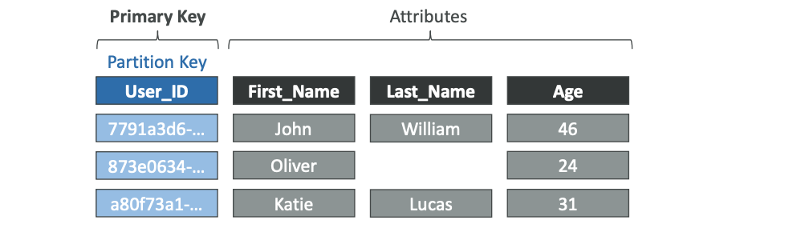
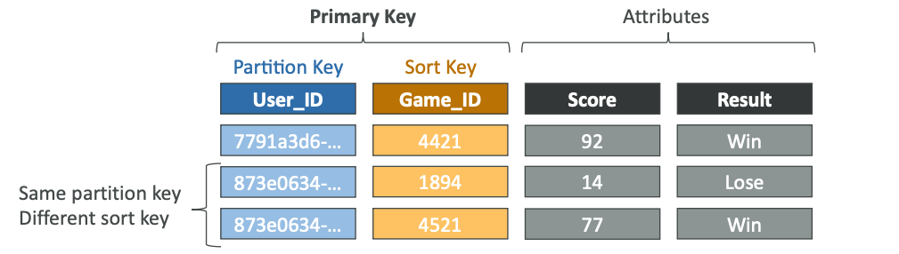
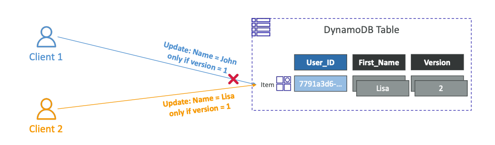
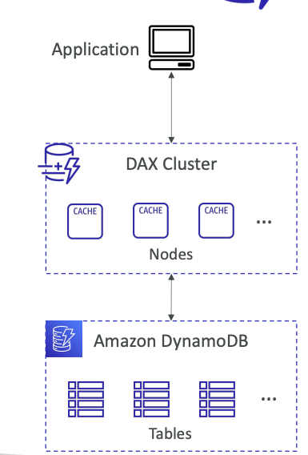
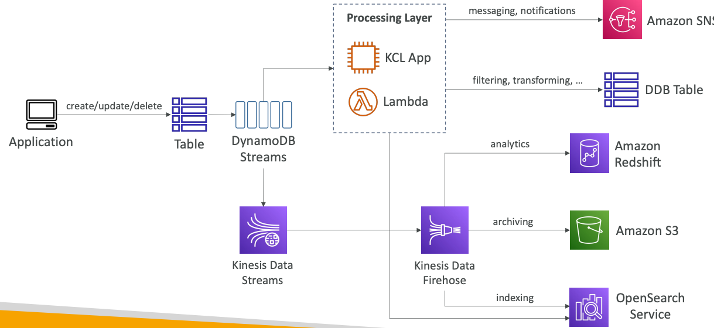
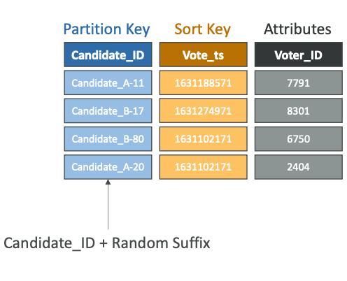
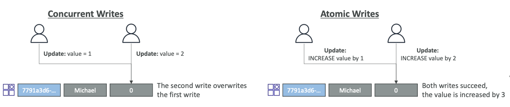
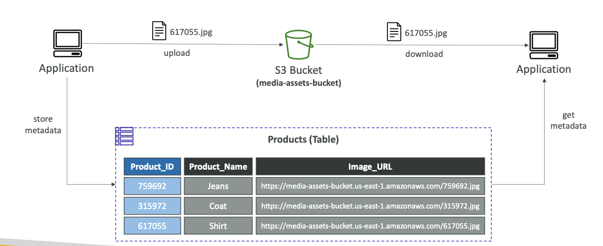

## AWS DynamoDB

DynamoDB is NoSQL, serverless database.

DynamoDB is made of Tables, each table has a Primary Key, must be decided at creation time.
Data stored in partitions.
Each table can have an infinite number of `items`.
Each item has `attributes`, can be added over time.
**The Maximum size of item is 400KB**.

Data types supported:
1. Scalars: String, Number, Binary, Boolean
2. Documents: List, Map
3. Sets: String set, Number set, Binary set

### Primary Key

How to pick a Primary Key (PK) for a DynamoDB table:
* Partition Key (HASH): PK must be unique for each item,
  must be diverse to truly distribute data.
  
* Partition Key with Sort Key (HASH + RANGE): the combination must be unique for each item,
  **data is grouped by partition key**.
  

### R/W Capacity Modes

DynamoDB has 2 modes:
1. Provisioned mode, default one:
   you specify the number of reads/writes per second,
   you need to plan the capacity,
   and _pay for provisioned read & write capacity units_;
   in provisioned mode you can choose an option of
   throughput autoscaling to meet demand.
2. On-Demand mode:
   automatically scales up and down with your workloads,
   pay for what you use, more expensive,
   use-cases: unknown workloads, unpredictable traffic, etc.

You can switch between different modes once every 24 hours.

In Provisioned mode, you can temporarily exceed throughput
using Burst Capacity.
If Burst Capacity has been consumed, you'll get a
`ProvisionedThroughputExceededException`.
If this is the case, exponential backoff can be applicable.


One Write Capacity Unit (WCU) represents one write per second for an
item up to 1KB in size.
If the items are larger than 1KB, you'll consume more WCUs.

Examples:
```text
1. we write 10 items/second,
   with the item size of 2KB:
   10 * 2 = 20WCUs
2. we write 6 items/second,
   with the item size of 4.5KB:
   6 * 5 = 30WCUs, since 4.5 rounded to upper KB
```

Eventually Consistent Reads in a default mode:
if we read just after write, it's possible
we'll get stale data.
In case of Strongly Consistent Read (set `ConsistentRead` to True in API calls),
if we read after writing, we'll get the correct data,
consumes twice the RCU and latency is higher.


One Read Capacity Unit (RCU) represents one `Strongly Consistent Read`
per second, or two `Eventually Consistent Reads` per second,
for an item up to 4KB in size.
If the items are larger than 4KB, more RCUs are consumed.

Examples:
```text
1. 10 Strongly Consistent Reads per second,
   with item size of 4KB:
   10 * (4/4) = 10RCUs
2. 16 Evenually Consistent Reads per second,
   with item size of 12KB:
   8 * (12/4) = 24RCUs
3. 10 Strongly Consistent Reads per second,
   with item size of 6KB:
   10 * (8/4) = 20RCUs, since 6KB will be rounded up to 8KB
```

since data is stored in partitions,
to calculate on which partition data is located, 
partition keys go through a hashing algorithm:
`ceil(max(by capacity, by size))`

To compute the number of partitions:
1. by capacity: `(RCU / 3000) + (WCU / 1000)`
2. by size: `Total Size / 10GB`

WCUs and RCUs are spread evenly across all partitions.

In case if you are exceeding the WCUs or RCUs,
you'll get a throttling:
`ProvisionedThroughputExceededException`.

Reasons:
1. Hot Keys
2. Very large items

Distribute partition keys as much as possible.

### Operations

* `PutItem`: creates a new item or fully replace an old one,
  consumes WCUs.
* `UpdateItem`: edits an existing item's attributes or adds a
  new item if it doesn't exist, can be used to implement `Atomic Counters`.
* `GetItem`: read based on [Primary Key](#primary-key), ProjectionExpression can be
  specified to retrieve only certain attributes.
* `Query`: returns items based on:
  `KeyConditionExpression`: partition key value (required),
  sort key value (optional);
  `FilterExpression`: additional filtering after the query operation;
  Also, you have a limit how many items you can see
  based on `Limit` query parameter, OR up to 1MB of data.
* `Scan`: scan the entire table and then filter out data,
  consumes a lot of RCUs, for faster performance — use Parallel Scan.
* `DeleteItem`: delete an individual item.
* `DeleteTable`: delete a whole table and all it's items.

#### Batch Operations

* `BatchWriteItem`:
  up to 25 PutItem/DeleteItem in one call,
  up to 16MB of data written, up to 400KB per item,
  can't update items (use UpdateItem),
  `UnprocessedItems` for failed operations: exponential backoff
  or add more WCUs.
* `BatchGetItem`: return items from on or more tables,
  up to 100 items, up to 16MB of data,
  items will be retrieved in parallel,
  `UnprocessedKeys` for failed read ops: exponential backoff
  or add more RCUs.

Using `--starting-token` CLI command you can iterate
over the elements using token received form `--max-items`
or other `--starting-token` command.

#### PartiQL

You can use SQL-compatible language for DynamoDB.

#### Conditional writes

For `PutItem`, `UpdateItem`, `DeleteItem` and `BatchWriteItem`.

Accept a write/update/delete only if conditions are met,
otherwise returns an error.
Helps with concurrent access to items.

### Indexes

Local secondary index (LSI) — An index that has the same partition key as the base table,
but a different sort key, **used for extend access patterns and avoid scans**.

LSI — Local Secondary Index, **can be created only on table creation**, **up to 5** in scope of one table.
GSI — Global Secondary Index, can be created anytime, **up to 20** in scope of one table,
need to provision RCUs & WCUs.

A global secondary index lets you query over the entire table, across all partitions.
The primary key of a global secondary index can be either simple (partition key) or composite (partition key and sort key).
A local secondary index lets you query over a single partition, as specified by the partition key value in the query.
The primary key of a local secondary index must be composite (partition key and sort key).

In general, you **should use global secondary indexes** rather than local secondary indexes.
The exception is when you need strong consistency in your query results,
which a local secondary index can provide but a global secondary index cannot
(global secondary index queries only support eventual consistency).

**If the writes are throttled on the GSI, then the main table will be throttled**,
while LSI uses RCUs & WCUs from the main table.

### Optimistic Locking

A strategy to ensure an item hasn't changed before
you update/delete it.
Each item has an attribute that acts as a _version_ number.



### DAX

DynamoDB Accelerator: fully managed, seamless in-memory
cache for DynamoDB.
There is no need to change application logic,
since DAX is fully compatible with DynamoDB.

**Solves a Hot Key problem, too many reads**.
5 minutes by default of TTL for cache.
Up to 11 nodes in the cluster.
Multi-AZ supported.



### Streams

Ordered stream of item-level modifications in a table.
Stream records can be sent to Kinesis Data Streams, Lambda,
and so forth.

Data retention for up to 24 hours.
Use-cases: react to changes in real-time, CDC.



DynamoDB Streams offers the ability to choose the information
that will be written to the stream:
* KEYS_ONLY: only the key attributes of the modified item.
* NEW_IMAGE: the entire item, as it appears after it was modified.
* OLD_IMAGE: the entire item, as it appeared before it was modified.
* NEW_AND_OLD_IMAGES: both new and the old images of the item.

DynamoDB Streams are made of shards like Kinesis Data Streams,
but you don't need to provision shards, it's automated by AWS.

### TTL

Automatically delete items after an expiry timestamp.
Doesn't consume any WCUs, must be a 'Number' data type
with Unix epoch timestamp value.
**Expired items deleted within 48 hours of expiration**
from both: LSIs and GSIs.

### Transactions

Provides ACID for:
* Read modes: Eventual Consistency, Strong Consistency, Transactional
* Write modes: Standard, Transactional

**Consumes 2x more WCUs & RCUs**, since DynamoDB performs
2 operations for each item: prepare & commit.

Transactions API:
* TransactGetItems
* TransactWriteItems

### DynamoDB as Session State

DynamoDB can store a session state.

### Write Sharding

A strategy that allows better distribution of items
evenly across partitions.

To partition better, add the suffix to a partition key.
That suffix can be picked randomly or calculated somehow.



Concurrent writes vs. Atomic writes:



### Large Objects in S3



### Migration

AWS Migration Service (DMS) can be used to migrate to DynamoDB
from other databases.