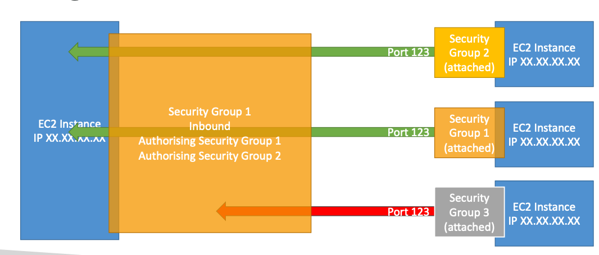
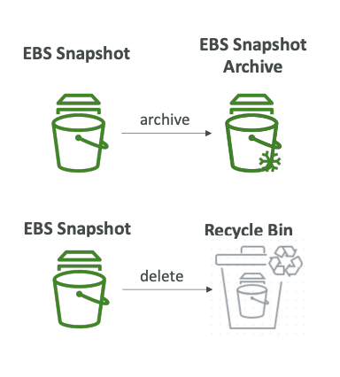
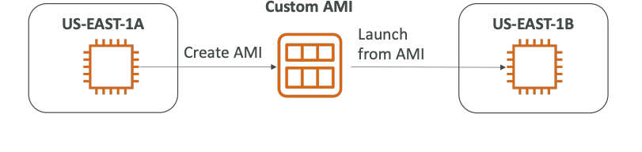

## AWS EC2

Elastic Compute Cloud (EC2), Infrastructure as a Service.
It mainly consists of:
1. Renting virtual machines (EC2)
2. Storing data on virtual drives (EBS)
3. Distributing a load across machines (ELB)
4. Scaling the services using an auto-scaling group (ASG)

EC2 sizing and configuration options:
1. OS: Linux, Windows, macOS
2. CPU
3. RAM
4. Storage: EBS (Elastic Block Storage), EFS (Elastic File Storage), hardware (EC2 Instance Store)
5. Network: speed of the card, Public IP address
6. Firewall rules: security group
7. Bootstrap script (on machine launch): EC2 User Data

Each EC2 User Data script runs from root user (`sudo` required).

`t2.micro` (1 vCPU, 1 GB) is part of the AWS free tier (up to 750 hours per month).

### EC2 Configuration

1. Amazon Machine Image (**AMI**) - is a template that contains the software configuration
   (operating system, application server, and application) required to launch your instance.
   Base image can be: Amazon Linux, Ubuntu, Windows, macOS, Red Hat, etc.
2. Instance type
3. Key pair for SSH connection
4. Storage volumes
5. Advanced: Spot instances, Tenancy, User Data script, etc.

After EC2 instance stops, Public IP can be **resigned**.
`0.0.0.0/0`- CIDR block of 'everywhere.'

### Instance Types

AWS EC2 Instance Types:
1. **General Purpose**, Great diversity of workloads such as web servers or code repos.
   Balance between: Compute, Memory, Networking.
2. **Compute Optimized**, Great for compute-intensive tasks that require high-performance processors:
   Batch processing workloads, Media transcoding, High performance computing (HPC),
   Scientific modeling, Machine Learning, Dedicated gaming servers.
3. **Memory Optimized**, Fast performance for workloads that process large data sets in memory.
   Use-cases: High performance databases, Distributed web scale cache stores,
   In-memory databases optimized for BI (business intelligence), Real-time processing of big unstructured data.
4. **Storage Optimized**, Great for storage-intensive tasks that require high,
   sequential read and write access to large data sets on local storage.
   Use-cases: High frequency online transaction processing (OLTP) systems,
   Relational and NoSQL databases, Cache for in-memory database,
   Data warehousing applications, Distributed file systems.

AWS has the following naming convention: `m5.2xlarge`, where


m: instance class
<br>
5: generation (AWS improves them over time)
<br>
2xlarge: size withing the instance class

### Security Groups

Security groups control how traffic is allowed into or out of our EC2 instances.
Security groups only contain `allow` rules.
Security groups rules can be reference by IP or by security group.

Security groups are acting as a 'firewall' on EC2 instances.
They regulate port accessing, IP ranges (IPv4 and IPv6),
inbound network (from others to the instance),
outbound network (from the instance to others).

Any **timeout is cause of EC2 Security Groups**.


Security groups can be attached to multiple instances.
By default, all inbound traffic is `blocked` by default.
By default, all outbound traffic is `authorised` by default.

Referencing other security groups:


Classic Ports to know:
<br>
22 = SSH (Secure Shell) - log into a Linux instance
<br>
21 = FTP (File Transfer Protocol) - upload files into file share
<br>
22 = SFTP (Secure File Transfer Protocol) - upload files using SSH
<br>
80 = HTTP - access unsecured websites
<br>
443 = HTTPS - access secured websites
<br>
3389 = RDP (Remote Desktop Protocol) - log into a Windows instance

### EC2 Connection

Using SSH:

```shell
ssh -i certi.pem ec2-user@<public ip>
```

If you have an error: `UNPROTECTED PRIVATE KEY FILE` ->

```shell
chmod 0400 certi.pem
```

Using EC2 Instance Connect:
In the Management Console, you can start a new browser session with connection to your EC2.

### EC2 Instances Purchasing Options

**On-Demand Instances** — short workload, predictable pricing, pay by uptime second.
Pay for what you use:
1. Linux or Windows — billing per second, after the first minute
2. All other OSs — billing per hour
   <br>
   Has the **highest cost but no upfront payment**, no long-term commitment.

**Reserved** (1 and 3 years):
1. Reserved Instances — long workloads, you specify `Instance Type`, `Region`, `Tenancy`, `OS`.
2. Convertible Reserved Instances — long workloads with flexible instances,
   you can change the `Instance Type`, `Region`, `Tenancy`, `OS`,
   less discount comparing to Reserved Instances.
   Good for databases.
   **Savings Plan** (1 and 3 years) — commitment to and amount of usage, long workload.
   Get a discount based on long-term usage (up to ~72%),
   usage beyond EC2 Savings Plan is billed at the On-Demand price.
   Locked to a specific instance family & AWS region (e.g., `M5` in `us-east-1`).
   But flexible across: Instance size (e.g., `m5.xlarge`, `m5.2xlarge`), and OS (e.g., Linux, Windows).

**Spot Instances** - short workloads, cheap, can lose instances (less reliable).
Can get a discount of up to 90% compared to On-Demand.
Instances that you **can 'lose'** at any point of time
if your max price is less than the current spot price.
**Useful for workloads that are resilient to failure.**
**Not suitable for critical jobs or databases.**
<br>
**Dedicated Host** - book an entire physical server, control instance placement.
A physical server with EC2 instance capacity fully dedicated to your use.
Allows you to address compliance requirements and use your existing server-bound software licenses.
Can be purchased using these options: On-Demand, Reserved.
**The most expensive** option.
<br>
**Dedicated Instances** - no other customers will share your hardware.
Instances **run on hardware that's dedicated to you.**
May share hardware with other instances in the same account.
No control instance placement (can move hardware after Stop / Start).
<br>
**Capacity Reservations** - reserve capacity in a specific AZ for any duration.
You can reserve it with a full price, even you don't stay in it.

#### Instance Metadata

EC2 Instance Metadata (`IMDS`):
EC2 Instance Metadata allows EC2 instances to learn about
'themselves' without using an IAM Role for that purpose.
You can retrieve the IMA Role name from the metadata,
**but you cannot retrieve the IAM Policy**.

`IMDSv1` vs. `IMDSv2`:
IMDSv1 is accessing directly on endpoint: `http://169.254.169.254/latest/meta-data/`

IMDSv2 is more secure and is done in two steps:
1. Get Session Token (limited validity) using headers and PUT
2. Use Session Token in IMDSv2 via using headers `-H "X-aws-ec2-metadata-token: $TOKEN"`

### EC2 Instance Storage Options

#### EBS

Elastic Block Store (EBS) Volume
is a **network drive** you can attach to EC2 instances while they run.
It allows instances to persist data, even after their termination.
They can only be **mounted to one instance at a time**.
They are **bound to specific AZ**.

EBS Delete on Termination attribute:
by default, enabled in the EBS Root, and disabled in any other attached EBS.
It can be controlled by the AWS Management Console/AWS CLI.

**EBS Snapshots — a backup of the EBS volume** at a point in time.
Not necessary to detach volume to do snapshot, but recommended.
You can copy snapshots across AZ or Region.

EBS Snapshots Features:
1. EBS Snapshot Archive: move a snapshot to an 'archive tier' that is 75% cheaper,
   but takes within 24 to 72 hours for restoring the archive.
2. Recycle Bin for EBS Snapshots: setup retention rules (from 1d to 365d) to retain deleted snapshots,
   so you can recover them after an accidental deletion.
3. Fast Snapshot Restore (FSR): force full initialization of snapshot to have no latency on the first use,
   expensive $$$.



EBS volumes are network drives with 'limited' performance.
**If a high-performance disk is required, use EC2 Local Instance Store**.
EC2 Local Instance Store loses their storage if they are stopped (ephemeral storage).
EC2 Local Instance Store can't be used as a durable, long-term place to store data.
Good for buffer, cache, scratch data, temporary content.
Risk of data loss if hardware fails.
**Backups and Replication are your responsibility**.

EBS Volume Types:
1. **gp2/gp3 (SSD)**: General Purpose SSD volume
   that balances price and permanence for a wide variety of workloads.
2. **io1/io2 (SSD)**: Highest-performance SSD volume for mission-critical
   low-latency or high-throughput workloads.
3. **st1 (HDD)**: Low cost HDD volume designed for frequently accessed, throughput-intensive workloads.
4. **sc1 (HDD)**: Lowest cost HDD volume designed for less frequently accessed workloads.

EBS Volumes are characterized in `Size` | `Throughput` | `IOPS` (I/O Operations Per Second).
**Only gp2/gp3 and io1/io2 can be used as boot volumes (SSD).**

General Purpose SSD:

`gp2`: Small gp2 volumes can burst IOPS to 3,000,
**Size of the volume, and IOPS are linked**, max IOPS is 16,000,
3 IOPS per GB, means at 5,334 GB we are at the max IOPS.

`gp3`: Baseline of 3,000 IOPS and throughput of 125 MB/s,
gp3 can increase IOPS up to 16,000 and throughput up to 1000 MB/s **independently**.

Provisioned IOPS (PIOPS) SSD:
Critical business application with sustained IOPS performance.
Or application **requires more than 16,000 IOPS**.
Great for **database workloads** (sensitive to storage performance and consistency).
Then, `io1/io2` is solution: size is 4GB - 16TB, max **PIOPS 64,000 for Nitro EC2 instances** and 32,000 for other,
**io1/io2 can increase PIOPS independently of storage size**,
io2 has more durability and more IOPS per GB (at the same price as io1).

io2 Block Express (4GB - 64 TB): sub-millisecond latency,
max PIOPS: 256,000 with an IOPS:GB ratio of 1,000:1,
**supports EBS Multi-attach**.

Hard Disk Drives (HDD):
cannot be a boot volume,
from 125GB to 16TB.

`st1`: Throughput Optimized HDD, great for Big Data, Data Warehouses, Log processing,
max throughput: 500 MB/s, max IOPS: 500.

`sc1`: Cold HDD, for data that is infrequently accessed, scenarios where the lowest cost is important,
max throughput: 250 MB/s, max IOPS: 250.

EBS Multi-attach: attach the same EBS volume to multiple EC2 instances in the same AZ.
Each instance has full read and write permissions to the HP volume.
**Up to 16 EC2 Instances at a time.**

Use-case:
1. Achieve **higher application availability** is clustered Linux applications.
2. Applications must manage concurrent write operations.

#### EFS

Elastic File System (EFS) — managed Network File System (NFS) that **can be mounted on many EC2**.
**EFS works with EC2 instances in multi-AZ.**
Highly available, scalable, expensive (3x gp2), pay per use.

Use-case:
1. Content management
2. Web serving
3. Data sharing
4. WordPress

**EFS is only compatible with Linux based AMIs.**
Encryption at rest using KMS.
POSIX file system that has a standard file API.
File system **scales automatically**, pay-per-use, **no capacity planning**.

EFS Classes:

1. EFS Scale
2. Performance Mode (set at EFS creation time)
3. Throughput Mode

EFS Storage Tiers:
1. Standard: for frequently accessed files
2. Infrequent Access (EFS-IA)

EFS Availability and Durability Tiers:
1. Regional or Standard (old naming): Multi-AZ
2. One Zone
3. One Zone-IA (over 90% in cost savings)

#### EBS vs. EFS vs. Instance Store

EBS volumes:
1. can be attached to only one instance (expected io1/io2)
2. are locked at the AZ level
3. to migrate an EBS volume across AZ, we need to make a snapshot and restore it into another AZ
4. Root EBS volumes of instances get terminated by default if the EC2 instance gets terminated

EFS:
1. it can be attached to many EC2 Instances
2. multi-AZ
3. only for Linux Instances (POSIX)
4. higher price point than EBS

Local Instance Store:
1. high-performance disk
2. lose their storage if they are stopped (ephemeral storage)
3. it can't be used as a durable, long-term place to store data

### AMI

Amazon Machine Image (AMI) is a customization of an EC2 instance **by reusing EC2 state**:
1. You add your own software, configuration, OS, monitoring, etc.
2. Faster boot/configuration time because **all your software is pre-packaged**

**AMIs are built for a specific region**, and can be copied across regions.

**Public AMI**: AWS provided.
<br>
**Your own AMI**: you make and maintain them yourself
<br>
**An AWS Marketplace AMI**: an AMI someone else made (and potentially sells)



### Auto Scaling Groups

Horizontal scaling implies distributed systems.
Scale out — increase number of instances.
Scale in - decrease number of instances.

Auto Scaling Group (ASG) features:
1. Scale out (add EC2 Instances) to match an increased load
2. Scale in (remove EC2 Instances) to match a decreased load
3. Ensure that we have a minimum and a maximum number of EC2 Instances running
4. Automatically register new instances to a load balancer
5. If ELB seems that EC2 Instance is unhealthy, then the ASG will terminate it
6. Re-create an EC2 Instance in case a previous one is terminated or unhealthy

**ASGs are free (you only pay for the underlying EC2 Instances).**

ASG requires a **Launch Template** (contains information on how to launch your EC2 Instances):
1. AMI, Instance Type
2. EC2 User Data
3. EBS Volumes
4. Security Groups
5. SSH Key Pair
6. IAM Roles for your EC2 Instances
7. Network and Subnet information
8. Load Balancer information

Also, you need to define:
1. Size (Min size, Max size, Initial size)
2. Scaling Policies (when to scale out/scale in)

Use-case: It is possible to scale an ASG **based on CloudWatch alarms**,
an alarm monitors a metric (such as Average CPU, or a custom metric).

Scaling Policies:
Dynamic Scaling Policies:
1. Target Tracking Scaling: I want the avg ASG CPU to stay at around 40%.
2. Simple/Step Scaling: When CloudWatch alarm is triggered (CPU > 70%), then add 2 units to ASG,
   When CloudWatch alarm is triggered (CPU < 30%), then remove 1 unit from ASG
3. Schedule Actions: anticipate a scaling based on known usage patterns;
   increase the min capacity to 10 at 5pm on Fridays.

Predictive Scaling: continuously forecast load and schedule scaling ahead.
ML powered.

Metrics to scale on:
1. CPUUtilization
2. RequestCountPerTarget
3. Average Network In/Out
4. Any custom metric (that you push using CloudWatch)

Scaling Cool-downs:
**after a scaling activity happens, you are in the cool-down period** (default 300 secs).
During the cool-down period,
the ASG will not launch or terminate additional instances (to allow for metrics to stabilize).


**Use a ready-to-use AMI
to reduce configuration time**,
in order to be serving request faster and **reduce the cool-down period**.

Instance Refresh.
Goal: update launch template and then re-creating all EC2 Instances.
For this, we can use the **native feature or Instance Refresh**.

Each time, Instances with old Instance Template will be terminated
and swapped to Instances with new Instance Template.
