## AWS ECS

**ECS (Elastic Container Service) — Docker on AWS**.
Docker images are stored in image repositories:
Docker Hub (`https://hub.docker.com`) - public repository,
**AWS ECR (Elastic Container Registry)** - private repository,
but also has a public repository (ECR Public Gallery - `https://gallery.ecr.aws`).

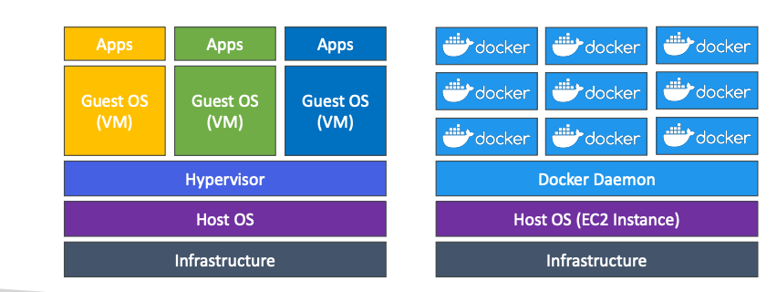

Container Management on AWS:
1. **ECS (Elastic Container Service)** — Amazon Container Platform.
2. **EKS (Elastic Kubernetes Service)** - Managed Kubernetes service.
3. **Fargate** — Amazon's serverless container platform, works with ECS and EKS.
4. **ECR (Elastic Container Registry)** — image repository.

Launch Docker containers on AWS means launch **ECS Tasks** on ECS Clusters.
Each Task includes containers.
Container can be essential (if it crashes, a whole task crashes) or not.
**ECS Cluster needs provisioned and maintained infrastructure based on launch type**.
 
Launch types:
1. EC2 Launch Type: Each EC2 Instance must run ECS agent to register in the ECS Cluster.
   **AWS take care of starting or stopping containers**.
   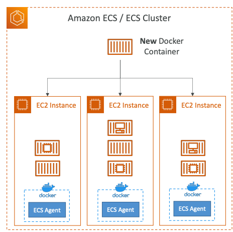
2. Fargate Launch Type: **you don't provision the infrastructure (no EC2 Instances to manage)**,
   it's all **serverless**.
   You just create **task definitions**, AWS runs ECS Tasks based on the CPU/RAM you need.
   To scale, the number of tasks can be increased.
   **Easier to manage, comparing with EC2 Launch Type**.
   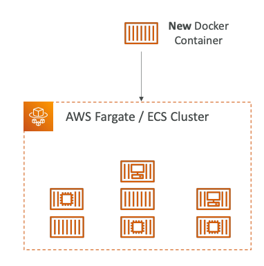

### IAM Roles for ECS

1. **EC2 Instance Profile (EC2 Launch Type only)**:
   used by the ECS agent, makes API calls to ECS service,
   send container logs to CloudWatch Logs, pull docker images from ECR,
   reference sensitive data in Secrets Manager or SSM Parameter Store
2. ECS Task Role:
   allows each task to have a specific role

**IAM Roles assigned per Task Definition**.
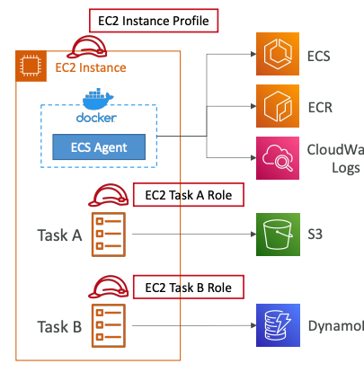

### Load Balancer Integrations

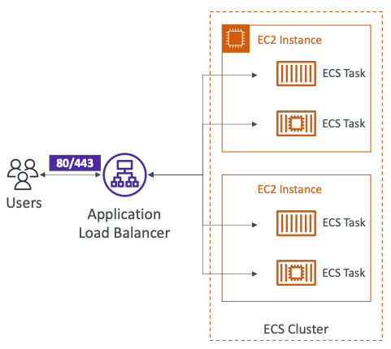
**Application Load Balancer** is supported and works for most use cases.
 
**Network Load Balancer** is recommended only for high throughput.
 
**Classic Load Balancer** is supported, but not recommended (no Fargate).

### Data volumes

Mount EFS file systems onto ECS tasks.
**S3 cannot be mounted as a file system**.
Works for both **EC2** and **Fargate** launch types.
**Tasks running in any AZ will share the same data in the EFS**.
**Also, on EC2 you can mount data on EC2 Instance storage**.
**On Fargate, you can use ephemeral storage with capacity of 20GB — 200GB**.

`Fargate + EFS = Serverless`.

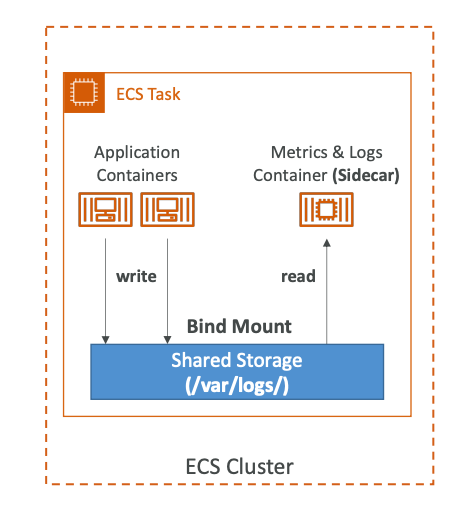

Use-case:
1. Persistent multi-AZ shared storage for your containers.
2. Sidecar container.

### Service Auto Scaling

Automatically increase/decrease the desired number of ECS Tasks.
ECS Auto Scaling uses **AWS Application Auto Scaling**:
1. ECS Service Average CPU Utilization
2. ECS Service Average RAM Utilization
3. ALB Request Count Per Target

**Target Tracking** - scale based on target value for a specific CloudWatch Metric.
 
**Step Scaling** - scale based on a specific CloudWatch Alarm.
 
**Schedule Scaling** - scale based on a specified date/time.

Fargate Auto Scaling is much easier to setup (because Serverless).
 
Auto scaling ECS based on EC2 Launch type:
1. Auto Scaling Group
2. ECS Cluster Capacity Provider: smarter one, recommended to use.

### Rolling Updates

When updating from v1 to v2,
we can control how many tasks can be started and stopped, and in which order.

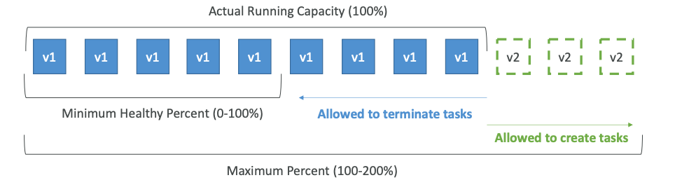

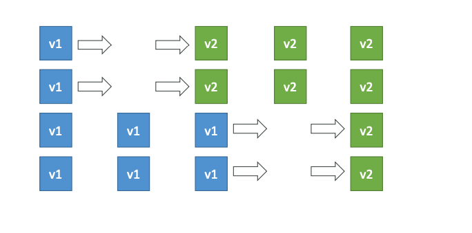

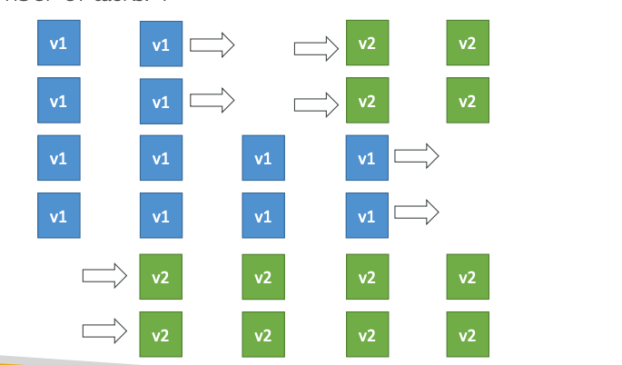

### Arc examples

ECS Tasks invoked by Event Bridge:
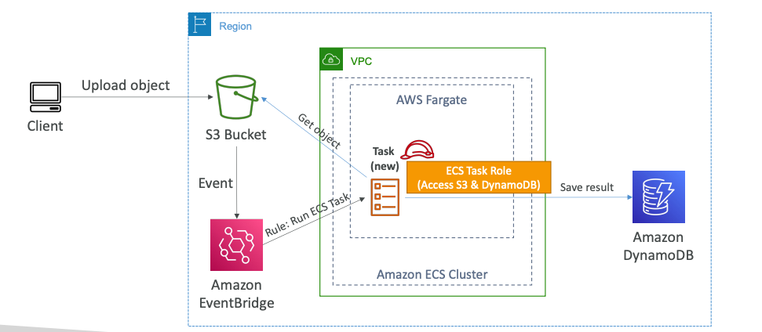

ECS Tasks invoked by Event Bridge Schedule:
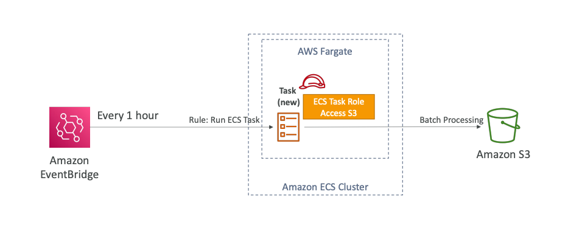

### Task Definitions

Task Definitions are **metadata in JSON format to tell ECS how to run a Docker container**.
It contains information, such as
1. image name
2. port binding for container and host
3. memory and CPU required
4. Environment variables: **Hardcoded**, **SSM Parameter Store**, **Secrets Manager** or
   **Environment files - `.env` (bulk) from S3 bucket**.
5. Networking information
6. IAM Role
7. Logging configuration

**Up to 10 containers can be defined in task definition**.
**Each task from within hosted on EC2 Instance is going to be
accessible from a different (random) port on the host EC2 Instance**.

We get a Dynamic Host Port Mapping if you define only the container port in the task definition.
**You must allow on the EC2 Instance's Security Group any port from ALB's Security Group**.
The ALB finds the right port on your EC2 Instances.

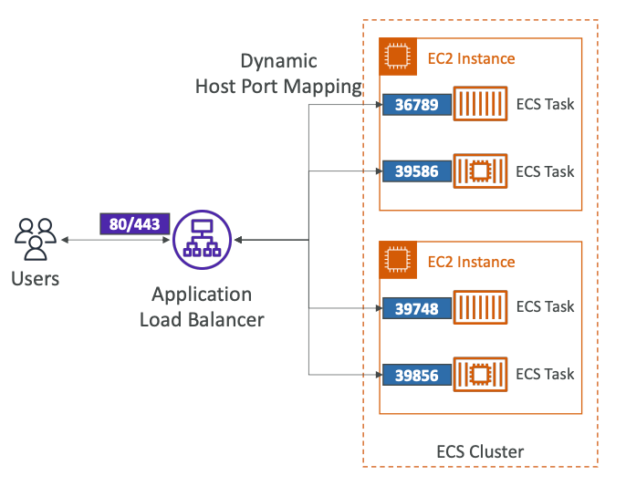

On Fargate, **each task has a unique private IP**.
Only define the container port (host port is not applicable).
You must allow only port 80 on ECS ENI and 80/443 on ALB.

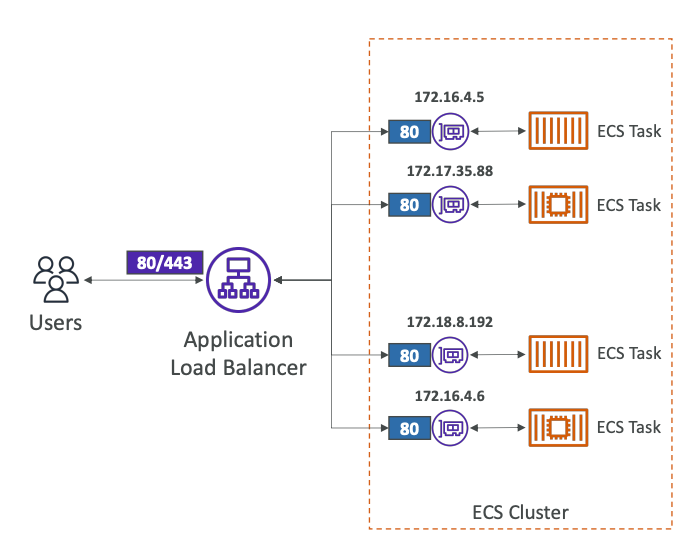

### Task Placement

When a task of type EC2 is launched, ECS must determine where to place it,
with the constraints of CPU, memory, and available port.
Similarly, when a service scales in,
ECS needs to determine which task to terminate.

To assist with this, you can **define a task placement strategy**
and **task placement constraints**.

`Placement strategies`:
1. **Binpack**: place tasks based on the least available amount of CPU or memory, minimizes the number of instances,
   brings cost savings.
2. **Random**: place tasks randomly.
3. **Spread**: place the task evenly based on specified value, e.g., `instanceID`, `attribute:ecs.availability-zone`

Placement strategies can be mixed together.

`Placement constraints`:
1. `distinctInstance`: place each task on a different container instance
2. `memberOf`: places tasks on instances that satisfy an expression, uses Cluster Query Language,
   e.g., `"attribute:ecs.instance-type =~ t2.*"`

AWS Task Placement Process:
1. Identify the instances that satisfy the CPU, memory, and port requirements in the task definition.
2. Identify the instances that satisfy the task placement constraints.
3. Identify the instances that satisfy the task placement strategies.

### ECR

**Elastic Container Registry**.
Store and manage Docker images on AWS.
Backed by S3.
Supports image vulnerability scanning, versioning, image tags, image lifecycle.

#### Copilot

AWS Copilot is a CLI tool to build, release,
and operate production-ready containerized applications.
Automated deployments with one command using CodePipeline.
Deploy to multiple environments.

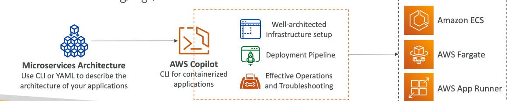

### EKS

**Elastic Kubernetes Service (EKS)**.
**Managed Kubernetes cluster on AWS (master node is managed, you only create a worker ones)**.
EKS supports EC2 if you want to deploy worker nodes or Fargate to deploy serverless containers.

Use-case: if your company is already using Kubernetes on-premises
or in another cloud and wants to migrate to AWS using Kubernetes.
**Kubernetes is cloud-agnostic** (can be used in any cloud - AWS, Azure, GCP).
 
Node types:
1. Managed Node Groups: EKS creates and manages Nodes (EC2 Instances) for you.
2. Self-Managed Nodes: nodes created by you and registered to the EKS cluster,
   can be prebuilt using AMI.
3. Fargate mode: no maintenance required, no nodes are managed.

Also, you can attach Data Volumes to EKS cluster.
Need to specify StorageClass manifest on your EKS cluster.
Leverages a Container Storage Interface (CSI) compliant driver.

Support of:
1. EBS
2. EFS
3. FSx for Lustre
4. FSx for NetApp ONTAP
