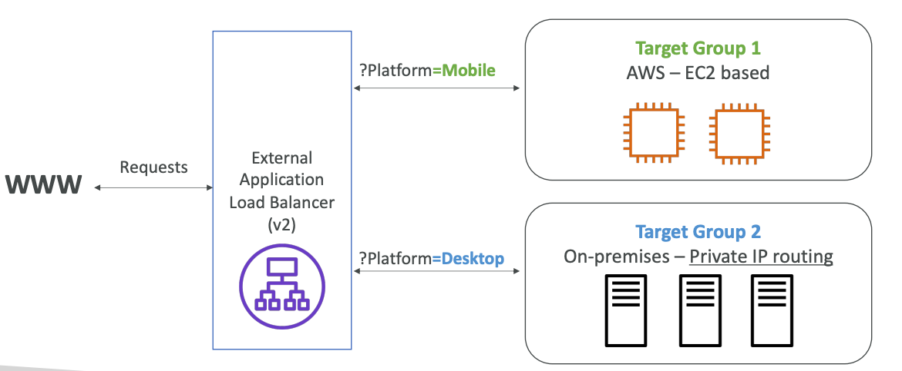

## Load Balancing on AWS

Using horizontal scaling, we need load balancing between them.

High availability means running your application/system in at least 2 data centers (AZs).
The goal of high availability is to survive a data center loss.

Managing horizontal scaling on AWS:
1. Auto Scaling Group
2. Load Balancer

Managing high availability on AWS:
1. Run instances for the same application across multi AZ.

Why use a load balancer:
1. Spread a load across multiple downstream instances
2. Explore a single point of access (DNS) to your application
3. Health-checking instances
4. Separate public traffic from private traffic

### Elastic Load Balancer

An Elastic Load Balancer is a **managed load balancer**.

Types of load balancers on AWS:
1. **Classic Load Balancer** (CLB) — 2009, HTTP, HTTPS, TCP, SSL, **Deprecated**
2. **Application Load Balancer** (ALB) — 2016, HTTP, HTTPS, WebSocket
3. **Network Load Balancer** (NLB) — 2017, TCP, TLS, UDP, High performance, Low-latency
4. **Gateway Load Balancer** (GWLB) - 2020, IP Protocol (layer 3 of an OSI model)

some load balancers can be setup as internal (private) or external (public), a.k.a internet-facing ELBs.
**ELB provides static DNS name.**

EC2 instances should only **allow traffic only coming directly from load balancers**.

#### Application Load Balancer

Application Load Balancers (ALB) are Layer 7 (HTTP).

Use-cases:
1. Load balancing to multiple HTTP applications across machines (target groups)
2. Load balancing to multiple applications on the same machine

Support for HTTP/2 and WebSocket.
Also supports redirects (e.g., from HTTP to HTTPS).

Routing tables to different target groups:
1. Routing based on a path in URL (`example.com/users` and `example.com/posts`)
2. Routing based on hostname in URL (`one.example.com` and `another.example.com`)
3. Routing based on Query String, Headers (`example.com/users?id=123&order=false`)

ALBs are a great fit for microservices, container-based application.
We can have one ALB in front of many applications.

Target Groups:
1. EC2 Instances (can be managed by an Auto Scaling Group) - HTTP
2. ECS Tasks (managed by ECS itself) - HTTP
3. Lambda Functions — HTTP request is translated into a JSON event
4. IP Addresses - must be private IPs

ALB can route to multiple target groups.
Health checks are at the target group level.

ALB gives you fixed hostname (`xxx.region.elb.amazonaws.com`).
The application servers **don't see the IP of the client directly**,
real IP of the client is stored in `X-Forwarded-For` header.
We can also get Port (`X-Forwarded-Port`), and Proto (`X-Forwarded-Proto`).

#### Network Load Balancer

Network Load Balancers (NLB) are Layer 4 (TCP).
Forward TCP and UDP traffic.
Extreme performance, NLB can handle millions of requests per second.
Less latency ~100ms vs. ~400ms for ALB.
NLB has **one static IP per AZ**, and supports assigning Elastic IP.

Target groups:
1. EC2 Instances
2. IP Addresses
3. Application Load Balancer

Health checks support the TCP, HTTP and HTTPS protocols.

#### Gateway Load Balancer

Gateway Load Balancer (GWLB) — load balancer for deploying, scaling,
and managing a fleet of 3rd party network virtual appliances in AWS.
**Operates at Layer 3 (Network Layer) — IP.**
**Uses the GENEVE protocol on port 6081**.

Combines the following functions:
1. Transparent Network Gateway — singe entry/exit for all traffic.
2. Load Balancer - distributes traffic to your virtual appliances

Example: Firewalls, Intrusion Detection and Prevention Systems (IDPS),
Deep Packet Inspection Systems, Payload manipulation, etc.

Target groups:
1. EC2 Instances
2. IP Addresses - must be private IPs

#### Sticky Sessions (Session Affinity)

It is possible to implement stickiness,
so that the same client is always redirected to the same instance behind a load balancer.

Can not be implemented with Gateway Load Balancer.

Use-case: make sure the **user doesn't lose his session data**.

Application-based Cookies:
**Custom Cookie**: generated by the target,
can include any custom attributes required by the application.
Also, cookie name must be specified individually for each target group.
Don't use `AWSALB`, `AWSALBAPP`, `AWSALBTG` (they are reserved for use by the ELB).
**Application Cookie**: generated by the load balancer, cookie name is `AWSALBAPP`.
 
**Duration-based Cookies**
Cookie generated by the load balancer,
cookie name is `AWSALB` for ALB and `AWSELB` for Classic Load Balancer (CLB).

Thus, **cookies help in implementation of the Session Affinity**.

#### Cross-Zone Load Balancing

**With Cross-Zone Load Balancing**: each load balancer instance
distributes evenly across all registered instances in all AZ.

 
**Without Cross-Zone Load Balancing**:
Requests are distributed in the instances of the node the Elastic Load Balancer.

For Application Load Balancer (ALB), Cross-Zone Load Balancing is **enabled by default**
(can be disabled at the Target Group level).
No charges for inter AZ data.

For Network Load Balancer (NLB), Cross-Zone Load Balancing is **disabled by default**.
You pay charges for inter AZ data if enabled.

For Classic Load Balancer (CLB), Cross-Zone Load Balancing is **disabled by default**.
No charges for inter AZ data if enabled.

#### Certifications with Load Balancing

SSL - Secure Socket Layer.
 
TLS — Transport Layer Security.

SSL Termination:

The load balancer uses an X.509 certificate (SSL/TLS server certificate).
**Certificates can be managed using ACM (AWS Certificate Manager)**.
You can create and upload your own certificates alternatively.

Server Name Indication (SNI):
simple mapping between `hostname` and `certificate` name.

SNI **solves the problem of loading multiple SSL certificates onto one web server**
(to serve multiple websites).
It's a newer protocol and requires the client to indicate the hostname
of the target server in the initial SSL handshake.
The server will then find the correct certificate or return the default one.

**Only works for** `ALB` and `NLB`, CloudFront.
**Does not work for `CLB`**.
Classic Load Balancer supports only one SSL certificate,
must use multiple CLB for multiple hostname with multiple SSL certificates.

Connection Draining.

**Connection Draining for CLB**, **Deregistration Delay for ALB and NLB** -
time to complete 'in-flight requests' while the instance is de-registering or unhealthy.
a.k.a **Graceful shutdown**.
So, **load balancer is waiting for existing connections to complete;
new connections will not be established**.

This feature stops sending new requests to the EC2 Instance, which is de-registering.
Connection Draining feature can be disabled, by setting a `0` value.
**Set to a low value if your requests are short.**
