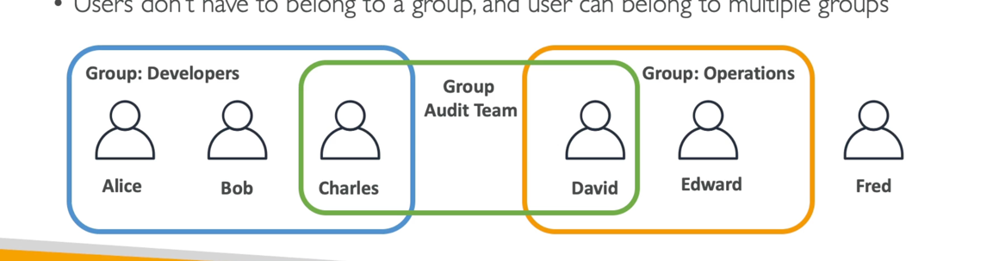
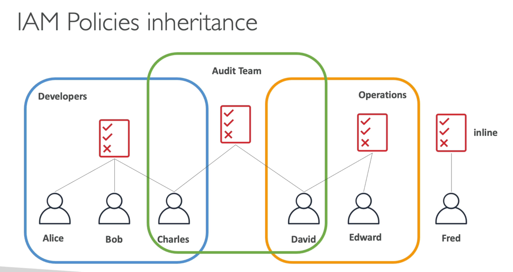

## AWS IAM
IAM — Identity and Access Management.

### Accounts, Users, Groups
Deactivate and delete your ROOT account credentials, it shouldn't be used or shared.
Create users instead.
**Users** can be part of multiple groups.
**Groups** only contain users, not other groups.


### Policies
Users and Groups can be assigned JSON documents, a.k.a IAM Policies:

```json
{
    "Version": "2012-10-17",
    "Statement": [
        {
            "Sid": "FullAccess",
            "Effect": "Allow",
            "Action": ["s3:*"],
            "Resource": ["*"]
        },
        {
            "Sid": "DenyCustomerBucket",
            "Action": ["s3:*"],
            "Effect": "Deny",
            "Resource": ["arn:aws:s3:::customer", "arn:aws:s3:::customer/*" ]
        }
    ]
}
```

```json
{
    "Version": "2012-10-17",
    "Statement": [
        {
            "Effect": "Allow",
            "Action": [
                "dynamodb:DeleteItem",
                "dynamodb:GetItem",
                "dynamodb:PutItem",
                "dynamodb:UpdateItem"
            ],
            "Resource": [
                "arn:aws:dynamodb:us-west-1:123456789012:table/myDynamoTable"
            ],
            "Condition": {
                "ForAllValues:StringEquals": {
                    "dynamodb:LeadingKeys": [
                        "${cognito-identity.amazonaws.com:sub}"
                    ]
                }
            }
        }
    ]
}
```
These policies define the **permissions** of the users.
In AWS, you apply **the least privilege principle**:
don't give more permissions than a user needs.

Generate IAM user's keys for security tracing (but without access to IAM).
Create RBAC (Role Based Access Control).
Create Admin and attach roles for others.
Account ID -> Account Alias.
Account Alias must be globally unique.

IAM Policies inheritance:
<br>
Users inherit the policies from attached Groups.
<br>
Also, can `Inline Policy` be applied.
`Inline Policy` — 1:1 mapping permissions only for 1 user / service and nobody else.


IAM Policy Structure:
<br>
`Version`: policy language version
<br>
`Id`: an identifier for the policy
<br>
`Statement`: one or more individual statements, which consists of:
<br>
`Sid`: an identifier for the statement
<br>
`Effect`: whether the statement allows or denies access (**Allow**, **Deny**)
<br>
`Principal`: account/user/role to which the policy applied to
<br>
`Action`: list of actions this policy allows or denies (based on the Effect)
<br>
`Resource`: list of resources on which actions will be applied
<br>
`Condition`: when to apply actions

Policies can be created using either JSON or Visual editor.

### IAM Multi-Factor Authentication (MFA)

Strong protection of your AWS account.
MFA = _password you know_ + _security device you own_

MFA device options in AWS:
<br>
Virtual device:
<br>
Google Authenticator (phone only)
<br>
Authy (multi-device)

Universal 2nd Factor (U2F) Security Key:
YubiKey by Yubico (3rd party) and other keychains.

#### MFA with CLI

To use MFA with CLI, you must create a temporary session token (run `STS GetSessionToken` API call).

Each service has permissions.
You can assign them to AWS services using policies.
For example, Inline Policy —
1:1 mapping permissions only for 1 user / service and nobody else.

### IAM Roles for Services
Some AWS service will need to perform actions on your behalf.
To do so, we need to assign **permissions** to AWS services (trusted entity) with IAM roles.
Most common use-cases are EC2 and Lambda.

Permissions, which are not explicitly allowed -> they are **implicitly denied**.
Everything can be setup in the IAM dashboard.

### Accessing the AWS
To access AWS, you have 3 options:
1. Management Console (protected by password + MFA)
2. Command Line Interface (CLI) (protected by access keys), Python runtime
3. Software Development Kit (SDK) (protected by access keys)
   or AWS API.

With AWS API, you must sign the request using access and secret keys,
so that AWS can identify you (except some S3 requests).
You should use **Signature v4 (SigV4)** for request signing:
1. HTTP Header option (signature in Authorization header)
2. Query String option (signature in X-Amz-Signature)

If you are using CLI or SDK, the requests are signed for you.

With CLI, output format can be `text`, `json`, or `yaml`.
AWS CloudShell — cloud terminal, where you can run your CLI commands,
upload and download files.

Users manage their own access keys.
Access Key ~= username
Secret Key ~= password

Configuration stored in `.aws/config`.
Credentials are stored in `.aws/credentials`.
You can give a name for your account with profile alias.
In `.aws/credentials` you can specify [$profile] node on top of `ACCESS_KEY` and `SECRET_KEY`.
Many AWS credentials can be managed using profiles.
In AWS CLI you can choose the profile using `--profile`.

**If you don't specify a default region, then `us-east-1` will be chosen by default**.

#### Credentials Provider Chain

CLI:
1. Command line options `--region`, `--output`, `--profile`
2. Environment variables `AWS_ACCESS_KEY_ID`, `AWS_SECRET_KEY_ID`, `AWS_SESSION_TOKEN`
3. `~/.aws/credentials`
4. `~/.aws/config`
5. Container credentials for ECS tasks
6. Instance profile credentials for EC2 Instance Profiles

SDK:
1. system properties
2. Environment variables
3. `~/.aws/credentials`
4. ECS container credentials
5. Instance profile credentials for EC2 Instance Profiles

### IAM Security Tools
1. **IAM Credentials Report** (account-level) -
   a report that lists all your account's users and the status of their various credentials.
2. **IAM Access Advisor** (user-level) -
   shows the service permissions granted to a user and when those services were last accessed.
   You can use this information to revise your policies.

### Shared Responsibility Model for IAM
AWS is responsible for Infrastructure (global network security),
configuration and vulnerability analysis, and compliance validation.

While, **you are responsible for managing Users, Groups, Roles, Policies management, and monitoring**.
Also, MFA enabling, key rotation, usage of IAM tools for applying appropriate permissions,
analyze access patterns and review permissions.

### IAM Summary

**Users**: mapped to a physical user, has a password for AWS Console
<br>
**Groups**: contains users only
<br>
**Policies**: JSON document that outlines permissions for users or groups
<br>
**Roles**: for AWS services, such as EC2 or Lambda
<br>
**Security**: MFA + Password Policy
<br>
**AWS CLI**: manage your AWS services using the command-line
<br>
**AWS SDK**: manage your AWS services using a programming language
<br>
**Access Keys**: access AWS using the CLI or SDK
<br>
**Audit**: IAM Credential Reports and IAM Access Advisor
