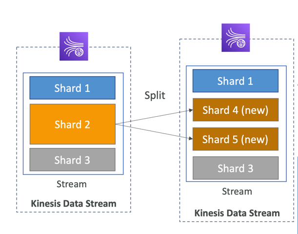

## AWS Kinesis

Kinesis combines the collection, processing, and analyzing of streaming data in real-time.
Ingest real-time data such as:
* Application Logs
* Metrics
* Website click streams
* IoT telemetry data
* etc.

Kinesis consists of 4 services:
1. Kinesis Data Streams: capture, process, and store data streams
2. Kinesis Data Firehose: load data streams into AWS data stores
3. Kinesis Data Analytics: analyze data streams with SQL or Apache Flink
4. Kinesis Video Streams: capture, process, and store video streams

### Data Streams

**Data Streams are made of multiple numbered shards**.
Data split across all the shards.
Number of shards you need to provision ahead of time.

* Retention between 1 day to 365 days.
* Ability to reprocess/replay data.
* Data Immutability: once data is inserted in Kinesis, it can't be deleted.
* Data with the **same partition key goes to the same shard**, thus ordering is guarantied.

#### Capacity Modes

1. Provisioned mode: you choose the number of shards provisioned, then scale manually or using API.
   Each shard gets 1MB/s in and 2MB/s out.
   **You pay per shard provisioned per hour**.
2. On-demand mode: no need to manage the capacity, capacity will be adjusted on-demand.
   Default capacity provisioned: 4MB/s.
   Scales automatically based on observed throughput peak during the last 30 days.
   **You pay per stream per hour and data in/out per GB**.

### Producers

Kinesis Producers **put data records into data streams**.
Data record consists of:
* Sequence number
* Partition key
* Data blob (up to 1 MB)

Producer can send a record with partition key and data blob up to 1MB.
1MB/s or 1000 msg/s per shard.
Producer examples:
* Clients
* SDK, KPL
* Kinesis Agent

API to put record into data stream is `PutRecord`.

Each record is going through hash function for high data distribution:

So, to avoid 'hot partition', **use highly distributed partition key**.

Kinesis ordering works with a partition key:
**the same key will always go to the same shard**.

In the case of SQS, you can have only one SQS FIFO Queue
and multiple Group IDs.

#### ProvisionedThroughputExceeded

Solution for this error:
1. Use a highly distributed partition key
2. Implement retries with exponential backoff
3. Increase shards (scaling): increased MB/s

### Consumers

Consumer can process the record consists of:
partition key, sequence number, and data blob.
Throughput in the **shared fan-out mode is 2MB/s per shard all consumers**,
in the **enhanced fan-out mode is 2MB/s per shard per consumer**.
Consumer examples:
* KCL, SDK
* Lambda
* Kinesis Data Firehose
* Kinesis Data Analytics

#### Shared vs. Enhanced mode

API call for receiving records is `GetRecords`.
In shared mode, all consumers share the throughput per shard.
The more consumers we will add, the more throughput limitations we will get.

* Latency: ~200ms
* Minimize cost
* Data polling using `GetRecords`
* Returns up to 10MB or 10 000 records, then throttle for 5 s.
   

In enhanced mode, consumer getting throughput per shard per consumer.
For enabling that, we need to hit `SubscribeToShard` API.
**In this mode, we are getting a Push model**, instead of a Kinesis Classic Pull model.

* Latency: ~70ms
* Higher cost
* Consumers subscribe to shard using `SubscribeToShard` API
* Kinesis Push data over HTTP/2
* Soft limit of 5 consumer applications/stream (can be resolved by creating AWS Ticket)

#### Lambda Consumers

Lambda functions can also be a Kinesis consumers.
Lambda functions both support shared and enhanced mode.

* Lambda function will read records in batches using `GetBatch` API
* Batch size and batch window can be configured
* In case of error, Lambda retries until succeeded or data expired
* Can process **up to 10 batches per shard simultaneously**

### Kinesis Client Library

Kinesis Client Library (KCL): Java library that helps
read records from a Kinesis Data Stream with distributed applications
**sharing the read workload**.

**Each shard is to be read by only one KCL instance**.

**Read progress will be checkpoint into DynamoDB (needs IAM access)**.
Records are read in order at the shard level.

**To scale Kinesis Data Stream, you need to increase the number of shards,
and only then increase the number of KCL applications**.

Versions:
1. KCL 1.x: supports shared consumers
2. KCL 2.x: supports shared and enhanced fan-out consumers

### Operations

**Since no autoscaling in Kinesis,
you need to do manual capacity increasing and decreasing**.

* Shard splitting (Scale Up):
  used to increase throughput, used to divide 'hot' shard,
  cost will also be increased
  can't split than two shards within a single operation.
* Merging shards (Scale Down): used to decrease capacity, cost saving,
  can't merge than two shards within a single operation.

### Data Firehose

Data Firehose, a fully managed, serverless service that
can take data from producers or [Data Streams](#data-streams)
and apply transformations using AWS Lambda (optionally),
after this, writes data using batch to the destination:
1. AWS Destinations: **S3**, **Redshift**, **OpenSearch**
2. 3rd-party Partner Destinations: Datadog, Splunk, MongoDB, etc
3. Custom Destinations: HTTP Endpoint

You can send failed or all data to a backup S3 bucket.

* **Near Real Time: 60-second latency** minimum for non-full batches
* Pay for data going through Firehose.

### Data Analytics

Fully managed, serverless service for SQL/Flink analytics.

Data Analytics for SQL applications can have the following sources:
1. Data Streams
2. Data Firehose

and destinations are:
1. Data Streams
2. Data Firehose

Data Analytics for Apache Flink can have the following sources:
1. Data Streams
2. MSK
