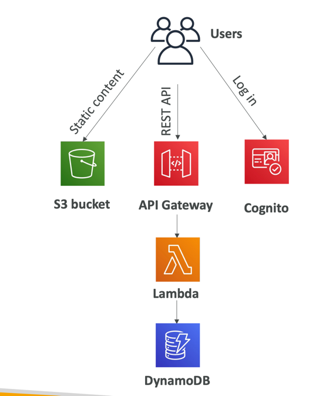
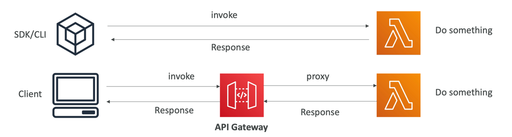
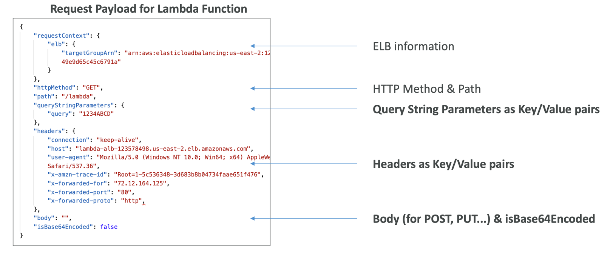
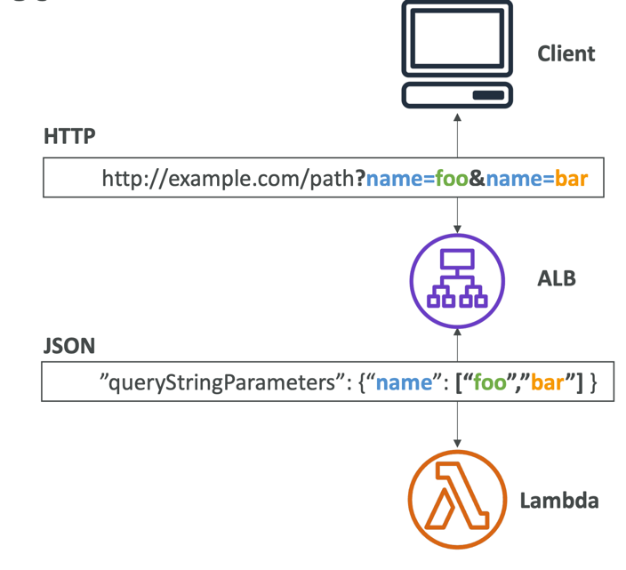
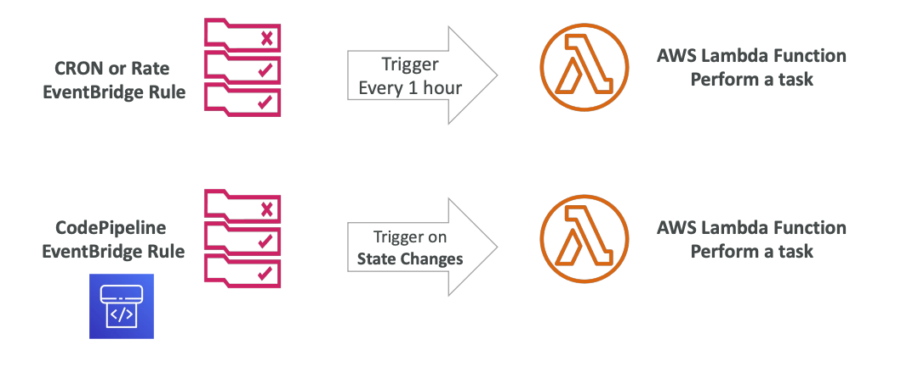
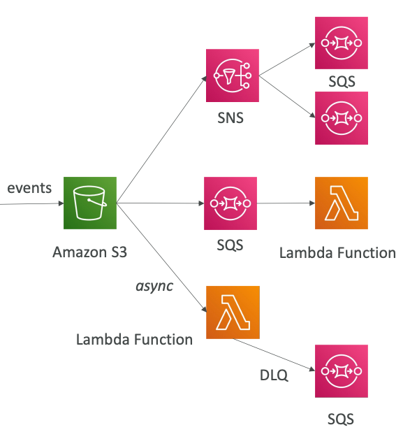
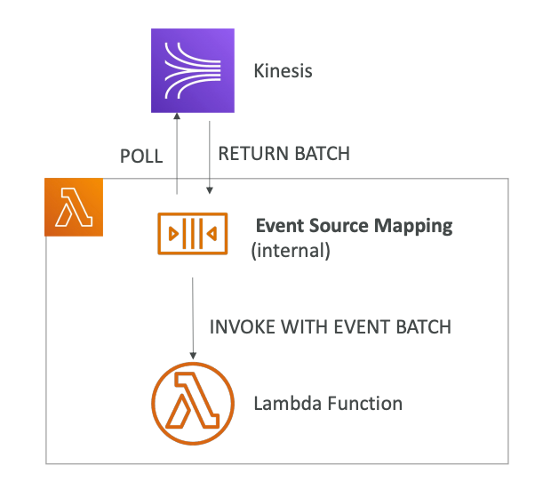
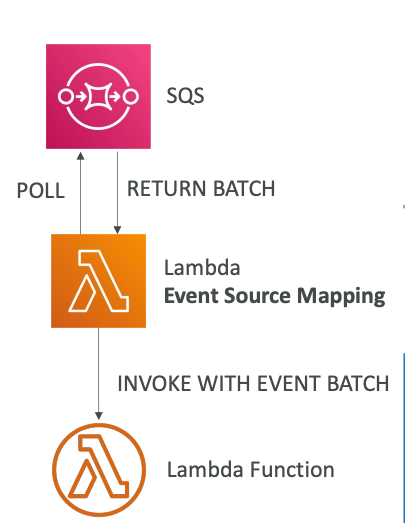
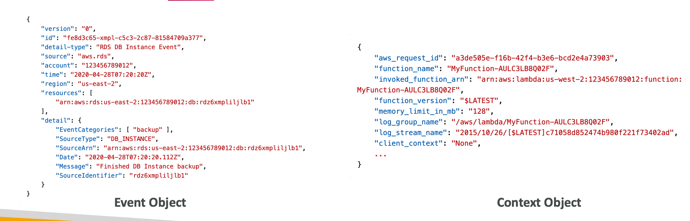

## AWS Lambda

Serverless Cloud Computing, Function as a Service (FaaS).
Simply put, you are not managing any servers.



Run code snippets in serverless way,
without server management.
**Lambda is a stateless service**.
**You are paying only for the time that you use**:
you can provision up to 10GB RAM per function.

Supported platforms:
1. NodeJS
2. Python
3. Java
4. Golang
5. Ruby
6. C#, Powershell
7. Custom runtime API (community supported)

Lambda Container Image must implement the Lambda Runtime API,
**ECS/Fargate is preferred for running arbitrary Docker images**.

Use-cases:
1. Real-time stream processing
2. Real-time file processing
3. ETL
4. Integration inside AWS
5. Cron jobs

**Lambda is a time-bound service: the maximum timeout is 15 minutes (900 seconds)**. 

### Serverless Integration

* API Gateway
* DynamoDB
* Cognito
* S3
* Kinesis
* EventBridge
* CloudFront

Lambda anti-patterns:
1. Long-running applications: use EC2 instead, or chain functions
2. Dynamic websites with AJAX
3. Stateful applications

**Each Lambda function has an IAM roles**.

### Sync Invocation

CLI, SDK, API Gateway, Application Load Balancer.
You are waiting for a result,
errors should be handled on the client side (retries).



Services that are synchronous:
* User invoked:
  * ELB
  * API Gateway
  * S3 Batch
  * CloudFront
* Service invoked:
  * Cognito
  * Step Functions
  * Lex
  * Alexa
  * Kinesis Data Firehose

#### Lambda + ELB

A Lambda function must be registered in a **target group**.

ALB transform HTTP request to JSON, as well as JSON to HTTP for response:



All the responses should have the same structure:

```json
{
  "statusCode": 200,
  "statusDescription": "200 OK",
  "isBase64Encoded": False,
  "headers": {
    "Content-Type": "text/html"
  },
  "body": "<h1>Lambda Example</h1>"
}
```

#### Multi-Header Values

ALB can support multi-header values (need to enable it in ALB).
When you enable it, values for them will be translated to
arrays inside the JSON request:



### Async Invocation

S3, SNS, EventBridge are callers of async invocation.
Also, SES (Simple Email Service), CodeCommit, CodePipeline, Cloudformation.


**Invocation type will be an Event**,
so we are just triggering function
and don't know the result.


**Whether always OK or function failed,
Lambda will return 202 (Accepted) status code**.


**Lambda attempts to retry on errors: 3 tries total,
1-minute wait after 1st one, then 2 minutes wait**.

Make sure that processing is **immutable**.

If the function is retried, you will see 
duplicate logs entries in CloudWatch.

**Can define a DLQ: SQS or SNS for failed processing
(IAM permissions are needed)**.


### Lambda + EventBridge

Events will be sent by EventBridge as a Lambda function source:



### Lambda + S3 Events

S3 Events can call asynchronously
Lambda function:



If you want to ensure that an event
notification is sent for every successful write operation,
you can enable versioning on your bucket.

### Event Source Mapping

**Records need to be polled from the source**.
Applies to Kinesis Data Streams,
SQS and SQS FIFO queues, DynamoDB Streams.

In this case, lambda function will be invoked synchronously.



There are two types of event source mappers:
1. Streams
2. Queues

#### Streams

Applies to Kinesis Data Streams and DynamoDB Streams.
An event source mapping creates an iterator for each shard,
processes items in order at shard level.
Processed items aren't removed from the stream:
so other consumers can process them.

For low traffic streams, you can set up
a batch window to accumulate records before processing.
For high one, process multiple batches in parallel:
up to 10 batches per shard, in-order processing for each partition key.

By default, if your function returns an error, the entire batch
is reprocessed until the function succeeds, or batch expires.

To work on this, you can:
1. discard old events
2. restrict the number of retries
3. split the batch on error
**Discarded events can go to a destination**.

#### Queue

Applies for SQS and SNS.



In the case of SQS, Event Source Mapping will poll SQS
using Long Polling.
Batch size also can be specified.

AWS Recommended: set the queue visibility timeout
to 6x the timeout of your Lambda function.

**To use DLQ, you need to set up it on SQS level,
not on Lambda**.

For `SQS Standard`, Lambda adds 60 more instances per minute to scale up.
Up to 1000 batches of messages processed simultaneously.

While `SQS FIFO`: Lambda function scales to the number
of active messages groups.

### Event & Context Objects



`Event` object is JSON document that contains
information to process: `version`, `source`, `type`, `time`,
and `detail`: body.


`Context` object is metadata object, `aws_request_id`,
`function_name`and other.

### Destinations

Asynchronous invocations can define destinations
for successful and failed event:
* SQS
* SNS
* Lambda
* EventBridge

AWS recommends using destinations instead of DLQ.


For Event Source Mapping, for discarded event batches:
* SQS
* SNS

### Permissions

Grant the Lambda function permissions to AWS 
services/resources (destinations).
Sample managed policies for Lambda:
* `AWSLambdaBasicExecutionRole`: upload logs to CloudWatch.
* `AWSLambdaKinesisExecutionRole`: read from Kinesis.
* `AWSLambdaDynamoDBExecutionRole`: read from DynamoDB streams.
* `AWSLambdaSQSQueueExecutionRole`: read from SQS queue.
* `AWSLambdaVPCAccessExecutionRole`: deploy Lambda function in VPC.
* `AWSXRayDaemonWriteAccess`: upload trace data to X-Ray.

When you use an event source mapping to invoke your function, Lambda
uses the execution role to read event data.

**Create one Lambda Execution Role per function**.

If your Lambda function is invoked by other services, we should use
`Lambda Resource-Based Policies`: give to other accounts and AWS services
permissions to use your Lambda resources.

An IAM principal can access Lambda:
* if the IAM policy attached to the principal authorizes it (e.g., user access)
* or if the resource-based policy authorizes (e.g., service access)

When an AWS service like S3 calls Lambda function, the resource-based
policy gives it access.

### Env

Besides, you are using environment variables, Lambda service adds its own
system environment variables as well.
Helpful to store secrets (encrypted by KMS).
Secrets can be encrypted using a Lambda service key
or your own CMK (Customer Master Key).

Environment variables help change the behavior without 
changing the source code.