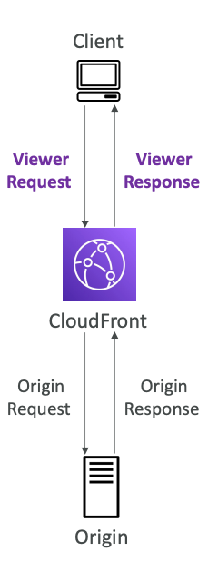
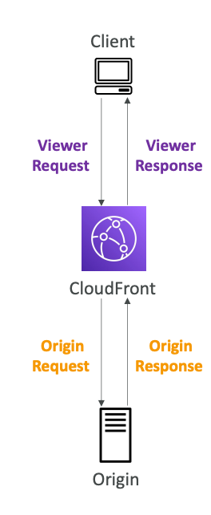
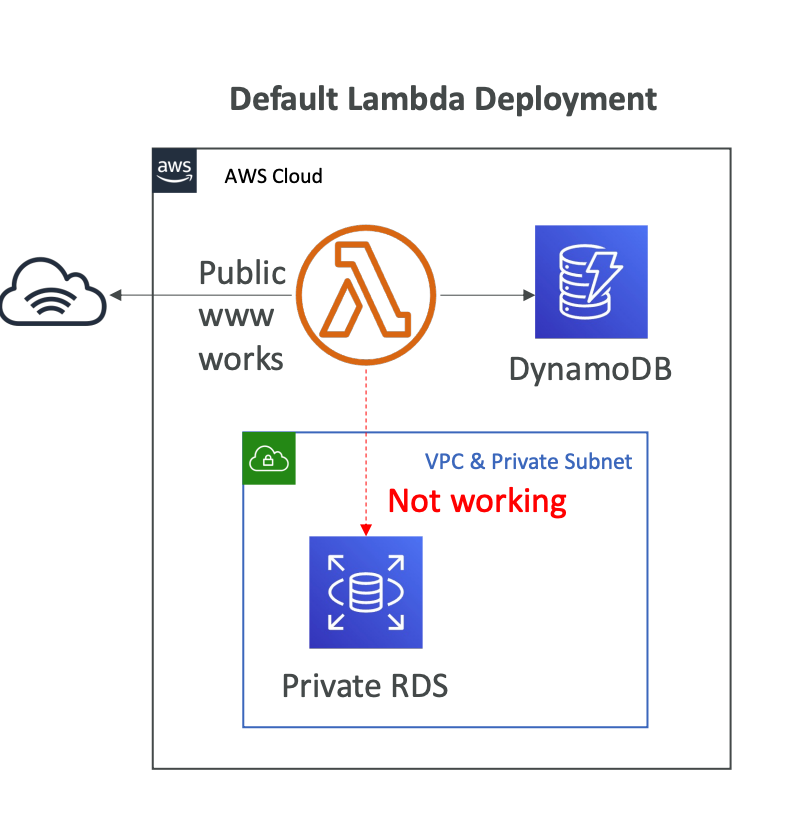
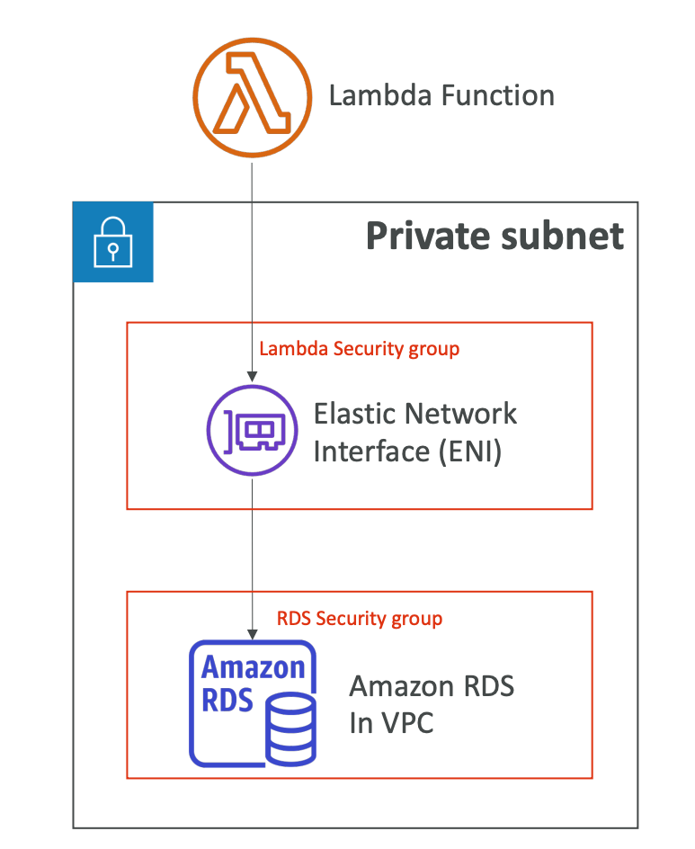
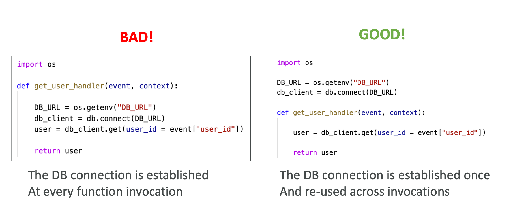
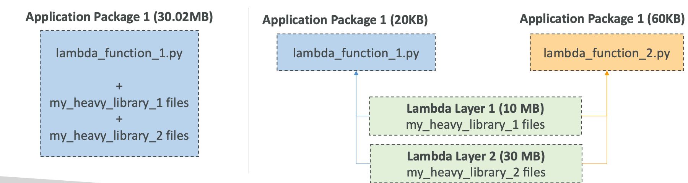
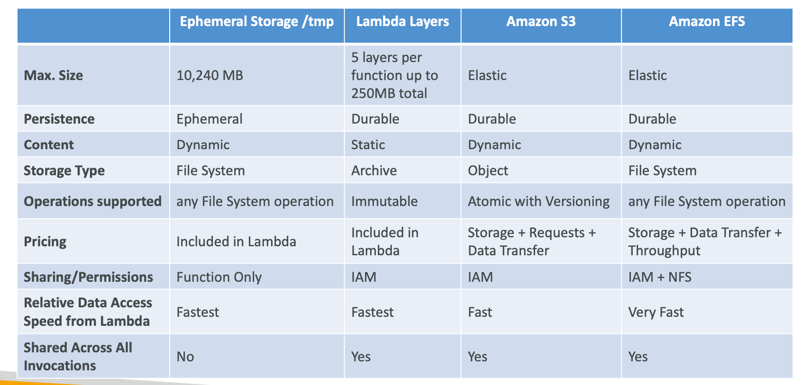
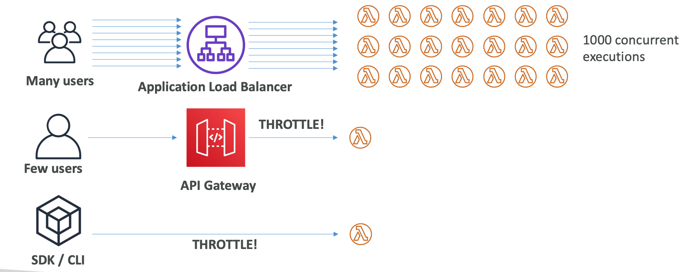

## AWS Lambda

Serverless Cloud Computing, Function as a Service (FaaS).
Simply put, you are not managing any servers.


Run code snippets in serverless way,
without server management.
**Lambda is a stateless service**.
**You are paying only for the time that you use**:
you can provision up to 10GB RAM per function.

Supported platforms:
1. NodeJS
2. Python
3. Java
4. Golang
5. Ruby
6. C#, Powershell
7. Custom runtime API (community supported)

Lambda Container Image must implement the Lambda Runtime API,
**ECS/Fargate is preferred for running arbitrary Docker images**.

Use-cases:
1. Real-time stream processing
2. Real-time file processing
3. ETL
4. Integration inside AWS
5. Cron jobs

**Lambda is a time-bound service: the maximum timeout is 15 minutes (900 seconds)**. 

### Serverless Integration

* API Gateway
* DynamoDB
* Cognito
* S3
* Kinesis
* EventBridge
* CloudFront

Lambda anti-patterns:
1. Long-running applications: use EC2 instead, or chain functions
2. Dynamic websites with AJAX
3. Stateful applications

**Each Lambda function has an IAM roles**.

### Sync Invocation

CLI, SDK, API Gateway, Application Load Balancer.
You are waiting for a result,
errors should be handled on the client side (retries).


Services that are synchronous:
* User invoked:
  * ELB
  * API Gateway
  * S3 Batch
  * CloudFront
* Service invoked:
  * Cognito
  * Step Functions
  * Lex
  * Alexa
  * Kinesis Data Firehose

#### Lambda + ELB

A Lambda function must be registered in a **target group**.

ALB transform HTTP request to JSON, as well as JSON to HTTP for response:


All the responses should have the same structure:

```json
{
  "statusCode": 200,
  "statusDescription": "200 OK",
  "isBase64Encoded": False,
  "headers": {
    "Content-Type": "text/html"
  },
  "body": "<h1>Lambda Example</h1>"
}
```

#### Multi-Header Values

ALB can support multi-header values (need to enable it in ALB).
When you enable it, values for them will be translated to
arrays inside the JSON request:


### Async Invocation

S3, SNS, EventBridge are callers of async invocation.
Also, SES (Simple Email Service), CodeCommit, CodePipeline, Cloudformation.


**Invocation type will be an Event**,
so we are just triggering function
and don't know the result.


**Whether always OK or function failed,
Lambda will return 202 (Accepted) status code**.


**Lambda attempts to retry on errors: 3 tries total,
1-minute wait after 1st one, then 2 minutes wait**.

Make sure that processing is **immutable**.

If the function is retried, you will see 
duplicate logs entries in CloudWatch.

**Can define a DLQ: SQS or SNS for failed processing
(IAM permissions are needed)**.


### Lambda + EventBridge

Events will be sent by EventBridge as a Lambda function source:


### Lambda + S3 Events

S3 Events can call asynchronously
Lambda function:


If you want to ensure that an event
notification is sent for every successful write operation,
you can enable versioning on your bucket.

### Event Source Mapping

**Records need to be polled from the source**.
Applies to Kinesis Data Streams,
SQS and SQS FIFO queues, DynamoDB Streams.

In this case, lambda function will be invoked synchronously.


There are two types of event source mappers:
1. Streams
2. Queues

#### Streams

Applies to Kinesis Data Streams and DynamoDB Streams.
An event source mapping creates an iterator for each shard,
processes items in order at shard level.
Processed items aren't removed from the stream:
so other consumers can process them.

For low traffic streams, you can set up
a batch window to accumulate records before processing.
For high one, process multiple batches in parallel:
up to 10 batches per shard, in-order processing for each partition key.

By default, if your function returns an error, the entire batch
is reprocessed until the function succeeds, or batch expires.

To work on this, you can:
1. discard old events
2. restrict the number of retries
3. split the batch on error
**Discarded events can go to a destination**.

#### Queue

Applies for SQS and SNS.


In the case of SQS, Event Source Mapping will poll SQS
using Long Polling.
Batch size also can be specified.

AWS Recommended: set the queue visibility timeout
to 6x the timeout of your Lambda function.

**To use DLQ, you need to set up it on SQS level,
not on Lambda**.

For `SQS Standard`, Lambda adds 60 more instances per minute to scale up.
Up to 1000 batches of messages processed simultaneously.

While `SQS FIFO`: Lambda function scales to the number
of active messages groups.

### Event & Context Objects


`Event` object is JSON document that contains
information to process: `version`, `source`, `type`, `time`,
and `detail`: body.


`Context` object is metadata object, `aws_request_id`,
`function_name`and other.

### Destinations

Asynchronous invocations can define destinations
for successful and failed event:
* SQS
* SNS
* Lambda
* EventBridge

AWS recommends using destinations instead of DLQ.


For Event Source Mapping, for discarded event batches:
* SQS
* SNS

### Permissions

Grant the Lambda function permissions to AWS 
services/resources (destinations).
Sample managed policies for Lambda:
* `AWSLambdaBasicExecutionRole`: upload logs to CloudWatch.
* `AWSLambdaKinesisExecutionRole`: read from Kinesis.
* `AWSLambdaDynamoDBExecutionRole`: read from DynamoDB streams.
* `AWSLambdaSQSQueueExecutionRole`: read from SQS queue.
* `AWSLambdaVPCAccessExecutionRole`: deploy Lambda function in VPC.
* `AWSXRayDaemonWriteAccess`: upload trace data to X-Ray.

When you use an event source mapping to invoke your function, Lambda
uses the execution role to read event data.

**Create one Lambda Execution Role per function**.

If your Lambda function is invoked by other services, we should use
`Lambda Resource-Based Policies`: give to other accounts and AWS services
permissions to use your Lambda resources.

An IAM principal can access Lambda:
* if the IAM policy attached to the principal authorizes it (e.g., user access)
* or if the resource-based policy authorizes (e.g., service access)

When an AWS service like S3 calls Lambda function, the resource-based
policy gives it access.

### Env

Besides, you are using environment variables, Lambda service adds its own
system environment variables as well.
Helpful to store secrets (encrypted by KMS).
Secrets can be encrypted using a Lambda service key
or your own CMK (Customer Master Key).

Environment variables help change the behavior without 
changing the source code.

### Lambda monitoring and tracing

Lambda execution logs are stored in AWS CloudWatch Logs.
To do logging, Lambda needs `AWSLambdaBasicExecutionRole`
to authorize into CloudWatch.

Lambda metrics in CloudWatch:
* Invocations, Durations, Concurrent Executions
* Error count, Success rates, Throttles
* Async Delivery Failures
* Async Delivery Failures
* Iterator Age (Kinesis & DynamoDB Streams)

Integration with X-Ray can be enabled in **Active Tracing**,
it will run the X-Ray daemon for you.
Ensure Lambda function has correct IAM Execution Role:
`AWSXRayDaemonWriteAccess`.
Now, you can use X-Ray SDK in Lambda code.

Environment variables to communicate with X-Ray:
* `_X_AMZN_TRACE_ID`: contains the tracing header.
* `AWS_XRAY_CONTENT_MISSING`: by default, LOG_ERROR.
* `AWS_XRAY_DAEMON_ADDRESS`: the X-Ray Daemon IP_ADDRESS:PORT

### Lambda with CloudFront

To execute some form of logic at the edge:
a code that you write and attach to CloudFront distributions,
and runs close to your end-users to minimize latency.


CloudFront provides two types: `CloudFront Functions`
and `Lambda@Edge`:

Use-cases:
1. Website security and privacy
2. Dynamic web application at the edge
3. Search Engine Optimization (SEO)
4. Intelligently Route Across Origins and Data Centers
5. Bot mitigation at the Edge
6. Real-time Image Transformation
7. A/B Testing
8. User Authentication and Authorization
9. User tracking



`CloudFront Functions` are lightweight functions written in JavaScript.
For high-scale, latency-sensetive CDN customizations.
Sub-ms startup times, **millions of request/second**.

Used to change Viewer requests and responses:
* Viewer Request: after CloudFront receives a request
  from a viewer.
* Viewer Response: before CloudFront forwards the response
  to the viewer.

Native feature of CloudFront.

Use-cases:
1. Cache key normalization
2. Header manipulation
3. URL rewrites or redirects
4. Request authentication & authorization



`Lambda@Edge` Lambda functions written in Node.js or Python:
scales to 1000s of request/second.
Used to change CloudFront requests and responses:
* Viewer Request: after CloudFront receives a request from a viewer.
* Viewer Response: before CloudFront forwards the response to the viewer. 
* Origin Request: before CloudFront forwards the request to the origin.
* Origin Response: after CloudFront receives the response from the origin.

Use-cases:
1. File system access or access to the body of HTTP request
2. Accessing other AWS services
3. Network access to use external services

### Lambda VPC

By default, your Lambda function is launched outside
your own VPC, in AWS-owned VPC.

Therefore, it cannot access resources
in your VPC (RDS, ElastiCache, etc).



to deploy Lambda in your own VPC, you
must define the VPC ID, the Subnets and the Security Groups.

Lambda will create an ENI(Elastic Network Interface) in your subnets.
To do so, Lambda function needs `AWSLambdaVPCAccessExecutionRole` IAM Role.



A Lambda function in your VPC does not
have internet access.

**Deploying a Lambda function in a public subnet
does not give it internet access or a public IP**.

To do so, you need to deploy a Lambda function in a private
subnet gives it internet access if you have a NAT Gateway/Instance.


To privately access AWS services, you can use
VPC endpoints.

**CloudWatch Logs will work even if you don't have an
endpoint or NAT Gateway**.

### Lambda Configuration

* RAM: 128MB to 10GB in 1MB increments, the more RAM you add,
  the more CPU credit you get, since **there is no way to change CPU in Lambda**.
  At 1,792 MB, a function has the equivalent of one full CPU.
  After 1,792 MB, you get more than one CPU, and need to use multi-threading
  in your code to benefit from it.
**If your application is CPU-bound, increase RAM**.
* Timeout: default is 3 seconds, the maximum is 900 seconds (15 minutes).
* Lambda execution context: temp runtime environment that initializes any
  external dependencies of your lambda code.
  Great for database connections, HTTP clients, SDK clients.
  **The execution context is maintained for some time in anticipation of
  another Lambda function invocation**.
  The execution context includes the `/tmp` dir.



**You should establish a connection between resources outside the handler function**.

Anything that takes a lot of time to initialize
put it outside the handler and reuse it across executions.

#### /tmp space

If you Lambda function needs disk space to perform operations,
you can use the `/tmp` directory.

Max size is 10GB, the directory remains when the execution context is frozen,
providing transient cache that can be for multiple invocations and checkpoints.
To encrypt content on `/tmp` you must generate KMS Data Keys.

**For permanent persistence of objects, use S3**.

### Lambda Layers

Externalize Dependencies to re-use them without packaging it again:



### File system mounting

Lambda functions can access EFS file systems
if they are running in a VPC.

Configure Lambda to mount EFS file systems to local directory
during initialization.

**Limitations**:
one function instance = one connection.

Lambda storage options:



### Lambda Concurrency

Concurrency limit: up to 1000 concurrent executions.
Can set a limit, reserved concurrency at the function level.
Each invocation over the concurrency limit will trigger a 'Throttle'.

Throttle behavior:
1. Synchronous invocation: 429 Too Many Requests
2. Asynchronous invocation: retry and then go to DLQ

If you don't reserve concurrency, the following can happen:



**The Concurrency limit applies to all functions in your account**:
1000 by default, so if you are a reserving function with 20,
all others can get 980 by now.

For throttling errors and system errors, Lambda returns the event
to the queue and attempts to run the function again for up to 6 hours.

To run function first time you need to load the code and dependencies, etc,
it's slow, and users will feel the `cold start`.
So, the first request served by new instances has higher latency than the rest.

To prevent cold starts, you can use `provisioned concurrency`:
you allocate concurrency before the function is invoked.
