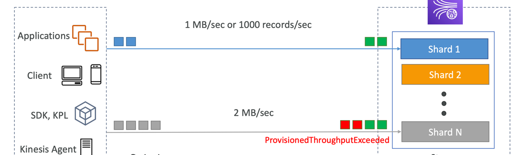

## AWS Integration and Messaging

When multiple applications appear,
they will inevitably need it to communicate with one another using:

1. Synchronous communication (app to app)
2. Asynchronous communication (app to queue to app):
  1. SQS queue model
  2. SNS pub/sub model
  3. Kinesis real-time processing/streaming model

**Using asynchronous communication systems can scale independently**.

## SQS

Simple Queuing Service (SQS):
producers send a message to the queue, consumers poll it and process.

### Standard Queue

Fully managed service, used to decouple applications.
* Unlimited throughput, unlimited number of messages in queue
* At-least-once delivery
* Best-effort ordering

**Default retention of messages: 4 days, max: 14 days**.
 
**Low latency**: (less than 10ms on publish and receive).
**Limitation of 256KB per message sent**.
 
**Can have duplicate messages (at least once delivery)**.
 
**Can have out of order messages**.

 
SQS can be integrated with CloudWatch Metrics and Alarms for autoscaling purposes:

### Producing Messages

Producer sends a message to the Queue using the SDK SendMessage API.
The message is persisted in SQS **until a consumer deletes it**.
Or retention is off.

### Consuming Messages

Consumers can be running on EC2 Instances, other servers, or AWS Lambda).
Consumer polls queue for messages using SDK ReceiveMessages API, and **can receive up to 10 messages at a time**.
**Competing consumers can increase throughput**.
**By deleting message from SQS queue we are signaling that message was successfully processed**.
 
**Purge a queue — delete all messages from the queue**.

### Security

`Encryption`:
* In-flight encryption using HTTPS API;
* At-rest encryption using KMS keys;
* Client-side encryption if the client wants to perform encryption/decryption itself.
  `Access Controls`:
* IAM Policies to regulate access to the SQS API.
  `SQS Access Policies` (similar to S3 bucket policies):
* **Useful for cross-account access to SQS queues**.
* **Useful for allowing other services to send messages to an SQS queue**.

### Queue Access Policy

JSON Resource IAM Policies.

Use-cases:
1. Cross-Account Access
   
2. Access from other services
   

### Message Visibility Timeout

After a consumer polls a message, **it becomes invisible to other consumers**.
By default, the 'message visibility timeout' is `30` seconds.
**If a message is not deleted from the queue, and message visibility timeout is elapsed,
the message will be visible for other consumers**.

**Simply put, if a message is not processed within the visibility timeout,
it will be processed twice**.
A consumer could call the `ChangeMessageVisibility` API to get more time.

* If visibility timeout is high (hours), and consumer crashes,
  re-processing will take a lot of time.

* If visibility timeout is too low (seconds), we may get duplicate processing.

### Dead Letter Queue (DLQ)

If a message is processed too many times and not successfully,
it goes to the DLQ.

Useful for _debugging_.

**DLQ of a FIFO queue must be also a FIFO queue**.
 
**DLQ of a Standard queue must be also a Standard queue**.

When working with DLQs, it's a good idea to set long retention in DLQ.

### Redrive to Source

Feature to help consume messages in the DLQ to understand
what is wrong with them.

When everything is fixed, you can redrive
messages from DLQ into the source queue.

### Delay Queues

Delay a message, so consumers don't see it immediately (up to 15 minutes).
Default is 0 seconds.
Can set a default at queue level.
Message delay can be overridden by sending data with `DelaySeconds` parameter.

### Long Polling

Long Polling: When a consumer requests messages from the queue,
it can optionally wait for messages to arrive if there are none in the queue.
**Long Polling decreases the number of API calls made to SQS,
while increasing the latency of your application**.

Using `ReceiveMessageWaitTimeSeconds`, on each polling you can tell your consumer:
how long to wait before getting a response.

The wait time can be **between 1 and 20 seconds**.
Consumers will wait up to x seconds if the queue is empty.
**The default one is 0 seconds (Short Polling)**.

### Extended Client

Extended client helps to deliver large messages:

Use-cases:
* Video files
* Large documents

### SQS API

* `CreateQueue(MessageRetentionPeriod)`
* `DeleteQueue`
* `PurgeQueue`: delete all the messages in queue
* `SendMessage(DelaySeconds)`
* `ReceiveMessage`
* `DeleteMessage`
* `MaxNumberOfMessages`: default is 1, max 10 (for `ReceiveMessage` API)
* `ReceiveMessageWaitTimeSeconds`: how long to wait before getting a response (Long Polling)
* `ChangeMessageVisibility`: change the message timeout

Also, batch APIs for `SendMessage`, `DeleteMessage`, `ChangeMessageVisibility`
helps decrease costs.

### FIFO Queue

First In First Out (ordering of messages in the queue).
**FIFO is a queue with limited throughput: `300msg/s` without batching,
and `3000 msg/s` with**.
* Exactly-once send capability (by removing duplicates)
* Messages are processed in order by the consumer

Queue's name must ends with `.fifo`

### FIFO Deduplication

Deduplication interval is 5 minutes.
**If the same message is delivered in this interval,
it will be refused**.

Deduplication methods:
1. Content-based deduplication: check SHA-256 hash of message body
2. Explicitly provided Message Deduplication ID

### Message Grouping

If you specify the **same value of `MessageGroupID`** is an SQS FIFO queue,
**you can only have one consumer, and all the messages are in order**.
 
To get **ordering at the level of a subset of messages**,
specify **different values for `MessageGroupID`**.
* So, messages will be ordered within a group,
  while global ordering is not guaranteed.
* Each Group ID can have a different consumer (parallel processing)

## AWS SNS

Simple Notification Service.
It is either can be [Standard](#standard-queue) or [FIFO](#fifo-queue).
One message to many receivers.
 
**SNS is a Pub-Sub messaging**.
Each subscriber to the SNS topic will get all the messages.
Messages can be filtered.

* Up to 12,500,000 subs per topic
* 100,000 topics limit
* SNS can send messages directly to `Email`, `SMS`, mobile notifications,
  `HTTP(S)` endpoints or other AWS services: `SQS`, `Lambda`, `Kinesis Data Firehose`.
* SNS integrates with a lot of AWS services: `CloudWatch Alarms`, `AWS Budgets`, `Auto Scaling Group`,
  `S3 Bucket Events`, `CloudFormation State Changes`, `AWS DMS New Replic`, `RDS Events`, and others.

The same as SQS and S3, you will need Access Policies for allowing other services
to publish into an SNS topic.

### SNS & SQS Fan Out

Push once in SNS, receive in all SQS queues that are subscribers.
* Fully decoupled, no data loss
* SQS allows for: data persistence, delayed processing and retries of work
* Ability to add more SQS subscribers over time

**Make sure your SQS queue Access Policy allows for SNS to publish in it**.

Use-cases:
* S3 Events to multiple queues

### SNS FIFO Topic

* Similar to [SQS FIFO](#fifo-queue)
* **Can only have SQS FIFO queues as subs**
* Limited throughput as SQS FIFO

Fan Out pattern with FIFO will look like this:

### Message Filtering

JSON Policy used to filter messages sent to SNS topic's subs.
**If a sub doesn't have a filter policy, it will receive every message**.

## AWS Kinesis

Kinesis combines the collection, processing, and analyzing of streaming data in real-time.
Ingest real-time data such as:
* Application Logs
* Metrics
* Website click streams
* IoT telemetry data
* etc.

Kinesis consists of 4 services:
1. Kinesis Data Streams: capture, process, and store data streams
2. Kinesis Data Firehose: load data streams into AWS data stores
3. Kinesis Data Analytics: analyze data streams with SQL or Apache Flink
4. Kinesis Video Streams: capture, process, and store video streams

### Data Streams

**Data Streams are made of multiple numbered shards**.
Data split across all the shards.
Number of shards you need to provision ahead of time.

* Retention between 1 day to 365 days.
* Ability to reprocess/replay data.
* Data Immutability: once data is inserted in Kinesis, it can't be deleted.
* Data with the **same partition key goes to the same shard**, thus ordering is guarantied.

#### Capacity Modes

1. Provisioned mode: you choose the number of shards provisioned, then scale manually or using API.
   Each shard gets 1MB/s in and 2MB/s out.
   **You pay per shard provisioned per hour**.
2. On-demand mode: no need to manage the capacity, capacity will be adjusted on-demand.
   Default capacity provisioned: 4MB/s.
   Scales automatically based on observed throughput peak during the last 30 days.
   **You pay per stream per hour and data in/out per GB**.

### Producers

Kinesis Producers **put data records into data streams**.
Data record consists of:
* Sequence number
* Partition key
* Data blob (up to 1 MB)

Producer can send a record with partition key and data blob up to 1MB.
1MB/s or 1000 msg/s per shard.
Producer examples:
* Clients
* SDK, KPL
* Kinesis Agent

API to put record into data stream is `PutRecord`.

Each record is going through hash function for high data distribution:

So, to avoid 'hot partition', **use highly distributed partition key**.

Kinesis ordering works with a partition key:
**the same key will always go to the same shard**.

In the case of SQS, you can have only one SQS FIFO Queue
and multiple Group IDs.

#### ProvisionedThroughputExceeded

Solution for this error:
1. Use a highly distributed partition key
2. Implement retries with exponential backoff
3. Increase shards (scaling): increased MB/s

### Consumers

Consumer can process the record consists of:
partition key, sequence number, and data blob.
Throughput in the **shared fan-out mode is 2MB/s per shard all consumers**,
in the **enhanced fan-out mode is 2MB/s per shard per consumer**.
Consumer examples:
* KCL, SDK
* Lambda
* Kinesis Data Firehose
* Kinesis Data Analytics

#### Shared vs. Enhanced mode

API call for receiving records is `GetRecords`.
In shared mode, all consumers share the throughput per shard.
The more consumers we will add, the more throughput limitations we will get.

* Latency: ~200ms
* Minimize cost
* Data polling using `GetRecords`
* Returns up to 10MB or 10 000 records, then throttle for 5 s.
   

In enhanced mode, consumer getting throughput per shard per consumer.
For enabling that, we need to hit `SubscribeToShard` API.
**In this mode, we are getting a Push model**, instead of a Kinesis Classic Pull model.

* Latency: ~70ms
* Higher cost
* Consumers subscribe to shard using `SubscribeToShard` API
* Kinesis Push data over HTTP/2
* Soft limit of 5 consumer applications/stream (can be resolved by creating AWS Ticket)

#### Lambda Consumers

Lambda functions can also be a Kinesis consumers.
Lambda functions both support shared and enhanced mode.

* Lambda function will read records in batches using `GetBatch` API
* Batch size and batch window can be configured
* In case of error, Lambda retries until succeeded or data expired
* Can process **up to 10 batches per shard simultaneously**

### Kinesis Client Library

Kinesis Client Library (KCL): Java library that helps
read records from a Kinesis Data Stream with distributed applications
**sharing the read workload**.

**Each shard is to be read by only one KCL instance**.

**Read progress will be checkpoint into DynamoDB (needs IAM access)**.
Records are read in order at the shard level.

**To scale Kinesis Data Stream, you need to increase the number of shards,
and only then increase the number of KCL applications**.

Versions:
1. KCL 1.x: supports shared consumers
2. KCL 2.x: supports shared and enhanced fan-out consumers

### Operations

**Since no autoscaling in Kinesis,
you need to do manual capacity increasing and decreasing**.

* Shard splitting (Scale Up):
  used to increase throughput, used to divide 'hot' shard,
  cost will also be increased
  can't split than two shards within a single operation.
* Merging shards (Scale Down): used to decrease capacity, cost saving,
  can't merge than two shards within a single operation.

### Data Firehose

Data Firehose, a fully managed, serverless service that
can take data from producers or [Data Streams](#data-streams)
and apply transformations using AWS Lambda (optionally),
after this, writes data using batch to the destination:
1. AWS Destinations: **S3**, **Redshift**, **OpenSearch**
2. 3rd-party Partner Destinations: Datadog, Splunk, MongoDB, etc
3. Custom Destinations: HTTP Endpoint

You can send failed or all data to a backup S3 bucket.

* **Near Real Time: 60-second latency** minimum for non-full batches
* Pay for data going through Firehose.

### Data Analytics

Fully managed, serverless service for SQL/Flink analytics.

Data Analytics for SQL applications can have the following sources:
1. Data Streams
2. Data Firehose

and destinations are:
1. Data Streams
2. Data Firehose

Data Analytics for Apache Flink can have the following sources:
1. Data Streams
2. MSK
