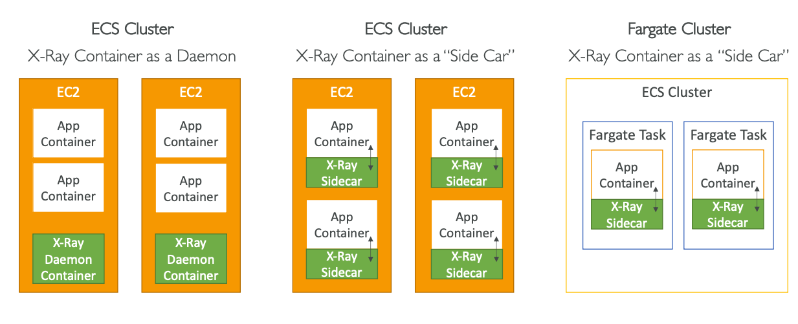

## AWS CloudWatch & X-Ray

Users don't care how we are deploying our applications.
**Users only care that application is working**:
`Application latency`, `Application outages`.

In AWS, you can use `CloudWatch`:
* metrics
* logs
* events
* alarms

`X-Ray`:
* troubleshooting
* distributed tracing

`CloudTrail`:
* Internal monitoring of API calls being made
* Audit changes to AWS Resources by your users

### CloudWatch Metrics

CloudWatch provides metrics for every service in AWS.

Metric is a variable to monitor: `CPUUtilization`, `NetworkIn`, ...
Metrics have timestamps.
Metrics belong to **namespaces**.
Dimension is attribute of a metric (instance id, environment, etc.):
up to 30 dimensions per metric.

#### EC2 Detailed Monitoring

EC2 instance metrics have metrics every 5 minutes.
With detailed monitoring, (for extra cost) **you get data every 1 minute**.

**Use detailed monitoring if you want to scale faster for your ASG**.
EC2 RAM is not pushed by default.

### Custom Metrics

In CloudWatch, you can set up your own custom metrics.
Use API `PutMetricData`.
* Ability to use dimensions to segment metrics:`instance.id`, `environment.name`
* Metric resolution: `StorageResolution` API, possible values:
  Standard: 1 minute, High: 1/5/10/30 seconds, higher cost

### Logs

* `Log groups`: application name.
* `Log stream`: instances within application/log files/containers.
  Also, you will need to define log expiration policy.

Logs Sources:
* SDK
* CloudWatch Logs Agent
* CloudWatch Unified Agent
* Elastic Beanstalk
* Lambda
* API Gateway
* VPC Flow Logs
* CloudTrail: filter
* Route53: Log DNS queries

**CloudWatch Logs Insights is a querying capability in CloudWatch**.
Logs Insights provides a query language for application logs.

Logs can be exported to multiple destinations:
* S3, Log data can take up to 12 hours to become available for export, `CreateExportTask` API.

To get real-time stream of logs from CloudWatch, you can use `Logs Subscriptions`
to send to Kinesis Data Streams, Kinesis Data Firehose, or Lambda.
Also, you can specify the`Subscription Filter`
for filtering events and their destinations.

Besides that, you can set up `Cross-Account Subscription`:
**send log events to resource in a different AWS accounts**:


### Agents

By default, no logs from your EC2 will go to CloudWatch.
You need to run a CloudWatch Agent on EC2/on-premises servers
to push the log files you want.
Make sure IAM permissions are correct.

CloudWatch `Logs Agent` & CloudWatch `Unified Agent`:
* **Logs Agent is older**, can only send to CloudWatch Logs.
* **Unified Agent is newer**, collects logs and
  system-level metrics: RAM, processes, etc.,
  can be configured using SSM Parameter Store.

**If you need more high-level logs think about `Logs Agent`**,
If you need more **granularity**, think about `Unified Agent`.

### Metric Filter

Metric Filter makes it possible to scan the logs,
find some specific data and make metric out of it:


Metric filters start working only after its creation.

### Alarms

**Alarms are used to trigger notifications for any metric**.

Alarm states:
* `OK`
* `INSUFFICIENT_DATA`
* `ALARM`

Alarms Targets:
* Stop, Terminate, Reboot or Recover an EC2 Instance
* Trigger Auto Scaling Action
* Send notification to SNS

Composite Alarms compose the state of other Alarms:
`AND` and `OR` conditions.

### Synthetics Canary

Configurable script (Node.js or Python) that monitors your APIs, URLs, and Websites, and so on.
* Reproduce what your customers do programmatically to find issues
  before customers are impacted.
* Check the availability and latency of your endpoints and can store
  load time data and screenshots of the UI

## AWS EventBridge (formerly CloudWatch Events)

Event bus that capable of:
* **Schedule** cron jobs.
* **Event pattern**: event rules to react to a service doing something.
* **Trigger** SQS/SNS, Lambda functions.


Events can be submitted to `Default Event Bus`(AWS Services),
`Partner Event Bus`(AWS SaaS Partners), or `Custom Event Bus`(Custom apps).

Events also can be archived with the ability to replay them.

### Schema Registry

EventBridge can analyze the events in your bus and infer the schema,
schema can be versioned.

### Multi-Account Aggregation


## X-Ray

Without X-Ray, debugging distributed services is quite hard.
Log formats differ across applications using CloudWatch,
and analytics is hard.

AWS X-Ray provides visual analysis of our applications:


X-Ray advantages:
* Troubleshooting performance
* Understand distributed dependencies
* Pinpoint service issues
* SLA checks

### Enabling X-Ray

1. Your code must import AWS X-Ray SDK.
   SDK will capture the AWS API calls,
   HTTP requests, Database calls, etc.

2. Install X-Ray daemon or enable X-Ray AWS Integration,
   that daemon will send a batch of traces to X-Ray service.

**Each application must have the IAM rights to submit data to X-Ray**.
To activate it on Lambda, you need to **enable Lambda X-Ray Active Tracing**.

### Concepts and Terms

**Segments**: each application / service will send them.
**Subsegments**: if you need more granularity in your segment.
**Trace**: segments collected together to form end-to-end trace.
**Annotations**: key-value pairs used to **index traces and use with filters**.
**Metadata**: key-value pairs, **not indexed**.
**Sampling**: send only some % of requests to X-Ray, decreases cost.

#### Sampling

By default, the X-Ray SDK records the **first request each second**, and
**five percent** of any additional requests.
Sampling can be changed without changing code.

One request per second is the `reservoir`, while five percent of
additional requests is a `rate`.

You can create your own rules with the `reservoir` and `rate`:


### Write APIs

Write API is used by X-Ray daemon.

`arn:aws:iam::aws:policy/AWSXrayWriteOnlyAccess` consists of Write Actions:
* `PutTraceSegments`: uploads segment documents to X-Ray.
* `PutTelemetryRecords`: upload a telemetry.
* `GetSamplingRules`: retrieve all sampling rules.
* `GetSamplingTargets` and `GetSamplingStatisticSummaries`:
  for advanced sampling data.

### Read APIs

* `GetServiceGraph`: main graph.
* `BatchGetTraces`: list of traces specified by ID.
* `GetTraceSummaries`: retrieves IDs and annotations for traces
  available for a specified time frame.
* `GetTraceGraph`: retrieves a service graph for one or more specific trace IDs.

### X-Ray + Beanstalk

**AWS Elastic Beanstalk platforms include the X-Ray daemon**.
You can run it by setting one option in `.ebextensions/xray-daemon.config`:
```yaml
option_settings:
  aws:elasticbeanstalk:xray:
    XRayEnabled: true
```
Now you can instrument your code with X-Ray SDK.

### X-Ray + ECS

X-Ray container as a Daemon or **X-Ray container as a Side Car**.
Also, it can be used in Fargate Cluster as Side Car.



## AWS CloudTrail
