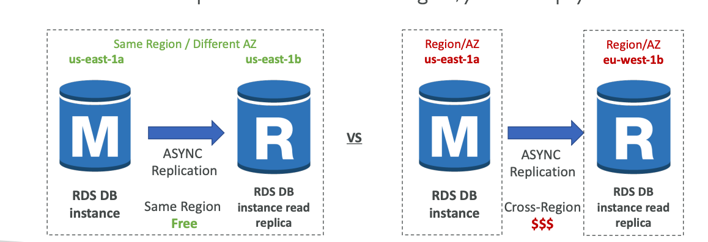
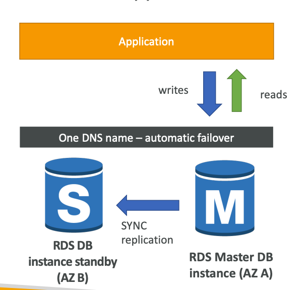
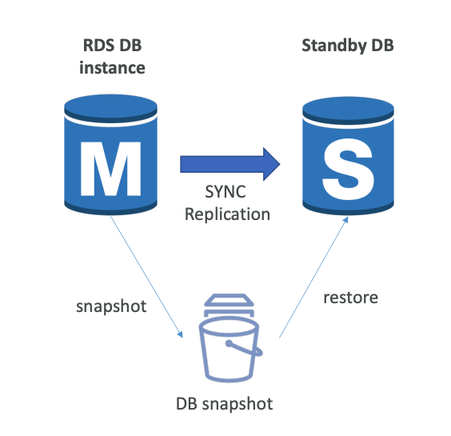
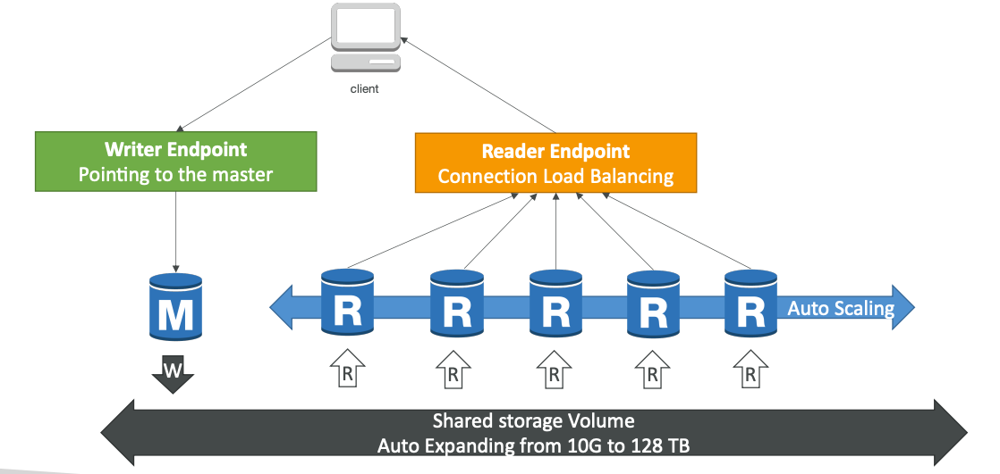
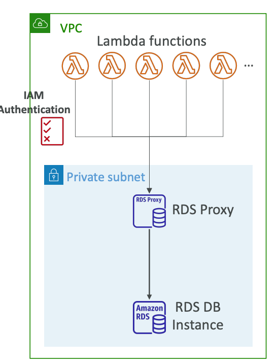

## AWS RDS

**RDS (Relational Database Service) — managed database service** for a database
that uses SQL as a query language.

Database Options:
1. PostgreSQL
2. MySQL
3. MariaDB
4. Oracle
5. Microsoft SQL Server
6. Aurora

Databases will be managed by AWS:
1. Automated provisioning, OS patching
2. Continuous backups and restore to specific timestamp (Point in Time Restore)
3. Monitoring dashboards
4. Read replicas for improved read performance
5. Multi AZ setup for Disaster Recovery
6. Maintenance windows for upgrades
7. Scaling capability (vertical and horizontal)
8. Storage backed by EBS (`gp2` or `io1`)

**But you can't SSH into your instances!**

**RDS Storage Auto Scaling** helps you increase storage on your RDS DB instance dynamically.
When RDS detects you are running out of free database storage, it scales automatically.
You have to set **Maximum Storage Threshold** (maximum limit for DB storage).

Storage is automatically modified if:
1. Free storage is less than 10% of allocated storage
2. Low storage lasts at least 5 minutes
3. 6 hours have passed since the last modification

**Useful for applications with unpredictable workloads**.

**Avoid manually scaling your database storage!**

#### RDS Read Replicas vs Multi AZ

RDS Read Replicas for read scalability
 
Up to `15` Read Replicas.
 
Within AZ, Cross AZ or Cross Region.
 
Replication is `ASYNC`, **so reads are eventually consistent**.
 
**Replicas can be promoted to their own Database**.
 
**To use Read Replicas, applications must update the connection string.**

 
Network cost.
 

In AWS there is a **network cost** when data goes from one AZ to another.

**For RDS Read Replicas within the same region, you don't pay that fee.**

**RDS Multi AZ (Disaster Recovery)**
`SYNC` replication, One DNS name - automatic app failover to standby.
No manual intervention in apps.
Not used for scaling.

**Read Replicas can be setup as Multi AZ for Disaster Recovery.**

**RDS from Single-AZ to Multi-AZ**:
Zero downtime operation (no need to stop the database).
Just click on 'modify' for the database.

The following happens internally:
1. A snapshot is taken
2. A new database is restored from the snapshot in a new AZ
3. Synchronization is established between the two databases

Also, RDS has a connectivity feature with EC2 Instance.

#### RDS Templates

RDS has templates for database creation:
1. Production
2. Dev/Test
3. Free tier

#### Database authentication

1. Password authentication
2. Password and IAM database authentication (Oracle is not supported)
3. Password and Kerberos authentication

## AWS Aurora

Aurora is a proprietary database technology from AWS.
**PostgreSQL and MySQL are both supported as Aurora database** (drivers are fully compatible).
Aurora is 'cloud optimized' and claims 5x performance improvement over MySQL on RDS,
over 3x performance of PostgreSQL on RDS.

Aurora's storage automatically grows in increments of 10GB, up to 128TB.
Aurora can have up to 15 replicas,
and the replication process is faster than MySQL (sub 10ms replica lag).
Failover ins Aurora is instantaneous, it's highly available natively.
Aurora costs more than RDS (20% more) - but is more efficient.

6 copies of your data across 3 AZ:
1. 4 copies out of 6 needed for writes
2. 3 copies out of 6 needed for reads
3. Self-healing with peer-to-peer replication

Master-Slave replication.
Fast master failover for master in less than 30 secs.

Also, Aurora supports **Backtrack feature: restore data at any point of time without using backups**.

#### RDS & Aurora Security

`At-rest encryption`:
1. Database master and replicas encryption using AWS KMS must be defined as launch time.
2. **If the master is not encrypted, the read replicas cannot be encrypted.**
3. To encrypt an unencrypted database, go through a database snapshot and restore as encrypted.

`In-flight encryption`: TLS-ready by default, use the AWS TLS root certificates client-side.
 
`IAM Authentication`: IAM roles to connect to your database (instead of username and password).
 
`Security Groups`: Control Network access to your RDS / Aurora DB.
No SSH available except on RDS Custom.
Audit Logs can be enabled and sent to CloudWatch Logs for longer retention.

**SSL connections can be enforced with RDS MySQL using `REQUIRE SSL` to all db users**.

#### RDS Proxy

Fully managed database proxy for RDS.
Allow apps to pool and share database connection established with the database.
**RDS Proxy is used to minimize and pool connections to your database.**
**Improving database efficiency by reducing
the stress on database resources** (e.g., CPU, RAM) and minimize open connections (and timeouts).
Serverless, autoscaling, highly available (Multi-AZ).
**Reduced RDS and Aurora failover time by up `66%`.**

**Enforce IAM Authentication for a database**,
and securely store credentials in AWS Secrets Manager.

**RDS Proxy is never publicly accessible (must be accessed from VPC)**.

