## AWS S3
S3 — Simple Storage Service.
**Distributed Object Storage**.

Use-case:
1. Bucket + content
2. Web-site hosting
3. Data Lake
4. Software Delivery

S3 stores files, called **objects** into **buckets**.
**Buckets must have a globally unique name** (across all regions and accounts).
**Buckets are defined at the region level**.

Naming convention:
1. No uppercase
2. No underscore
3. 3-63 chars long
4. Not an IP
5. Must start with a lower case letter or number
6. Must NOT start with the prefix `xn--`
7. Must NOT end with the suffix `-s3alias`

### S3 Objects

Objects are files stored in S3.
**The key is the full path to the object**: `s3://my-bucket/my-file.txt`.
The key is composed of **prefix** and **object name**.

1. Object values are the content of the **body**:
   Max object size is 5TB (~5000 GB).
   When upload an object that has size more than 5GB, **use multipart upload**.
2. **Metadata**
3. Tags
4. Tags
5. Version ID (if versioning is enabled)

S3 presigned URL vs. Public URL:
**Public URL** does not have security tokens, while **presigned URL has security token and signature**.
So, with a presigned URL object can be viewed,
while with a Public URL, by default object can not be viewed.

### S3 Security

**User-based**:
1. **IAM policies**: which API calls should be allowed for a specific user from IAM.

**Resource-based**:
1. **Bucket policies**: bucket wide rules from the S3 console — allows cross-account.
2. **Object Access Control List (ACL)** — finer grain (can be disabled).
3. **Bucket Access Control List (ACL)** — less common (can be disabled).

IAM principal can access an S3 object if:
The user **IAM permissions ALLOW  it** `OR` **resource policy ALLOWS it**
`AND` there's no explicit `DENY`.

Encryption: encrypt objects in S3 using encryption keys.
For enabling public URL, you need to expose `GetObject` permission to **public**.

```json
{
   "Version": "2012-10-17",
   "Statement": [
      {
         "Sid": "GetObjectPublicly",
         "Effect": "Allow",
         "Principal": "*",
         "Action": [
            "s3:GetObject"
         ],
         "Resource": "arn:aws:s3:::DOC-EXAMPLE-BUCKET/*"
      }
   ]
}
```

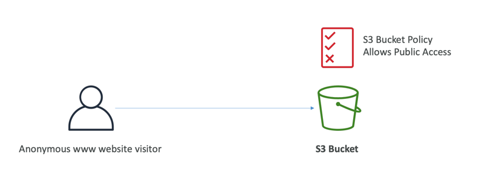

With IAM permissions to the IAM user:
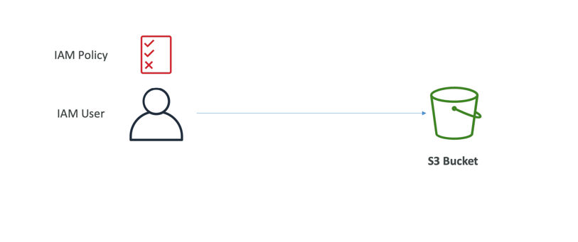

With Roles:
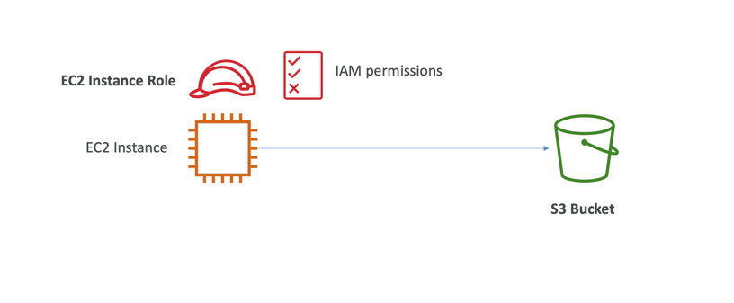

**Bucket Block Public Access**:
Extra layer of S3 security.
These settings were created to prevent company data leaks.
Even, if we give it public access, bucket will be private.

With Data Lake use-case you can query objects.
Also, AWS S3 supports events, mainly for integration purposes.

#### S3 Static Website Hosting

S3 can host static websites and have them accessible on the internet.

The website URL will be (depending on the Region):
`http://bucket-name.s3-website-aws-region.amazonaws.com`
OR
`http://bucket-name.s3-website.aws-region.amazonaws.com`

To make it accessible to the users, **S3 bucket must be public**.

### S3 Versioning

You can version your files in S3.
**It is enabled at the bucket level**.

The Same key overwriting will change the version to 1, 2, 3, etc.
<br>
**It is the best practice to version objects in bucket**:
1. Protect against unintended deletes (ability to restore version)
2. Easy rollback to a previous version

**Any file that is not versioned prior to enabling versioning will have version 'null'**.
**Version suspending does not delete the previous version**.

#### S3 Replication (CRR and SRR)

Cross-Region Replication (CRR) and Same Region Replication (SRR).

**Must enable Versioning in source and destination buckets**.
Buckets can be in different AWS accounts.
Copying is asynchronous.
Must give proper IAM permissions to S3.

After you enable Replication, **only new objects are replicated**.
Existing objects can be replicated using **S3 Batch Replication**.
For delete operations:
1. Can replicate delete markers from source to the target.
2. Deletions with a Version ID are not replicated

**Also, there is no 'chaining' replication**:
If `bucket-1` has replication to `bucket-2`, which has replication into `bucket-3`:
**then objects created in `bucket-1` are not replicated to `bucket-3`**.

**By default, delete markers are not replicated**, but it can be enabled.
**Deletes are not replicated, only delete markers**.

Use-case:
1. CRR — compliance, lower latency access, replication across accounts
2. SRR — log aggregation, live replication between production and test accounts.

### S3 Storage Classes

**S3 has very high durability (99.99999999999%, 11 9's) of objects across multiple AZ**.
If you store 10,000,000 objects with S3,
you can on averagely expect loss of a 1 object every 10,000 years.
This durability is the same for all storage classes.

S3 Standard has 99.99% availability -> not available 53 minutes a year.

1. S3 Standard - General Purpose: 99.99% availability,
   used for frequently accessed data, low latency and high throughput,
   sustain 2 concurrent facility failures, no retrieval charges.
   Use-case: **Big Data analytics, mobile and gaming applications, content distribution, etc**.
2. S3 Standard-Infrequent Access (IA): 99.9% availability, used for data that is less frequently accessed,
   but requires rapid access when needed lower cost than S3 standard.
   Use-case: **Disaster Recovery, backups**.
3. S3 One Zone-Infrequent Access: 99.5% availability, high durability in a single AZ,
   data lost when AZ is destroyed.
   Use-case: **Secondary backups of on-premise data, or data you can recreate**.
4. S3 Glacier Instant Retrieval: **Low cost object storage meant for archiving / backup**;
   pricing model: price for storage + object retrieval cost.
   Instant Retrieval - millisecond retrieval, great for data accessed once a quarter;
   minimum storage duration of 90 days.
5. S3 Glacier Flexible Retrieval: expedited (1 to 5 mins),
   standard (3 to 5 hours), bulk (5 to 12 hours) — free;
   minimum storage duration of 90 days.
6. S3 Glacier Deep Archive: **for long term storage**;
   retrieval: standard (12 hours), bulk (48 hours), minimum storage duration of 180 days.
7. S3 Intelligent Tiering: small monthly monitoring and **auto-tiering fee**,
   **moves objects automatically between Access Tiers based on usage**,
   there are no retrieval charges in S3 Intelligent-Tiering.
   Tiers:
  1. Frequent Access Tier (automatic): default tier.
  2. Infrequent Access Tier (automatic): objects not accessed for 30 days.
  3. Archive Instant Access Tier (automatic): objects not accessed for 90 days.
  4. Archive Access Tier (optional, configurable): objects not accessed from 90 days to 700+ days.
  5. Deep Archive Access Tier (optional, configurable): objects not accessed from 180 days to 700+ days.

Objects can be moved between classes manually or using **S3 Lifecycle configurations**.

S3 Lifecycle Rules:

1. Transition Actions: configure objects to transition to another storage class;
   e.g., move objects to Standard IA class 60 days after creation,
   move to Glacier for archiving after 6 months.
2. Expiration Actions: configure objects to expire (delete) after some time:
   e.g., Access log files can be set to delete after 365 days,
   delete old versions of file (if versioning is enabled).

Rules can be created for a certain prefix: `s3://mybucket/mp3/*`.
Rules can be created for certain object tags: `Department: Finance`.

#### S3 Analytics, Storage Class Analysis

Help you decide when to transition objects to the right storage class.
Recommendations for Standard and Standard-IA, but **does not work for One-Zone IA or Glacier**.
Report is updated daily in `.csv` format.
24 to 48 hours to start seeing data analysis.

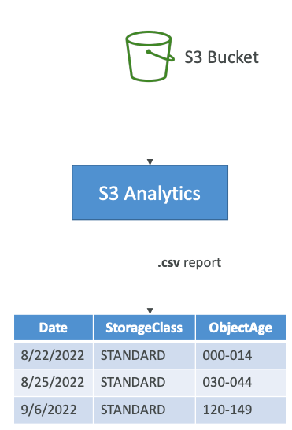

### S3 Event Notifications

`S3:ObjectCreated`, `S3:ObjectRemoved`, `S3:ObjectRestore`, `S3:Replication`.
Object name filtering possible: `*.jpg`.
Use-case:
1. generate thumbnails of images uploaded to S3.

Can create as many S3 events as desired.
S3 event notifications typically deliver events in seconds,
but sometimes it can take a minute or longer.

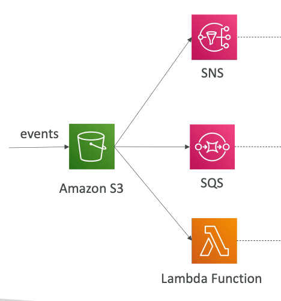

**To send data to other services, S3 needs permissions a.k.a Resource Access Policy**.

Using S3 events with **EventBridge**, you can propagate events to other services as destinations using:
1. Advanced filtering with JSON rules
2. Multiple destinations
3. Archive events, Replay events, etc.

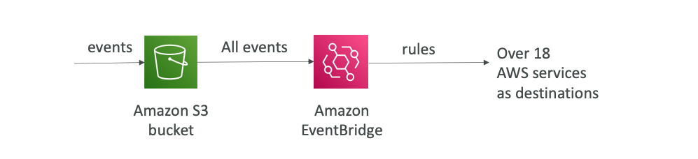

### S3 Baseline Performance

S3 automatically scales to high request rates, latency 100-200ms.
Your application can achieve at least
**3,500 PUT/COPY/POST/DELETE or 5,500 GET/HEAD requests per second per prefix in a bucket**.

Optimizing S3 performance:
1. Multi-Part upload: recommended for files > 100 MB, must use it for files > 5 GB,
   can help parallelize uploads (speed up transfers).
   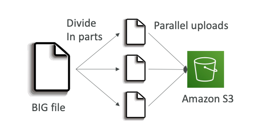
2. S3 Transfer Acceleration: increase transfer speed by transferring file
   to an AWS edge location which will forward the data to the S3 bucket in the target region;
   compatible with multi-part.
   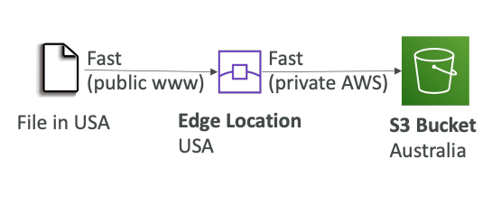
3. S3 Byte-Range Fetches: parallelize GETs by requesting specific byte ranges,
   better resilience in case of failures, can be used to speed download.
   

#### S3 Server Side Filtering

Retrieve less data using SQL by performing **server-side filtering**.

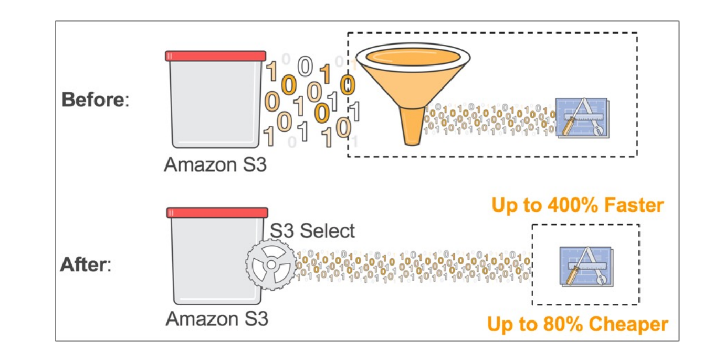

#### S3 Object Metadata, Tags

When uploading an object, you can also assign metadata
S3 User-Defined Object Metadata (K-V pairs):
1. User-Defined metadata must start with `x-amz-meta`.

S3 stores user-defined metadata keys in lowercase.
Metadata can be retrieved while retrieving the object.

S3 Object Tags are K-V pairs for objects in S3.
1. **Useful for fine-grained permissions (only access specific objects with specific tags)**.
2. **Useful for analytics purposes (using S3 Analytics to group by tags)**.
   <br>

**You cannot search the object metadata or object tags**.

**Instead, you must use an external DB as a search index such as DynamoDB**.

### S3 Object Encryption

Objects can be encrypted using one of 4 methods:
1. **Server-Side Encryption** (SSE):
  1. Server-Side Encryption with S3-Managed Keys (SSE-S3): managed by AWS - **Enabled by Default**.
     Encryption type is **AES-256**, must set header `"x-amz-server-side-encryption":"AES256"`.
  2. Server-Side Encryption with KMS Keys stored in AWS KMS (SSE-KMS): keys are managed by AWS KMS.
     KMS advantages: **user control + audit key usage using CloudTrail**.
     Must set header `"x-amz-server-side-encryption":"aws:kms"`.
     You maybe impacted by the KMS limits:
     KMS quota per second (5500, 10000, 30000 req/s based on the region).
     **So, if you have very high throughput S3 bucket, you may go in throttling**.
  3. Server-Side Encryption with Customer-Provided Keys (SSE-C): you are managing your own keys.
     **S3 does not store the encryption key you provide**, **HTTPS must be used**.
     **Supported only in CLI and SDK**.
2. **Client-Side Encryption**: **Clients must encrypt data themselves before sending to S3**.
   **Data decryption happens on the client side too**.
   **Don't need to indicate AWS that you are encrypting object at your own**.

Encryption in flight is also called SSL/TLS.
S3 exposes two endpoints:
1. HTTP — non encrypted
2. HTTPS — encryption in flight, recommended

Force Encryption in Transit: `aws:SecureTransport`:

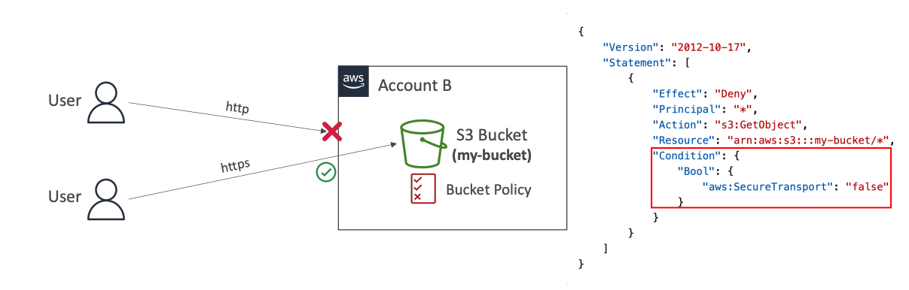

**Bucket Policies are evaluated before 'Default Encryption'**.

### S3 CORS

**Cross-Origin Resource Sharing** (CORS).
Origin = `protocol` + `host` + `port`.

Web Browser based mechanism to allow requests
to other origins while visiting the main origin.

**Same origin**: `http:example.com/app1` & `http:example.com/app2`.
<br>
**Different origins**: `http:www.example.com/app1` & `http:other.example.com/app1`.

**The requests won't be fulfilled unless the other origin allows for the requests,
using CORS Headers** (example: `Access-Control-Allow-Origin`).

**If a client makes a cross-origin request on our S3 bucket,
we need to enable the correct CORS headers using JSON configuration**.
**In `AllowedOrigins` you must specify URL without last slash `'/'`**.
You can allow specific origin or for * (all origins).

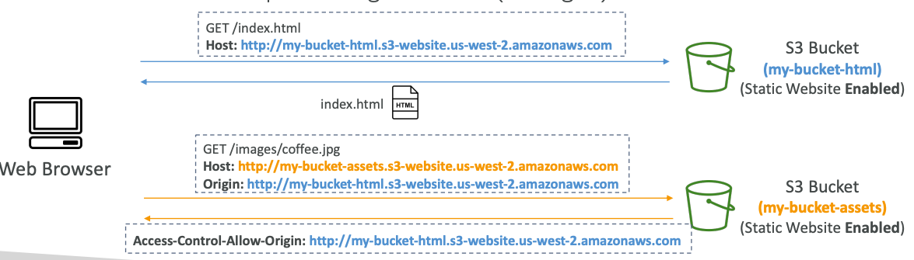

#### S3 MFA Delete

MFA Delete is extra protection to prevent deletion of object versions.

MFA will be required to **permanently delete an object version**,
or **suspend versioning on the bucket**.
To use MFA Delete, you must **enable versioning on the bucket**.
**Only the bucket owner (root account) can enable/disable MFA Delete**.

#### S3 Access Logs

For audit purpose, you may want to log all access to S3 buckets.
Any request made to S3, from any account, authorized or denied,
will be **logged into another S3 bucket**.

The target bucket must be in the same AWS region.
To the target bucket new policy will be issued,
that allows `logging.s3.amazonaws.com` to do `s3:PutObject` on the target bucket.

**Do not set your logging bucket to be the monitored bucket**.
**It will create a logging loop, and your bucket will grow exponentially**.

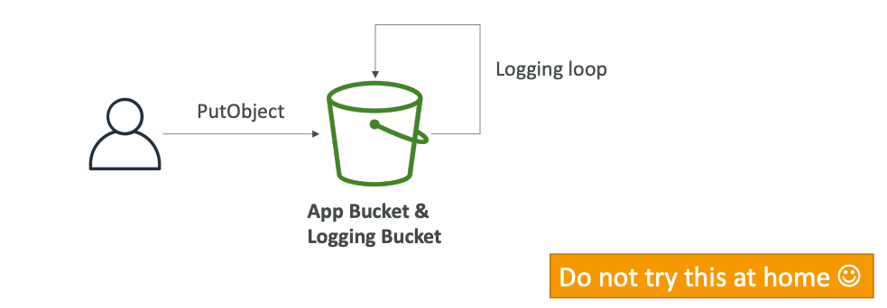

#### Pre-signed URLs

Generate pre-signed URLs using the S3 Console, CLI, or SDK.

URL expiration:
1. S3 Console: 1m to 720m (12 hours)
2. CLI and SDK: 3600s to 604800s (~168 hours)

Users given a pre-signed URL inherit the permissions of the user that generated the URL.

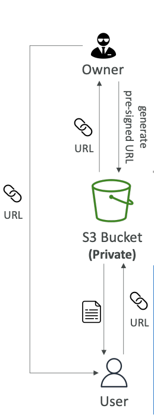

Use-case:
1. Allow only logged-in users to download a premium video from your S3 bucket.
2. Allow an ever-changing list of users to download files by generating URLs dynamically.

#### S3 Access Points

S3 Access Points can simplify management for S3 buckets.
Each Access Point has:
1. **DNS name (Internet Origin or VPC Origin)**
2. **An access point policy — to manage security at scale**

To use VPC Origin, we must create a VPC endpoint to access the Access Point.
The created VPC endpoint must allow access to the target bucket and Access Point.

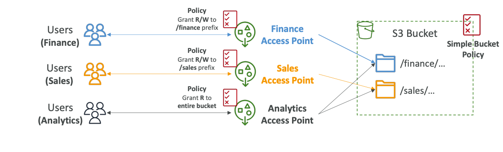

#### S3 Object Lambda

Use AWS Lambda Functions to change the object
before it is retrieved by the client.
On top of the bucket we want to modify, we should create
**S3 Access Points** and **Object Lambda Access Points**.

All Lambdas will access the bucket by contacting only **one** S3 Access Point.

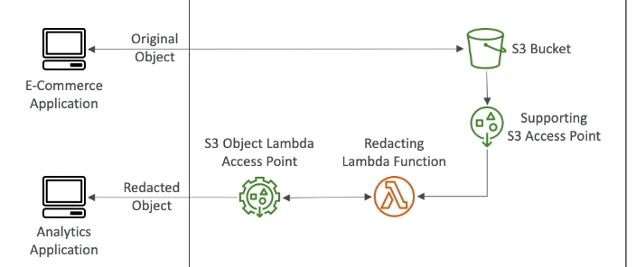

Use-case:
1. Redacting personally identifiable information for analytics or non-production environments.
2. Converting data formats, e.g., XML to JSON.
3. Resizing and watermarking images on the fly using caller-specific details.
