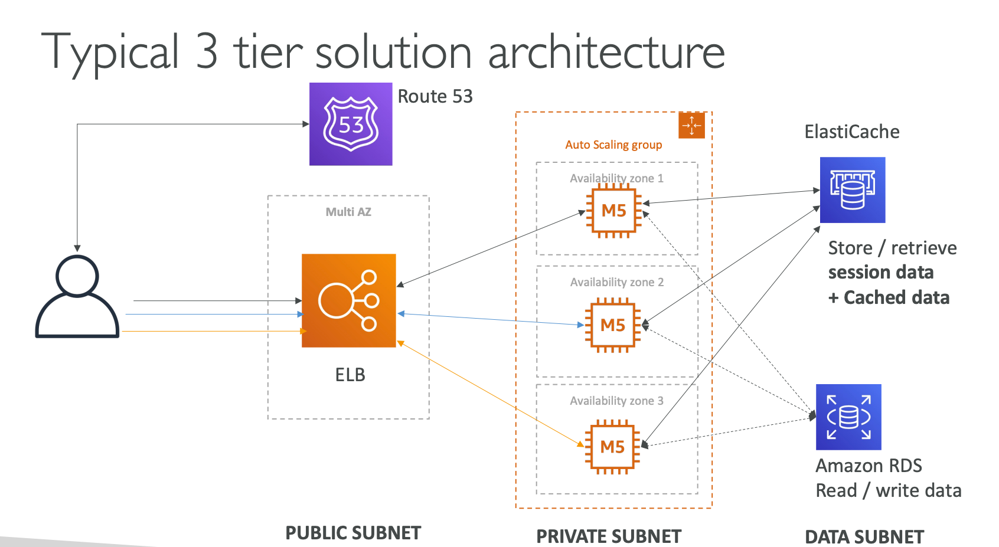

## Virtual Private Cloud (VPC)

1. **VPC: private network to deploy your resources** (regional resource), **1 default VPC per AWS Region**.
2. **Subnets**: allow you to partition your network inside your VPC (Availability Zone Resource).
3. **Public subnet** is a subnet that is accessible from the internet.
4. **Private subnet** is a subnet that is not accessible from the internet.
5. **Route Tables** are required to define access to the internet and between subnets.
   VPC CIDR Range: 10.0.0.0/16
6. **Internet Gateways** helps our VPC instances connect with the internet.
7. **Public Subnets have a route to the Internet Gateway**.
8. **NAT Gateways (AWS managed)** and NAT Instances (self-managed): allow your instances
   in your Private Subnets to access the internet while remaining private.

#### Network ACL & Security Groups

1. **NACL** (Network ACL) — a firewall which controls traffic from and to subnet.
   **Are attached to the Subnet level**.
   Can have `ALLOW` and `DENY` rules.
   Rules only include IP addresses.

2. **Security Groups**:
   a firewall that controls traffic to and from an ENI / an EC2 Instance.
   **Operates at the Instance level**.
   Can have only `ALLOW` rules.
   Rules include IP addresses and other security groups.

#### VPC Flow Logs

VPC Flow Logs capture information about IP traffic going into your interfaces:
1. VPC Flow Logs
2. Subnet Flow Logs
3. Elastic Network Interface Flow Logs

**Helps to monitor and troubleshoot connectivity issues**:
1. Subnets to internet
2. Subnets to subnets
3. Internet to subnets

VPC Flow Logs can be sent to S3, CloudWatch Logs, and Kinesis Data Firehose.

#### VPC Peering

**Connect two VPC, privately using AWS's network**.
**Make them behave as if they were in the same network**.
Must not have overlapping CIDR (IP address range).

**VPC Peering connection is not transitive**
(must be established for each VPC that need to communicate with one another).

**VPC Endpoints**: allow you
to connect to AWS Services using a private network instead of the public network.
This gives you enhanced security and lower latency to access AWS services.
**By default, all AWS services and resources talk to each other publicly**.

VPC Endpoint Gateway: S3 and DynamoDB.
VPC Endpoint Interface: all the rest services

#### Site to Site VPN and Direct Connect

**Site to Site VPN**:
1. Connect an on-premises VPN to AWS
2. The connection is automatically encrypted
3. Goes over the public internet
4. Takes a few minutes to establish

**Direct Connect**:
1. Establish a physical connection between on-premises and AWS
2. The connection is private, secure, and fast
3. Goes over a private network
4. Takes at least a month to establish

