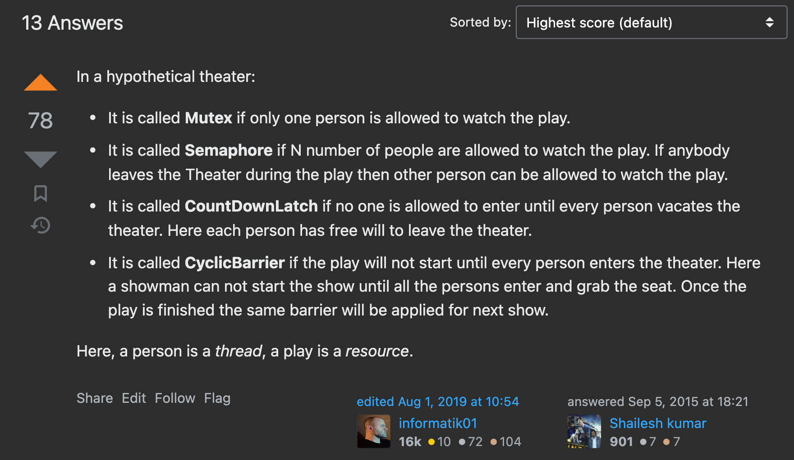

## Locks

`ReentrantLock`

More flexible synchronization mechanism than `synchronized` blocks.

`ReentrantReadWriteLock`

Read Lock - if no thread acquired the Write lock or requested for it, multiple threads can acquire the read lock.
Write Lock - if no threads are reading or writing, only one thread can acquire the Write lock.

`StampedLock` 

Lock acquisition methods return a stamp that is used to release a lock or to check if the lock is still valid.
Another feature provided by `StampedLock` is optimistic locking.
Most of the time, read operations don't need to wait for Write operation completion,
and as a result of this,
the full-fledged read lock isn't required.

## Conditions

The Condition class provides the ability for a thread to wait
for some conditions to occur while executing the critical section.

Traditionally JVM platform provides `wait()`, `notify()` and `notifyAll()` methods for threads intercommunication.
Conditions have similar mechanisms, but we can slo specify multiple conditions:

```java
final ReentrantLock lock = new ReentrantLock();
final Condition empty = lock.newCondition();
final Condition full = lock.newCondition();
```

Condition methods:
```java
empty.await();
full.signalAll();
```

## CountDownLatch

Mechanism to resolve concurrent programming.

CountDownLatch has a counter field, which you can decrement as we require.
We can then use it to block a calling thread until it's been counted down to zero.

Parallel processing: If you have a scenario where
you want to divide a large task into smaller subtasks and process them in parallel,
you can use CountDownLatch to ensure that all subtasks have completed before merging the results.


```java
new CountDownLatch(3); // init with count 3
latch.await(); // wait until the count becomes zero
latch.countDown(); // decrement the count
```
The `await()` method blocks the thread 
until the count reaches zero or until the thread is interrupted.

Waiting threads proceed:
When the count reaches zero, the waiting thread or threads are released,
and they can proceed with their execution.

It's worth noting that CountDownLatch is a one-time use mechanism,
meaning that once the count reaches zero, it cannot be reset.
If you need a similar functionality that can be reused, you can consider using CyclicBarrier.


## CyclicBarrier

Synchronization reusable mechanism.

```java
CyclicBarrier cb = new CyclicBarrier(workers, enableThread);
cb.await(); // in worker's code
```
When all workers will await,
the last worker will enable the barrier and runs the `enableThread`.



## Semaphore

Semaphore in Java is a variable that is used to manage processes that run in parallel.
It is a non-negative variable
that indicates the number of resources in the system that are available at a point in time.
By using counters,
the semaphore controls the shared resources
to ensure that threads running simultaneously are able to access the resources and avoid race conditions.
Thus, the semaphore protects critical sections by using synchronized constructs.

