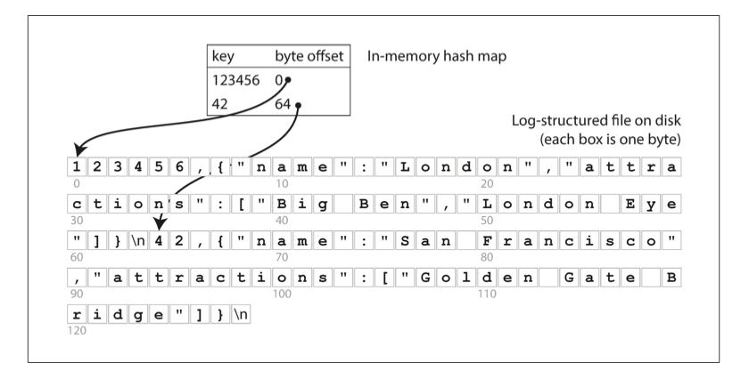
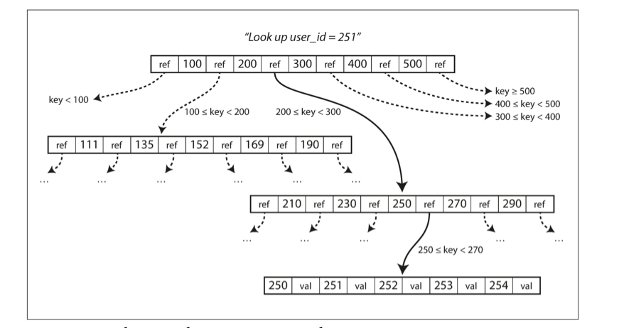

> "In the messy reality of distributed systems, you have to be very careful with your assumptions."
>  
> Martin Kleppmann

### Distributed Locking

If you need locks only on a best-effort basis
(as an efficiency optimization, not for correctness),
I would recommend sticking
with the straightforward single-node locking algorithm for Redis
(conditional set-if-not-exists to obtain a lock, atomic delete-if-value-matches to release a lock),
and documenting very clearly in your code that the locks are only approximate and may occasionally fail.
Don’t bother with setting up a cluster of five Redis nodes.

On the other hand, if you need locks for correctness,
please don’t use `Redlock`.
Instead, please use a proper consensus system such as `ZooKeeper`,
probably via one of the Curator recipes that implements a lock.
(At the very least, use a database with reasonable transactional guarantees.)
And please enforce use of fencing tokens on all resource accesses under the lock.

## Hash Indexes

Key-value stores are quite similar to the dictionary type that
you can find in most programming languages,
and which is usually implemented as a hash map (hash table).
Since we already have hash maps for our in-memory data structures,
why not use them to index our data on disk?

It is a viable approach.
In fact, this is essentially what Bitcask (the default storage engine in `Riak`) does.

A storage engine like Bitcask is well suited to situations where
the value for each key is **updated frequently**.
For example, the key might be the URL of a cat video,
and the value might be the number of times it has been played
(incremented every time someone hits the play button).
In this kind of workload, there are **a lot of writes**,
but there are not too many distinct keys—you have a large number of writes per key,
but it’s feasible to keep all keys in memory.

However, the hash table index also has limitations:

- The hash table must fit in memory, so if you have a very large number of keys, you're out of luck.
Also, on-disk hash map doesn't perform well, since it requires random access to the IO. 
- Range queries are not efficient.
For example, you cannot easily scan over all keys between kitty00000 and kitty99999.
You'll have to look up each key individually in the hash maps.

## Data logs

**File format**:
CSV is not the best format for a log.
It’s faster and simpler to use a binary format that first encodes the length of a string in bytes,
followed by the raw string (without a need for escaping).

**Deleting records**:
If you want to delete a key and its associated value,
you have to append a special deletion record to the data file
(sometimes called a **tombstone**).
When log segments are merged,
the tombstone tells the merging process to discard
any previous values for the deleted key.

**Crash recovery**:
If the database is restarted, the in-memory hash maps are **lost**.
In principle, you can restore each segment’s hash map
by reading the entire segment file from beginning to end
and noting the offset of the most recent value for every key as you go along.
However, that might take a long time if the segment files are large,
which would make server restarts painful.

An append-only log seems wasteful at first glance: 
why don’t you update the file in place,
overwriting the old value with the new value?
But an append-only design turns out to be good for several reasons:

- Appending and segment merging are sequential write operations,
which are generally much faster than random writes,
especially on magnetic spinning-disk hard drives.
To some extent, sequential writes are also preferable on flash-based solid state drives (SSDs).

- Concurrency and crash recovery are much simpler if segment files append-only or immutable.

## B-tree

The most widely used indexing structure.
B-trees break the database down into fixed-size blocks or **pages**,
traditionally 4 KB in size (sometimes bigger),
and read or write one page at a time.
This design corresponds more closely to the underlying hardware,
as disks are also arranged in fixed-size blocks.

One page is designated as the root of the B-tree;
whenever you want to look up a key in the index, you start here.
The page contains several keys and references to child pages.
Each child is responsible for a continuous range of keys (aka **leafs**),
and the keys between the references indicate where the boundaries between those ranges lie.

The number of references to child pages in one page of the B-tree is called the **branching factor**.

B-tree **overwrites** a page on disk with new data.
It is assumed that the overwrite does not change the location of the page;
i.e., all references to that page remain intact when the page is overwritten.
This is in stark contrast to log-structured indexes such as LSM-trees,
which only append to files but never modify files in place.

Moreover, some operations require **several different pages to be overwritten**.
If you split a page because an insertion caused it to be overfull,
you need to write the two pagers that were split,
and also overwrite their parent page with new refs on child nodes.

In order to make the database resilient to crashes,
it is common for B-tree implementations to include an additional data structure on disk:
a write-ahead log (**WAL**).
This is an **append-only** file to which 
every B-tree modification must be written before
it can be applied to the pages of the tree itself.
When the database comes back up after a crash,
this log is used to restore the B-tree back to a consistent state.

Also, **concurrency control** is required.
If multiple threads are going to access the B-tree at the same time 
-otherwise, a thread may see the tree in an inconsistent state.
This is typically done by protecting the tree’s data structures with latches (lightweight locks).
**LSM approach is simpler** in this regard,
because they do all the merging in the background without interfering with incoming queries
and atomically swap old segments for new segments from time to time.

## LSM-tree

We can now make our storage engine work as follows:

- When a write comes in, add it to an in-memory balanced tree data structure (for
  example, a red-black tree).
  This in-memory tree is sometimes called a **memtable**.
- When the memtable gets bigger than some threshold—typically
  a few megabytes —write it out to disk as an SSTable file.
  This can be done efficiently because the tree already maintains the key-value pairs sorted by key.
  The new SSTable file becomes the most recent segment of the database.
  While the SSTable is being written out to disk, writes can continue to a new memtable instance.
- In order to serve a read request, first try to find the key in the memtable, then in the most recent on-disk segment,
  then in the next-older segment, etc.
- From time to time, run a merging and compaction process in the background to combine segment files and to discard
  overwritten or deleted values.

If the database crashes, the most recent writes
(which are in the memtable but not yet written out to disk) are lost.

In order to avoid that problem, we can keep a separate log on disk to which
every writing is immediately appended, just like in the previous section.
That log is not in sorted order, but that doesn’t matter,
because its only purpose is to restore the memtable after a crash.
Every time the memtable is written out to an SSTable, the corresponding log can be discarded.